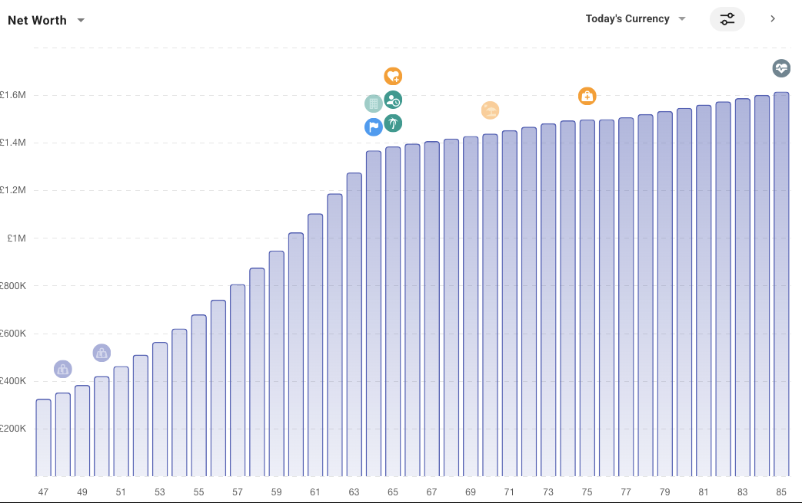

# Goals & Financial Planning Module - Detailed Technical Mapping

**Generated:** 3 February 2026
**Status:** Based on actual codebase implementation

---

## 1. Module Overview

The Goals & Financial Planning module is a comprehensive system for financial goal management, life event tracking, and long-term net worth projections. It consists of:

- **21 Vue Components** in `resources/js/components/Goals/`
- **1 View** in `resources/js/views/Goals/GoalsDashboard.vue`
- **1 Vuex Store** in `resources/js/store/modules/goals.js`
- **1 API Service** in `resources/js/services/goalsService.js`
- **1 Backend Controller** in `app/Http/Controllers/Api/GoalsController.php`
- **1 Life Events Controller** in `app/Http/Controllers/Api/LifeEventController.php`
- **1 Agent** in `app/Agents/GoalsAgent.php`
- **6 Services** in `app/Services/Goals/`
- **2 Models** (`Goal`, `LifeEvent`)

---

## 2. Architecture Flow

```
┌─────────────────────────────────────────────────────────────────────────────┐
│                              FRONTEND                                        │
├─────────────────────────────────────────────────────────────────────────────┤
│                                                                              │
│  GoalsDashboard.vue (Main Entry Point)                                       │
│         │                                                                    │
│         ├─► GoalsOverview.vue         ─► Summary cards, top goals, streaks  │
│         ├─► GoalsProjectionChart.vue  ─► Net worth projection chart         │
│         ├─► GoalsList.vue             ─► All goals with filtering           │
│         ├─► EventsTab.vue             ─► Life events management             │
│         ├─► GoalsByModule.vue         ─► Goals grouped by module            │
│         └─► GoalsAnalysis.vue         ─► Deep analysis & recommendations    │
│                                                                              │
│  Vuex Store (goals.js)                                                       │
│         │                                                                    │
│         └─► goalsService.js ─► API calls to /api/goals & /api/life-events   │
│                                                                              │
└─────────────────────────────────────────────────────────────────────────────┘
                                     │
                                     ▼
┌─────────────────────────────────────────────────────────────────────────────┐
│                              BACKEND                                         │
├─────────────────────────────────────────────────────────────────────────────┤
│                                                                              │
│  GoalsController.php                                                         │
│         │                                                                    │
│         ├─► GoalsAgent.php             ─► Orchestrates analysis              │
│         ├─► GoalAssignmentService.php  ─► Module auto-assignment             │
│         ├─► GoalAffordabilityService.php ─► Affordability analysis           │
│         ├─► GoalProgressService.php    ─► Progress, streaks, milestones      │
│         ├─► GoalRiskService.php        ─► Investment projections             │
│         ├─► GoalsProjectionService.php ─► Year-by-year net worth projection  │
│         └─► LifeEventService.php       ─► Life events CRUD                   │
│                                                                              │
│  LifeEventController.php                                                     │
│         │                                                                    │
│         └─► LifeEventService.php       ─► Life events management             │
│                                                                              │
└─────────────────────────────────────────────────────────────────────────────┘
                                     │
                                     ▼
┌─────────────────────────────────────────────────────────────────────────────┐
│                              MODELS                                          │
├─────────────────────────────────────────────────────────────────────────────┤
│                                                                              │
│  Goal.php                              LifeEvent.php                         │
│  ├── user_id                           ├── user_id                           │
│  ├── goal_name                         ├── event_name                        │
│  ├── goal_type                         ├── event_type                        │
│  ├── target_amount                     ├── amount                            │
│  ├── current_amount                    ├── impact_type (income/expense)      │
│  ├── target_date                       ├── expected_date                     │
│  ├── assigned_module                   ├── certainty                         │
│  ├── priority                          ├── status                            │
│  ├── status                            └── show_in_projection                │
│  ├── contribution_streak                                                     │
│  └── (57 total fields)                                                       │
│                                                                              │
└─────────────────────────────────────────────────────────────────────────────┘
```

---

## 3. Vue Components Inventory

### 3.1 Main Views

| Component | Path | Purpose |
|-----------|------|---------|
| `GoalsDashboard.vue` | `views/Goals/` | Main entry point with 6 tabs |

### 3.2 Tab Components

| Component | Path | Purpose |
|-----------|------|---------|
| `GoalsOverview.vue` | `components/Goals/` | Summary cards, top goals, progress bar, streaks |
| `GoalsProjectionChart.vue` | `components/Goals/` | Net worth projection with event icons |
| `GoalsList.vue` | `components/Goals/` | All goals table with filtering |
| `EventsTab.vue` | `components/Goals/` | Life events management interface |
| `GoalsByModule.vue` | `components/Goals/` | Goals grouped by assigned module |
| `GoalsAnalysis.vue` | `components/Goals/` | Analysis and recommendations |

### 3.3 Supporting Components

| Component | Purpose |
|-----------|---------|
| `GoalFormModal.vue` | Create/edit goal modal |
| `GoalCard.vue` | Individual goal card display |
| `GoalProgressBar.vue` | Visual progress indicator |
| `GoalMilestoneTracker.vue` | Milestone achievement display (25%, 50%, 75%, 100%) |
| `GoalContributionStreak.vue` | Streak display with intensity levels |
| `GoalCountdown.vue` | Days/months remaining countdown |
| `ContributionModal.vue` | Record contribution modal |
| `LifeEventForm.vue` | Create/edit life event form |
| `LifeEventCard.vue` | Individual life event card |
| `ChartTypeToggle.vue` | Toggle between line/bar chart |
| `ViewToggle.vue` | Toggle between Individual/Household views |
| `ProjectionSummaryCards.vue` | Summary statistics above chart |
| `EventIconLegend.vue` | Legend showing event type icons |
| `EventTooltip.vue` | Tooltip for event details on hover |
| `EventIconsOverlay.vue` | Icon overlay layer for charts |
| `AssumptionsDisclosure.vue` | Shows projection assumptions |

---

## 4. Data Flow: Goal Creation

When a user creates a goal:

```
1. User fills GoalFormModal.vue
         │
         ▼
2. Form emits @save with formData
         │
         ▼
3. GoalsDashboard.vue calls handleSaveGoal()
         │
         ▼
4. Vuex action: createGoal(goalData)
         │
         ▼
5. goalsService.createGoal(goalData)
         │
         ▼
6. POST /api/goals
         │
         ▼
7. GoalsController::store()
   ├── GoalAssignmentService::determineModule()  ─► Auto-assigns module
   ├── GoalAssignmentService::calculatePropertyCosts() ─► If property goal
   └── Goal::create()
         │
         ▼
8. GoalsAgent::clearCache() ─► Invalidates cached analysis
         │
         ▼
9. Response returns new goal
         │
         ▼
10. Vuex mutation: ADD_GOAL
          │
          ▼
11. Vuex action: fetchDashboardOverview() ─► Refreshes dashboard data
          │
          ▼
12. GoalsProjectionChart watchers detect change ─► updateEventMarkers()
```

---

## 5. Data Flow: Life Event Creation

When a user creates a life event:

```
1. User fills LifeEventForm.vue in EventsTab
         │
         ▼
2. Form emits @save with eventData
         │
         ▼
3. EventsTab.vue calls handleSaveEvent()
         │
         ▼
4. Vuex action: createLifeEvent(eventData)
         │
         ▼
5. goalsService.createLifeEvent(eventData)
         │
         ▼
6. POST /api/life-events
         │
         ▼
7. LifeEventController::store()
   └── LifeEvent::create()
         │
         ▼
8. Response returns new event
         │
         ▼
9. Vuex mutation: ADD_LIFE_EVENT
         │
         ▼
10. Vuex action: fetchProjection() ─► Refreshes projection data
          │
          ▼
11. GoalsProjectionService::generateProjection() regenerates
          │
          ▼
12. Chart updates with new event icon
```

---

## 6. Projection System Deep Dive

### 6.1 Data Sources

The projection chart pulls data from multiple sources:

| Source | Data | Used For |
|--------|------|----------|
| `User` model | `date_of_birth`, `target_retirement_age`, `gross_annual_income`, `annual_expenditure` | Age calculation, income/expense baseline |
| `NetWorthService` | Current assets (cash, investments, property, pensions), liabilities (mortgage) | Starting values |
| `Goal` model | Active goals with `target_date` and `target_amount` | Future expense events |
| `LifeEvent` model | Events with `expected_date`, `amount`, `impact_type` | Income/expense events |
| `AssumptionsService` | `inflation_rate`, `property_growth_rate` | Growth calculations |
| `DC/DB Pensions` | Pension fund values, accrued annual pension | Retirement income |

### 6.2 Projection Algorithm

Located in `GoalsProjectionService.php`:

```php
public function generateProjection(int $userId, bool $household = false): array
{
    // 1. Get user data
    $user = User::with(['goals', 'spouse'])->findOrFail($userId);

    // 2. Calculate age parameters
    $currentAge = $this->getCurrentAge($user);           // From date_of_birth
    $retirementAge = $this->getRetirementAge($user);     // Default: 68
    $projectionEndAge = 90;                               // Fixed

    // 3. Get current net worth breakdown
    $netWorth = $this->netWorthService->calculateNetWorth($user);
    // Returns: { breakdown: {cash, investments, property, pensions},
    //           liabilities_breakdown: {mortgages} }

    // 4. Get goals and life events
    $goals = Goal::where('status', 'active')
                 ->where('show_in_projection', true)
                 ->whereNotNull('target_date')
                 ->where('target_date', '>', now())
                 ->get();

    $lifeEvents = LifeEvent::active()->forProjection()->get();

    // 5. Generate year-by-year data (ages currentAge to 90)
    $yearlyData = $this->generateYearlyData(...);

    // 6. Build events array for chart icons
    $events = $this->buildEventsArray($user, $goals, $lifeEvents);

    return [
        'current_age' => $currentAge,
        'retirement_age' => $retirementAge,
        'projection_end_age' => 90,
        'yearly_data' => $yearlyData,
        'events' => $events,
        'assumptions' => [...],
        'summary' => [...]
    ];
}
```

### 6.3 Year-by-Year Calculation

For each year from `currentAge` to `90`:

**Pre-Retirement (age < retirement_age):**
```
1. Income = gross_annual_income + life_event_income_this_year
2. Expenditure = annual_expenditure + life_event_expenses + goal_completions
3. Surplus = Income - Expenditure
4. Cash += Surplus (if negative, draw from investments)
5. Investments *= 1.047 (4.7% growth)
6. Property *= 1.03 (3% growth)
7. Pensions *= 1.047 (4.7% growth)
8. Mortgage -= (mortgage / years_to_retirement)
```

**Post-Retirement (age >= retirement_age):**
```
1. Income = state_pension + dc_drawdown(4%) + db_pension_income + life_events
2. Expenditure = pre_retirement * 0.75 + life_events + goals
3. DC Pension -= drawdown amount (depletion)
4. Investments *= 1.0235 (reduced growth)
5. Property *= 1.009 (minimal growth)
6. If shortfall, draw from investments then pensions
7. After 10 years in retirement, apply additional 2% spending for healthcare
```

### 6.4 Events Array Structure

Each event (goal or life event) returned to the chart:

```javascript
{
  id: 123,
  age: 48,                    // User's age when event occurs
  year: 2029,                 // Calendar year
  type: 'goal' | 'life_event',
  category: 'holiday',        // Event type for icon lookup
  name: 'Summer Holiday',     // Display name
  amount: 5000,               // Monetary value
  impact: 'income' | 'expense',
  icon: 'GlobeAltIcon',       // Heroicons v2 name
  color: '#14B8A6',           // Hex color for icon
  certainty: 'confirmed'      // For life events only
}
```

---

## 7. Projection Chart Implementation

### 7.1 Component Structure

Located in `GoalsProjectionChart.vue`:

```vue
<template>
  <div class="goals-projection-chart">
    <!-- Header with controls -->
    <div class="flex ...">
      <select v-model="chartView">...</select>      <!-- net_worth/cash_flow/asset_breakdown -->
      <ChartTypeToggle v-model="chartType" />       <!-- line/bar -->
      <ViewToggle v-model="viewMode" ... />         <!-- Individual/Household -->
    </div>

    <!-- Summary Cards -->
    <ProjectionSummaryCards :projection="projection" />

    <!-- Event Icons Legend -->
    <EventIconLegend :events="projection.events" />

    <!-- Chart Container -->
    <div class="chart-wrapper relative">
      <apexchart
        :type="computedChartType"
        :options="chartOptions"
        :series="chartSeries"
        height="400"
      />

      <!-- Event Icons Overlay (absolutely positioned) -->
      <div v-for="marker in eventMarkers" :key="marker.event.id"
           class="event-marker absolute"
           :style="{ left: marker.x + 'px', top: marker.y + 'px' }">
        <!-- Icon circle -->
        <div class="w-6 h-6 rounded-full" :style="{ backgroundColor: marker.event.color }">
          {{ getIconText(marker.event) }}
        </div>
        <!-- Connector line -->
        <div class="w-px bg-gray-300" :style="{ height: marker.connectorHeight + 'px' }"></div>
      </div>
    </div>

    <!-- Assumptions Disclosure -->
    <AssumptionsDisclosure :assumptions="projection.assumptions" />
  </div>
</template>
```

### 7.2 Chart Views

Three chart views are available:

| View | Series Data | Chart Type |
|------|-------------|------------|
| `net_worth` | Single series: `{ name: 'Net Worth', data: [{x: age, y: net_worth}] }` | bar or area |
| `cash_flow` | Two series: `Income` and `Expenditure` | bar only |
| `asset_breakdown` | Four stacked series: `Pensions`, `Property`, `Investments`, `Cash` | stacked bar or stacked area |

### 7.3 Chart Configuration

```javascript
chartOptions: {
  chart: {
    id: 'goals-projection-chart',
    stacked: this.chartView === 'asset_breakdown',
    toolbar: { tools: { download: true, zoom: false, ... } },
    animations: { enabled: true, easing: 'easeinout', speed: 500 }
  },
  xaxis: {
    type: 'category',
    title: { text: 'Age' },
    tickAmount: 10
  },
  yaxis: {
    labels: { formatter: (val) => this.formatCompact(val) }  // £1.5M, £200K
  },
  grid: {
    padding: { top: 80 }  // Space for event icons
  },
  annotations: {
    xaxis: [{
      x: this.projection.retirement_age,
      borderColor: '#1257A0',
      label: { text: 'Retirement' }
    }]
  },
  colors: [PRIMARY_COLORS[600]]  // #1257A0 Trust Blue for net worth
}
```

### 7.4 Icon Positioning Algorithm

Located in `updateEventMarkers()`:

```javascript
updateEventMarkers() {
  const apexChart = this.$refs.chart.chart;
  const globals = apexChart.w.globals;

  // Get chart dimensions
  const gridWidth = globals.gridWidth;
  const gridHeight = globals.gridHeight;
  const translateX = globals.translateX;
  const translateY = globals.translateY;

  // Get axis ranges
  const xMin = globals.minX;
  const xMax = globals.maxX;
  const yMin = globals.minY;
  const yMax = globals.maxY;

  // Icon sizing
  const iconSize = 24;
  const iconGap = 6;
  const connectorLength = 30;

  // Group events by age for stacking
  const eventsByAge = {};
  this.projection.events.forEach(event => {
    if (!eventsByAge[event.age]) eventsByAge[event.age] = [];
    eventsByAge[event.age].push(event);
  });

  // Calculate positions
  Object.keys(eventsByAge).forEach(age => {
    const ageNum = parseInt(age);
    const netWorth = this.netWorthByAge[ageNum];

    // X position (age to pixel)
    const xRatio = (ageNum - xMin) / (xMax - xMin);
    const x = translateX + (xRatio * gridWidth);

    // Y position (bar top)
    const yRatio = (netWorth - yMin) / (yMax - yMin);
    const barTopY = translateY + gridHeight - (yRatio * gridHeight);

    // Stack icons vertically above bar
    eventsByAge[age].forEach((event, stackIndex) => {
      const baseConnectorHeight = connectorLength + (stackIndex * (iconSize + iconGap));
      const y = barTopY - baseConnectorHeight - (iconSize / 2);

      markers.push({
        event,
        x,
        y: Math.max(translateY + 5, y),
        connectorHeight: barTopY - (y + iconSize / 2)
      });
    });
  });

  this.eventMarkers = markers;
}
```

### 7.5 Icon Text Abbreviations

From `getIconText()`:

| Type | Abbreviation |
|------|-------------|
| emergency_fund | EF |
| property_purchase/home_deposit | H |
| holiday | V |
| car_purchase | C |
| wedding | W |
| education | E |
| retirement | R |
| inheritance | I |
| bonus | B |
| large_purchase | LP |
| home_improvement | HI |
| custom (expense) | - |
| custom (income) | + |

### 7.6 Tooltip Implementation

Two tooltip systems:

**1. Chart Hover Tooltip (ApexCharts custom):**
```javascript
tooltip: {
  custom: ({ series, seriesIndex, dataPointIndex, w }) => {
    const age = w.config.series[0].data[dataPointIndex].x;
    const yearData = this.projection.yearly_data.find(d => d.age === age);
    const eventsAtAge = this.projection.events.filter(e => e.age === age);

    // Build HTML with:
    // - Age header
    // - Net Worth/Income/Expenditure values
    // - Goals at this age (with amounts)
    // - Life events at this age (with amounts)
  }
}
```

**2. Icon Hover Tooltip (custom Vue element):**
```vue
<div v-if="activeTooltip" class="fixed z-50 bg-gray-900 text-white ...">
  <div>{{ activeTooltip.type === 'goal' ? 'Goal' : 'Life Event' }}</div>
  <div>{{ activeTooltip.name }}</div>
  <div>Age {{ activeTooltip.age }} · {{ formatCurrency(activeTooltip.amount) }}</div>
  <div>{{ activeTooltip.impact }} · {{ activeTooltip.certainty }}</div>
</div>
```

---

## 8. Chart Update Mechanisms

### 8.1 When Plans/Goals Are Added

```
1. Goal created via GoalsController::store()
2. GoalsAgent::clearCache($userId) invalidates projection cache
3. Frontend receives response, commits ADD_GOAL mutation
4. Vuex dispatches fetchDashboardOverview()
5. If on Projection tab, user refreshes or component auto-fetches
6. GoalsProjectionChart.vue watcher on `projection` triggers
7. $nextTick → setTimeout(100ms) → updateEventMarkers()
8. New icon appears on chart
```

### 8.2 When Plans/Goals Are Completed

```
1. Goal marked complete via GoalsController::update() with status='completed'
2. GoalsAgent::clearCache($userId) invalidates projection cache
3. Completed goals no longer show in projection (filter: status='active')
4. Projection regenerated without that goal
5. Chart updates, icon removed
```

### 8.3 When Plans/Goals Are Deleted

```
1. Goal deleted via GoalsController::destroy()
2. GoalsAgent::clearCache($userId) invalidates projection cache
3. Frontend receives response, commits REMOVE_GOAL mutation
4. If projection tab visible, fetchProjection() called
5. Chart re-renders without deleted goal
6. updateEventMarkers() recalculates positions
```

### 8.4 Vue Watchers

```javascript
watch: {
  viewMode(newMode) {
    this.onViewModeChange(newMode);  // Triggers fetchProjection
  },
  chartView() {
    this.$nextTick(() => { this.updateEventMarkers(); });
  },
  chartType() {
    this.$nextTick(() => { this.updateEventMarkers(); });
  },
  projection: {
    handler() {
      this.$nextTick(() => {
        setTimeout(() => this.updateEventMarkers(), 100);  // Wait for animation
      });
    },
    deep: true
  }
}
```

---

## 9. API Endpoints

### 9.1 Goals Endpoints

| Method | Endpoint | Controller Method | Purpose |
|--------|----------|-------------------|---------|
| GET | `/api/goals` | `index()` | List all goals (with filters) |
| POST | `/api/goals` | `store()` | Create new goal |
| GET | `/api/goals/{id}` | `show()` | Get goal with progress, affordability, projections |
| PUT | `/api/goals/{id}` | `update()` | Update goal |
| DELETE | `/api/goals/{id}` | `destroy()` | Delete goal |
| GET | `/api/goals/analysis` | `analysis()` | Comprehensive analysis via GoalsAgent |
| GET | `/api/goals/dashboard-overview` | `dashboardOverview()` | Dashboard card data |
| GET | `/api/goals/projection` | `getProjection()` | Net worth projection with events |
| GET | `/api/goals/household-summary` | `getHouseholdSummary()` | Combined household data |
| GET | `/api/goals/types` | `getGoalTypes()` | Available goal types |
| GET | `/api/goals/risk-levels` | `getRiskLevels()` | Risk level options |
| POST | `/api/goals/{id}/contribution` | `recordContribution()` | Record contribution |
| GET | `/api/goals/{id}/projections` | `getProjections()` | Investment goal projections |
| GET | `/api/goals/{id}/scenarios` | `getScenarios()` | What-if scenarios |
| GET | `/api/goals/{id}/contributions` | `getContributionHistory()` | Contribution history |
| POST | `/api/goals/calculate-property-costs` | `calculatePropertyCosts()` | SDLT, fees calculation |

### 9.2 Life Events Endpoints

| Method | Endpoint | Controller Method | Purpose |
|--------|----------|-------------------|---------|
| GET | `/api/life-events` | `index()` | List all life events |
| POST | `/api/life-events` | `store()` | Create new life event |
| GET | `/api/life-events/{id}` | `show()` | Get life event |
| PUT | `/api/life-events/{id}` | `update()` | Update life event |
| DELETE | `/api/life-events/{id}` | `destroy()` | Delete life event |
| GET | `/api/life-events/types` | `getEventTypes()` | Available event types |
| GET | `/api/life-events/by-age` | `getByAge()` | Events grouped by age |
| POST | `/api/life-events/{id}/complete` | `markCompleted()` | Mark event as occurred |

---

## 10. Module Connections

### 10.1 Data Pulled From Other Modules

| Module | Data Used | Purpose |
|--------|-----------|---------|
| **Auth** | `user.date_of_birth`, `user.target_retirement_age`, `user.has_accepted_spouse_permission` | Age calculation, retirement annotation, household view |
| **Profile** | `user.gross_annual_income`, `user.annual_expenditure`, `user.monthly_expenditure` | Income/expense baseline for projections |
| **Net Worth** | `NetWorthService::calculateNetWorth()` | Starting asset/liability values |
| **Pensions** | `user.dcPensions()->sum('current_fund_value')`, `user.dbPensions()->sum('accrued_annual_pension')` | Retirement income calculation |
| **Settings** | `AssumptionsService::getEstateAssumptions()` | Inflation rate, property growth rate |
| **Tax Config** | `TaxConfigService` via `GoalAssignmentService` | SDLT calculation for property goals |
| **Savings** | `linked_savings_account_id` on Goal | Link goals to savings accounts |
| **Investment** | `user.riskProfile` | Global risk preference for investment goals |

### 10.2 Where Goals/Events Data Is Used

| Location | Usage |
|----------|-------|
| **Main Dashboard** | GoalsDashboardCard shows summary (total goals, on-track count, overall progress) |
| **Protection Module** | Life insurance needs may reference goals |
| **Estate Planning** | Net worth projections for IHT planning |
| **Retirement Planning** | Retirement goal tracking, pension projections |
| **Investment Module** | Investment goals with risk-adjusted projections |

---

## 11. Event Icon System

### 11.1 Icon Constants

Located in `resources/js/constants/eventIcons.js`:

**Goal Icons:**
```javascript
GOAL_ICONS = {
  emergency_fund:     { icon: 'ShieldCheckIcon',  color: '#15803D', category: 'savings' },
  property_purchase:  { icon: 'HomeIcon',         color: '#1257A0', category: 'property' },
  home_deposit:       { icon: 'HomeIcon',         color: '#1257A0', category: 'property' },
  holiday:            { icon: 'GlobeAltIcon',     color: '#14B8A6', category: 'lifestyle' },
  car_purchase:       { icon: 'TruckIcon',        color: '#64748B', category: 'purchase' },
  wedding:            { icon: 'HeartIcon',        color: '#EC4899', category: 'lifestyle' },
  education:          { icon: 'AcademicCapIcon',  color: '#7C3AED', category: 'education' },
  retirement:         { icon: 'SunIcon',          color: '#F59E0B', category: 'retirement' },
  wealth_accumulation:{ icon: 'ChartBarIcon',     color: '#3B82F6', category: 'investment' },
  debt_repayment:     { icon: 'BanknotesIcon',    color: '#64748B', category: 'debt' },
  custom:             { icon: 'FlagIcon',         color: '#64748B', category: 'custom' },
}
```

**Life Event Icons:**
```javascript
LIFE_EVENT_ICONS = {
  // Income (positive)
  inheritance:        { icon: 'GiftIcon',         color: '#7C3AED', impactType: 'income' },
  gift_received:      { icon: 'GiftTopIcon',      color: '#EC4899', impactType: 'income' },
  bonus:              { icon: 'BanknotesIcon',    color: '#15803D', impactType: 'income' },
  redundancy_payment: { icon: 'DocumentTextIcon', color: '#F59E0B', impactType: 'income' },
  property_sale:      { icon: 'BuildingOfficeIcon', color: '#1257A0', impactType: 'income' },
  business_sale:      { icon: 'BriefcaseIcon',    color: '#0EA5E9', impactType: 'income' },
  pension_lump_sum:   { icon: 'CurrencyPoundIcon', color: '#F59E0B', impactType: 'income' },
  lottery_windfall:   { icon: 'SparklesIcon',     color: '#EC4899', impactType: 'income' },
  custom_income:      { icon: 'PlusCircleIcon',   color: '#15803D', impactType: 'income' },

  // Expense (negative)
  large_purchase:     { icon: 'ShoppingCartIcon', color: '#EF4444', impactType: 'expense' },
  home_improvement:   { icon: 'WrenchScrewdriverIcon', color: '#64748B', impactType: 'expense' },
  education_fees:     { icon: 'AcademicCapIcon',  color: '#7C3AED', impactType: 'expense' },
  gift_given:         { icon: 'GiftIcon',         color: '#EC4899', impactType: 'expense' },
  medical_expense:    { icon: 'HeartIcon',        color: '#EF4444', impactType: 'expense' },
  custom_expense:     { icon: 'MinusCircleIcon',  color: '#EF4444', impactType: 'expense' },
}
```

### 11.2 Certainty Styling

```javascript
CERTAINTY_STYLES = {
  confirmed:   { opacity: 1.0,  borderStyle: 'solid' },
  likely:      { opacity: 0.9,  borderStyle: 'solid' },
  possible:    { opacity: 0.7,  borderStyle: 'dashed' },
  speculative: { opacity: 0.5,  borderStyle: 'dotted' },
}
```

---

## 12. Comparison: Current Implementation vs bar.png Reference

### 12.1 The Reference Image (bar.png)

The reference image shows a projection chart with the following characteristics:



**Reference Chart Features:**
1. **Bar Chart Style**: Light blue/purple vertical bars for each age
2. **X-axis**: Ages from 47 to 85+ with each age shown
3. **Y-axis**: Currency values from £200K to £1.6M
4. **Icons**: Circular colored icons floating ABOVE bars with text abbreviations
5. **Connector Lines**: Thin vertical lines connecting icons to bar tops
6. **Icon Positioning**: Icons at varying heights, stacked when multiple events at same age
7. **Header**: "Net Worth" dropdown, "Today's Currency" dropdown, settings icon
8. **Grid**: Subtle horizontal grid lines

### 12.2 Current Implementation Analysis

**What IS Implemented:**
- ✅ Bar chart type with ApexCharts
- ✅ X-axis showing ages
- ✅ Y-axis with compact currency formatting (£M, £K)
- ✅ Circular colored icons with text abbreviations
- ✅ Connector lines from icons to bars
- ✅ Icons stack vertically when multiple at same age
- ✅ Chart view selector (Net Worth, Cash Flow, Asset Breakdown)
- ✅ Chart type toggle (line/bar)
- ✅ Household view toggle
- ✅ Retirement age vertical annotation line
- ✅ Custom tooltips showing events at each age

**Differences from bar.png:**

| Aspect | bar.png Reference | Current Implementation | Status |
|--------|-------------------|----------------------|--------|
| **Bar Color** | Light blue/purple (#A5B4FC or similar) | Trust Blue (#1257A0) | DIFFERENT |
| **Bar Opacity** | Appears semi-transparent | Solid fill | DIFFERENT |
| **Grid Lines** | Subtle, no y-axis border | Dashed with padding | SIMILAR |
| **Icon Size** | ~20-22px circles | 24px circles | CLOSE |
| **Icon Border** | None visible | `border-white/50` | MINOR DIFF |
| **Connector Color** | Very light gray | `bg-gray-300` | SIMILAR |
| **Header Layout** | Dropdown + dropdown + icon on right | Dropdown + toggle + toggle | DIFFERENT |
| **Currency Toggle** | "Today's Currency" dropdown | Not implemented | MISSING |
| **Settings Icon** | Filter/settings icon on right | Not present | MISSING |
| **Y-axis Labels** | Left aligned, outside chart | Standard ApexCharts position | SIMILAR |
| **Age Range** | 47-85+ (dense, every age) | ~10 tick marks | DIFFERENT |

### 12.3 Specific Visual Differences

**1. Bar Appearance:**
- Reference: Uses a softer, lighter blue/purple shade with possible gradient
- Current: Uses solid Trust Blue (#1257A0)

**2. Icon Placement Precision:**
- Reference: Icons appear precisely above bar tops with consistent connector lengths
- Current: Icons are positioned using ApexCharts internals, may drift slightly on resize

**3. Axis Density:**
- Reference: Shows every single age (47, 48, 49... 85)
- Current: Uses `tickAmount: 10` showing approximately every 4th age

**4. Header Controls:**
- Reference: "Net Worth ▼" dropdown, "Today's Currency ▼" dropdown, settings icon
- Current: "Net Worth/Cash Flow/Asset Breakdown" select, Line/Bar toggle, Individual/Household toggle

**5. Missing Features:**
- "Today's Currency" toggle (inflation-adjusted vs nominal)
- Settings/filter icon
- Dense age labelling on x-axis

---

## 13. Vuex Store Structure

Located in `resources/js/store/modules/goals.js`:

### 13.1 State

```javascript
state = {
  // Goals data
  goals: [],
  summary: { total_goals, on_track_count, total_target, total_current, overall_progress },
  topGoals: [],
  byModule: { savings: [], investment: [], property: [], retirement: [] },
  bestStreak: 0,

  // Analysis
  analysis: null,
  recommendations: [],

  // Reference data
  goalTypes: [],
  riskLevels: [],

  // Dashboard
  dashboardOverview: null,
  selectedGoal: null,

  // UI state
  loading: false,
  error: null,

  // Life Events
  lifeEvents: [],
  lifeEventsLoading: false,
  eventTypes: [],

  // Projection
  projectionData: null,
  projectionLoading: false,
  chartView: 'net_worth',    // 'net_worth' | 'cash_flow' | 'asset_breakdown'
  viewMode: 'individual',    // 'individual' | 'household'
}
```

### 13.2 Key Getters

```javascript
getters = {
  activeGoals: state => state.goals.filter(g => g.status === 'active'),
  goalsForModule: state => module => state.goals.filter(g => g.assigned_module === module),
  goalsOnTrack: state => state.goals.filter(g => g.status === 'active' && g.is_on_track),
  goalsBehind: state => state.goals.filter(g => g.status === 'active' && !g.is_on_track),
  completedGoals: state => state.goals.filter(g => g.status === 'completed'),
  totalTargetAmount: (state, getters) => getters.activeGoals.reduce((sum, g) => sum + parseFloat(g.target_amount || 0), 0),
  totalCurrentAmount: (state, getters) => getters.activeGoals.reduce((sum, g) => sum + parseFloat(g.current_amount || 0), 0),
  overallProgress: (state, getters) => Math.round((getters.totalCurrentAmount / getters.totalTargetAmount) * 100) || 0,
  dashboardData: state => state.dashboardOverview || { has_goals: false, ... },

  // Life events
  activeLifeEvents: state => state.lifeEvents.filter(e => ['expected', 'confirmed'].includes(e.status)),
  incomeEvents: state => state.lifeEvents.filter(e => e.impact_type === 'income'),
  expenseEvents: state => state.lifeEvents.filter(e => e.impact_type === 'expense'),
  lifeEventsForProjection: state => state.lifeEvents.filter(e => e.show_in_projection),

  // Projection
  currentChartView: state => state.chartView,
  currentViewMode: state => state.viewMode,
  isHouseholdView: state => state.viewMode === 'household',
}
```

### 13.3 Key Actions

```javascript
actions = {
  // Goals CRUD
  fetchGoals({ commit }, filters),
  createGoal({ commit, dispatch }, goalData),
  fetchGoal({ commit }, goalId),
  updateGoal({ commit, dispatch }, { goalId, goalData }),
  deleteGoal({ commit, dispatch }, goalId),

  // Analysis
  fetchAnalysis({ commit }),
  fetchDashboardOverview({ commit }),

  // Contributions
  recordContribution({ commit, dispatch }, { goalId, contributionData }),

  // Reference data
  fetchGoalTypes({ commit, state }),
  fetchRiskLevels({ commit, state }),

  // Life Events
  fetchLifeEvents({ commit }, { household }),
  fetchEventTypes({ commit, state }),
  createLifeEvent({ commit, dispatch }, eventData),
  updateLifeEvent({ commit, dispatch }, { eventId, eventData }),
  deleteLifeEvent({ commit, dispatch }, eventId),

  // Projection
  fetchProjection({ commit, state }),
  setChartView({ commit }, view),
  setViewMode({ commit, dispatch }, mode),  // Also refreshes projection

  // Utility
  clearGoals({ commit }),
}
```

---

## 14. Backend Services Detail

### 14.1 GoalsAgent (`app/Agents/GoalsAgent.php`)

Orchestrates goals analysis and caching.

**Methods:**
- `analyze(userId)` - Returns comprehensive analysis (summary, by_module, top_goals, streaks)
- `generateRecommendations(analysis)` - Generates actionable recommendations
- `buildScenarios(userId, parameters)` - What-if scenarios for goals
- `getDashboardOverview(userId)` - Top 5 goals, on-track count, best streak
- `clearCache(userId)` - Invalidates cached analysis

### 14.2 GoalAssignmentService

Determines module assignment and calculates property costs.

**Module Assignment Logic:**
1. Check `goal_type` first:
   - `emergency_fund` → `savings`
   - `property_purchase`, `home_deposit` → `property`
   - `retirement` → `retirement`
2. Check time horizon:
   - ≤3 years → `savings`
   - >3 years AND amount ≥ £5,000 → `investment`
3. Default → `savings`

**Property Cost Calculation:**
- Deposit = price × deposit_percentage
- Stamp duty with first-time buyer relief
- Legal fees (£1,200 - £2,000)
- Survey costs (£400 - £1,200)
- Moving costs (~£1,500)

### 14.3 GoalProgressService

Tracks progress, streaks, and milestones.

**Progress Calculation:**
- `progress_percentage` = (current / target) × 100
- `is_on_track` = actual_progress >= expected_progress - 10%

**Streak Management:**
- Contribution qualifies if ≥80% of expected monthly_contribution
- Grace periods: weekly (10 days), monthly (35 days), quarterly (95 days)
- Intensity levels: cold (0), starting (1-2), warm (3-5), hot (6-11), blazing (12+)

**Milestones:**
- Tracked at 25%, 50%, 75%, 100%
- Records timestamp and amount when reached

### 14.4 GoalAffordabilityService

Analyzes goal affordability.

**Calculation:**
1. Monthly surplus = (gross_income - tax) / 12 - monthly_expenditure
2. Available surplus = monthly_surplus - existing_goal_commitments
3. Affordability ratio = required_monthly / available_surplus

**Categories:**
- **Unaffordable** (ratio > 1.0)
- **Stretch Goal** (0.75 - 1.0)
- **Challenging** (0.5 - 0.75)
- **Moderate** (0.3 - 0.5)
- **Comfortable** (< 0.3)

### 14.5 GoalRiskService

Investment goal projections with Monte Carlo approximation.

**Risk Levels:**
| Level | Return | Volatility |
|-------|--------|------------|
| Conservative | 3% | 5% |
| Cautious | 4.5% | 8% |
| Balanced | 6% | 12% |
| Growth | 7.5% | 16% |
| Aggressive | 9% | 20% |

### 14.6 LifeEventService

Life events CRUD and type definitions.

**Event Types:**
- **Income (9):** inheritance, gift_received, bonus, redundancy_payment, property_sale, business_sale, pension_lump_sum, lottery_windfall, custom_income
- **Expense (7):** large_purchase, home_improvement, wedding, education_fees, gift_given, medical_expense, custom_expense

**Certainty Levels:**
- confirmed (weight: 1.0)
- likely (weight: 0.75)
- possible (weight: 0.5)
- speculative (weight: 0.25)

---

## 15. Caching Strategy

| Cache Key | TTL | Cleared When |
|-----------|-----|--------------|
| `goals_projection_{userId}_individual` | 30 min | Goal created/updated/deleted |
| `goals_projection_{userId}_household` | 30 min | Goal created/updated/deleted |
| `goals_analysis_{userId}` | 60 min | Goal created/updated/deleted |
| `goals_dashboard_{userId}` | 60 min | Goal created/updated/deleted |

---

## 16. Summary of What Is Currently Working

### 16.1 Fully Implemented

- ✅ Goal CRUD (create, read, update, delete)
- ✅ 11 goal types with auto-module assignment
- ✅ Progress tracking with milestones (25%, 50%, 75%, 100%)
- ✅ Contribution recording with streak tracking
- ✅ Affordability analysis
- ✅ Life events CRUD (16 event types)
- ✅ Net worth projection from current age to 90
- ✅ Three chart views (Net Worth, Cash Flow, Asset Breakdown)
- ✅ Line/Bar chart toggle
- ✅ Individual/Household view toggle
- ✅ Event icons positioned above bars with connectors
- ✅ Custom tooltips showing events at each age
- ✅ Retirement age annotation line
- ✅ Event icon legend
- ✅ Assumptions disclosure
- ✅ Dashboard overview summary
- ✅ Goals by module grouping
- ✅ Goals analysis with recommendations
- ✅ What-if scenarios for goals
- ✅ Property cost calculator (SDLT, fees)
- ✅ Investment goal projections with risk profiles

### 16.2 Not Implemented (vs bar.png reference)

- ❌ "Today's Currency" toggle (inflation-adjusted vs nominal)
- ❌ Settings/filter icon in chart header
- ❌ Dense age labelling (every age vs every 4th)
- ❌ Softer/lighter bar colors matching reference
- ❌ Bar gradient/transparency effect

---

## 17. File Reference

### 17.1 Frontend Files

```
resources/js/
├── views/Goals/
│   └── GoalsDashboard.vue
├── components/Goals/
│   ├── GoalsOverview.vue
│   ├── GoalsProjectionChart.vue
│   ├── GoalsList.vue
│   ├── EventsTab.vue
│   ├── GoalsByModule.vue
│   ├── GoalsAnalysis.vue
│   ├── GoalFormModal.vue
│   ├── GoalCard.vue
│   ├── GoalProgressBar.vue
│   ├── GoalMilestoneTracker.vue
│   ├── GoalContributionStreak.vue
│   ├── GoalCountdown.vue
│   ├── ContributionModal.vue
│   ├── LifeEventForm.vue
│   ├── LifeEventCard.vue
│   ├── ChartTypeToggle.vue
│   ├── ViewToggle.vue (in Shared/)
│   ├── ProjectionSummaryCards.vue
│   ├── EventIconLegend.vue
│   ├── EventTooltip.vue
│   ├── EventIconsOverlay.vue
│   └── AssumptionsDisclosure.vue
├── store/modules/
│   └── goals.js
├── services/
│   └── goalsService.js
└── constants/
    └── eventIcons.js
```

### 17.2 Backend Files

```
app/
├── Http/Controllers/Api/
│   ├── GoalsController.php
│   └── LifeEventController.php
├── Agents/
│   └── GoalsAgent.php
├── Services/Goals/
│   ├── GoalsProjectionService.php
│   ├── GoalAssignmentService.php
│   ├── GoalAffordabilityService.php
│   ├── GoalProgressService.php
│   ├── GoalRiskService.php
│   └── LifeEventService.php
├── Models/
│   ├── Goal.php
│   └── LifeEvent.php
└── Http/Requests/Goals/
    ├── StoreGoalRequest.php
    └── UpdateGoalRequest.php
```

---

*Document generated by mapping actual codebase implementation. No fabricated information included.*
