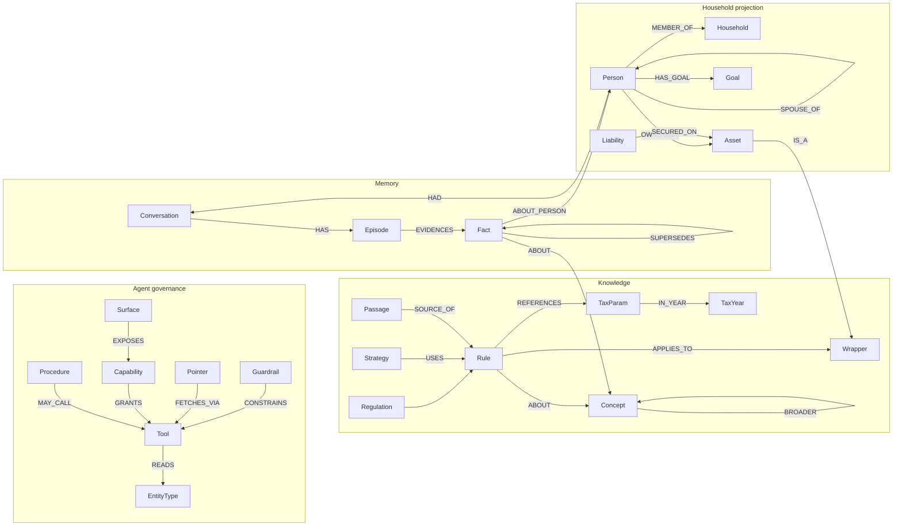

# Neo4j, vector storage and a knowledge layer for Fyn — research and recommendation

**Date:** 2026-09-24
**Implementation plan:** `docs/superpowers/plans/2026-09-24-fyn-typed-memory-and-dense-recall.md` (typed memory + Option 5 dense recall). Learning switched back **off** in production at 16:41 (spec section 10).

**Status:** Research, revised twice on 2026-09-24. Nothing in the architecture is built or decided until CSJ rules on section 12. Two operational fixes from this research are done (section 5.6): the episode leak is fixed (PR #937) and learning is on in production.
**Scope:** whether and how to bring Neo4j (graph + vector) into Fynla so the agents have better access to data and so memory stops living in separate files and tables.

Codebase facts in this document cite `file:line` on `dev` at `412cd5a0e`. External facts cite a URL in section 14. Anything we could not confirm is marked **UNCONFIRMED**.

---

## 1. The short answer

1. **There is no MIT-licensed Neo4j database.** Neo4j Community Edition is **GPLv3**. Enterprise Edition is a closed commercial licence. The MIT-licensed items around Neo4j are clients and tools only: the PHP client, the Labs MCP servers and Microsoft GraphRAG. The nearest MIT-licensed graph database is the Kuzu line. Kuzu itself was archived after Apple bought it in October 2025; its fork LadybugDB is MIT and active.
2. **GPLv3 does not stop us.** Running Community Edition on our own servers for a SaaS product is not "distribution", so copyleft is never triggered. Only the AGPL has a network clause. The real limits of Community are features: one database, no role-based access control, no clustering and no online backup.
3. **Neo4j cannot run on our current hosting.** It needs a long-running Java process. SiteGround shared hosting cannot run one, and it blocks outbound port 7687 (Bolt). The workable route is **Neo4j AuraDB in the London region**, reached from PHP over the **HTTPS Query API on port 443**.
4. **Neo4j is a graph database with a vector index, not a pure vector database.** That matters. Most of what we would put in it (tax rule structure, FCA rules, agent rules, permissions, ownership, household links) is *relational and exact*. It belongs in graph structure, not in embeddings. Vectors are only for *finding* the right text or memory by meaning.
5. **Option 2, "vectorise everything", should not be done.** Embeddings are lossy and approximate by design. Vector search returns *similar* rows, not *correct* ones. Figures would come back wrong or from the wrong person, erasure would get harder, and every personal record we embed is a new copy of personal data. Its goal, "the agent sees everything relevant for this user", is right. It is better reached a different way (see Option 3).
6. **Recommendation: Option 3, a hybrid.** It is your Option 1 plus a structured (not vectorised) read-only graph projection of each household's data. Concretely:
   - **MySQL stays the single source of truth** for user data and money.
   - **One Neo4j graph** holds four subgraphs: Knowledge, Agent governance, Memory, and a Household projection rebuilt from MySQL.
   - **Vectors live only on text:** rule passages, house views, memory facts and conversation episodes.
   - **Figures always come from deterministic tools**, never from retrieval.
7. **What it would replace.** It would replace the keyword scorers and the file-based memory stores: `fyn-memory/semantic/`, `fyn-memory/episodic/episodes/` and `storage/app/memory/semantic-user/`. The live memory described in 5.2 (known facts, conversation summaries, where the user is) keeps working throughout; only its retrieval would move into the graph. It does **not** replace the per-message episode blobs or the `ai_audit_events` hash chain. Those are the regulatory audit trail, not memory, and must stay as they are.
8. **The learning layer is not running on production today, and that is not an architecture problem** (section 5.3). It is built and passed its end-to-end test on csjones on 2026-06-15. On production it is switched off, nobody has worked the review queue on either server (206 facts have waited up to three months on csjones), and the episodic rubric was never authored. A graph would not change any of those three things. They can be fixed now, whatever is decided about Neo4j. This check also found a **live defect**: test output was shipped to production as user memory (section 5.4). **Update 08:35:** the defect is fixed and learning is switched on in production (section 5.6). The review queue owner and the episode rubric are still open, and until both are settled no learned fact reaches a prompt.

---

## 2. Terms, so the options compare fairly

| Store | What it is good at | What it is bad at |
|---|---|---|
| **Relational (MySQL, today)** | Exact values, transactions, constraints, sums, "this user's rows" | Many-hop relationships ("which rules affect a spouse's ISA held in trust?"), meaning-based search |
| **Graph (Neo4j nodes and relationships)** | Relationships as first-class data: ownership, household, rule X *depends on* allowance Y, fact A *supersedes* fact B. Traversal in a single query. | Heavy aggregation over large tables; it is not a ledger |
| **Vector index (embeddings + nearest-neighbour search)** | "Find text that *means* something like this question", for fuzzy recall of rules, notes and past conversations | Exact numbers, identity, completeness ("all my pensions"), anything where "close" is wrong |

An **embedding** turns a piece of text into a list of about 1,000 numbers. Texts with similar meaning land near each other, and a vector index finds the nearest ones quickly (Neo4j uses Lucene HNSW, which is approximate). Turning the row "DC pension, Aviva, £42,318" into numbers does not let anyone read £42,318 back reliably. It only lets you find that row when someone asks about "my Aviva pension".

**Neo4j gives us both graph and vector in one engine.** That is its real advantage over a pure vector store such as Qdrant or pgvector alone. The graph carries the exact structure, and the vector index sits on the text properties of chosen nodes.

---

## 3. Neo4j licensing — the MIT question in full

| Component | Licence | Notes |
|---|---|---|
| Neo4j Community Edition (current 2026.09) | **GPLv3** | Repo `neo4j/neo4j` LICENSE.txt and README |
| Neo4j Enterprise Edition | **Commercial, closed source** | Since 3.5 (late 2018). Before that it was AGPLv3; 3.4 briefly added the Commons Clause (source of the Neo4j v. PureThink/Suhy litigation) |
| Neo4j Desktop | Free, bundles an Enterprise **developer** licence for one machine | Not for production |
| AuraDB (console.neo4j.io) | Hosted service under Neo4j's terms | No licence to manage, we pay per GB |
| Official drivers | Apache 2.0 | |
| `laudis/neo4j-php-client` | **MIT** | Community PHP client. v3.6.1 (2026-09-22), actively maintained |
| APOC core | Apache 2.0 | |
| Graph Data Science | OpenGDS is GPLv3; Enterprise adds closed parts | We do not need it at first |
| `neo4j-graphrag-python`, LLM Knowledge Graph Builder | Apache 2.0 | Python only |
| Labs MCP servers (`mcp-neo4j-cypher`, `mcp-neo4j-memory`) | **MIT** | "Not supported by the Neo4j product team" |
| Official `neo4j/mcp` server | GPLv3 | |
| Kuzu (embedded graph) | MIT | **Archived 2025-10-10** after Apple bought it |
| LadybugDB (Kuzu fork) | MIT | Active (v0.20.4, 2026-09-10). Embedded, so it would run inside a Python or C++ process we do not have on SiteGround |

**What GPLv3 means for us.** The GNU FAQ says the GPL only requires source release when you release the modified program to the public. Serving it over a network is not a release; that is the AGPL's extra clause. So:

- Running Community Edition, modified or not, on a server we control and talking to it over Bolt or HTTP creates **no obligation**. Our Laravel code is not a derivative work, because it speaks a protocol.
- Shipping Neo4j inside something we distribute (an on-device iOS database, a downloadable app) **would** trigger GPLv3 for that work. The native iOS app only calls our API, so it is unaffected.
- This is a reading of the licence, not legal advice.

**Versioning.** Neo4j moved to calendar versions in January 2025 (2025.01 onwards). 5.26 is the last 5.x line, supported until June 2028. Each calendar release is supported only until the next one ships.

---

## 4. Constraints that shape every option

### 4.1 Hosting

| Fact | Consequence |
|---|---|
| Production (fynla.org) and dev (csjones.co) run on SiteGround. Dev is confirmed as **shared** hosting. **UNCONFIRMED:** whether production is shared or a SiteGround Cloud plan. | Shared hosting cannot run a JVM or any other daemon, so no self-hosted Neo4j, Qdrant or Python sidecar on the box |
| SiteGround shared hosting allows outbound TCP 21, 25, 80, 110, 143, 443, 465, 587, 993, 995, 18765, 2525, 3306, 5432, 30000. **7687 is not in the list.** Custom ports can be opened only on Cloud plans. | Bolt (7687) to Aura is blocked. The **Query API over HTTPS 443 works**. |
| `laudis/neo4j-php-client` **removed its HTTP driver in v3.3.0** (2025-05) | From SiteGround we would call the Query API directly with Laravel's `Http` client. That is a thin wrapper of about 100 lines, not a heavy dependency. |
| Query API v2 always answers **HTTP 202, including on query errors** (the error is in the JSON body) | The wrapper must check the body, never the status code. Anyone writing it needs to know this. |
| Python tools (Graphiti, neo4j-graphrag, the MCP servers) need a process host | Adopting them means a separate small VM or container host. That changes our data-processing footprint and needs its own DPIA line. Section 9 recommends copying Graphiti's *data model* in PHP instead. |

### 4.2 MySQL cannot do the vector part itself

MySQL 9 Community has a `VECTOR` column type, but **no distance function and no vector index**. `DISTANCE()` exists only in HeatWave/MySQL AI. SiteGround runs MySQL 8 and controls upgrades. So "keep it all in MySQL" gives us no similarity search. MariaDB 11.7+ has one, but SiteGround does not offer MariaDB.

### 4.3 Embeddings provider

**xAI has no public embeddings API.** Fyn chats on `grok-4.3` (`config/services.php:40-50`), so embeddings need a second provider:

| Provider | Model | Dims | Price per 1M tokens | Note |
|---|---|---|---|---|
| Voyage AI | voyage-4 / voyage-4-lite / voyage-4-large | 1024 (256–2048) | $0.06 / $0.02 / $0.12, first 200M tokens free | Anthropic's recommended embeddings partner. Owned by MongoDB since February 2024. Has `voyage-finance-2` and rerankers. Zero-day retention is available as an opt-out (admin, payment method on file). Processing region **UNCONFIRMED** |
| OpenAI | text-embedding-3-small / -large | 1536 / 3072 (reducible) | ~$0.02 / ~$0.13 | `gb.api.openai.com` stores data at rest in the UK, but **embeddings are processed in the US, EEA or UAE** |
| Cohere | embed-v4.0 | 256–1536 | ~$0.12 (secondary source, **UNCONFIRMED**) | Available through AWS/Azure/Oracle marketplaces, possibly in UK regions |
| Local open weights | voyage-4-nano, bge-m3, nomic-embed, Qwen3-Embedding | varies | Compute only | Needs a host we do not have |

At Fynla's volume the cost is negligible either way. Embedding the whole knowledge corpus is well under a million tokens, a few pence. **The deciding factor is where personal data is processed, not price.** Voyage's residency terms are **UNCONFIRMED** and must be checked before anything personal is embedded.

### 4.4 Regulation and data protection

- **Embeddings of personal data are personal data.** Inversion attacks (vec2text) recover 92% of 32-token inputs exactly, including names. OWASP LLM08:2025 lists cross-tenant leakage and inversion as the top risks for vector stores.
- **Right to erasure (UK GDPR Article 17)** must reach every embedding, extracted fact and summary, within one month. The Aura data processing addendum allows **up to 180 days** to delete data after contract end. Aura backups are kept 7 days (Professional), 30 days (Business Critical) or 60 days (Virtual Dedicated Cloud), so retention policy and privacy notice need updating. A June 2026 paper shows soft-deleted HNSW vectors can stay recoverable from index files until compaction.
- **Aura London:** available on AWS eu-west-2, Azure uksouth and GCP europe-west2, on Professional and above. The DPA includes the 2021 EU Standard Contractual Clauses and the UK International Data Transfer Addendum. ISO 27001:2022, SOC 2 Type II. The regions page lists London for Professional, Business Critical and Virtual Dedicated Cloud only; **Free is not listed**, so assume Free is not in London.
- A DPIA is needed before personal data goes to either Aura or the embeddings provider. Both are new sub-processors.

---

## 5. What Fynla has today — verified against code, production and csjones

**Correction (revised the same morning).** The first version of this section repeated a sub-agent's code map without checking it. It said "much of the memory machinery is empty, switched off or does nothing". That lumped together different stores and was not checked against a running server. Everything below was checked on 2026-09-24:

- in the code (`dev` at `412cd5a0e`);
- on **production** (fynla.org), read-only, through the ssh MCP;
- on **csjones**, read-only, over plain ssh.

The commands and raw results are in section 15.

### 5.1 Two kinds of memory, with different status

Fyn's memory has two separate jobs, and they are in very different states:

- **A. Knowing the user and where they are, within and across conversations.** This is live on production and working.
- **B. Learning over time: durable facts and episodes that build up as the user uses Fynla.** This is built and was verified end-to-end on csjones on 2026-06-15. On production it is **not running**. The approval step has never been run on either server. The episode store on production holds only test output, which is a live defect (5.4).

### 5.2 A. Live on production and working

| What Fyn knows | Mechanism (code) | Production evidence |
|---|---|---|
| **Where the user is.** Onboarding step, active campaign, paused and resumed flows | `users.onboarding_fyn_step` and `users.active_campaign`, read by the dispatch predicate in `AiChatController::sendMessage` (`AiChatController.php:265-273`). `ResumptionService` (`app/Services/AI/Loop/ResumptionService.php`) plus the resumption fields on `ai_conversations` | Live; this is the routing every turn depends on |
| **Facts about the user** (`<known_facts>`) | `MemoryRetrieverService::retrieve()` (`app/Services/AI/MemoryRetrieverService.php:75-89`) merges four layers: (1) the authoritative database (`fromAuthoritativeDb`), (2) `ai_conversations.onboarding_parked_facts`, (3) re-extraction from the current conversation (onboarding routes only), (4) the conversation index (`fromConversationIndex`, `:264`). Rendered by `renderKnownFactsBlock()` (`:316`) and injected at `FynContextAssembler.php:89-92` | `<known_facts>` appears in **109 of 109** stored assembled contexts. 13 conversations carry parked facts |
| **What was said before** (cross-conversation) | `ConversationSummariser` (xAI `grok-4.3`) fills `summary`, `topics`, `entities_mentioned`, `intents_stated` on `ai_conversations`. It runs every 30 minutes and after a 3-minute idle (`app/Console/Kernel.php`). Read back through `fromConversationIndex` (the last 5 summarised conversations) and the `search_conversation_index` tool (`CoordinatingAgent.php:1191`, a `whereJsonContains` search over topics and entities) | 77 of 307 conversations summarised; last summary 2026-09-23 17:30 |
| **This conversation** | The last 20 messages go in verbatim (`HasAiChat.php:98` `MAX_HISTORY_MESSAGES = 20`, `:1791`) | Live |
| **Strategy knowledge** (`<knowledge>`) | 20 `fyn-memory/semantic/house_view/*.md`, ranked by keyword overlap in `SemanticRetriever::retrieve()` (`:52`) | `<knowledge>` in 55 of 109 contexts |
| **Procedures** (`<procedures>`) | `fyn-memory/procedural/recommendation-routing.md`, relevance-filtered (`FynContextAssembler.php:100-113`) | In 4 of 109 contexts |
| **Live data prefetch** (`<live_data>`) | 9 pointers in `fyn-memory/procedural/pointers/` (the folder has 11 files including `README.md` and `_TEMPLATE.md`). Matched by substring in `PointerRegistry::matchPrefetch()` (`:60`) and also exposed as `fetch_*` tools | In 13 of 109 contexts |
| **Tool catalogue** | 52 Anthropic + 47 xAI tool-schema files, 2 overlays, 1 onboarding workflow under `fyn-memory/procedural/` | Live |
| **Audit trail** (not memory) | Per-message blobs written by `EpisodeBlobWriter` (`HasAiChat.php:1566`), with `ai_messages.blob_md_path/sha256` and the `ai_audit_events` hash chain. Read only by `AiAuditController` and `EpisodeProjection` (the audit view) and the erase path, never by a prompt | 207 blob files; 201 messages with a blob |

### 5.3 B. The learning layer: built, verified once on csjones, not running on production

The learning path is **CoALA Phase 6**, landed on `dev` as PR #554 on 2026-06-15. On that day the complete loop was verified on csjones with real xAI:

1. A transcript was summarised.
2. `ProposedFactSynthesiser` extracted "retire at 60" and "cautious / low-risk".
3. The facts were staged in `proposed_semantic_facts`.
4. They were approved in the admin UI (`/admin/proposed-facts`).
5. They were written to john's per-user store (`UserSemanticStore`).
6. They reappeared in the next turn through `SemanticRetriever::retrieveForUser()` (`FynContextAssembler.php:119`).

**That report was accurate for that day on csjones.** What is true now:

| Link in the learning chain | Code | Production | csjones |
|---|---|---|---|
| Master switch `FYN_LEARNING_ENABLED` | `config/fyn.php:68`, default `false`. It gates `ConversationSummariser::emitProposedFacts()` (`ConversationSummariser.php:98`) and `FynLoop::stageProposedFact()` / `stageProcedureAmendment()` (`FynLoop.php:362, 390`) | **Not set in `.env`, so false** | `true` |
| Facts staged for review | `proposed_semantic_facts` | **0 rows** | **206 pending**, oldest from June, last staged 2026-09-16. **0 approved, 0 rejected** |
| Approved facts that reach the prompt | `storage/app/memory/semantic-user/{id}/` via `SemanticFactPromoter::approve()` | **0 files** | **0 files** (john's June facts are no longer there) |
| Episodes the planner decides to record | `FynLoop::run()` calls the planner on **every advice turn** (`FynLoop.php:217-220`). A `learn` action with `store=episodic` writes through `FynMemoryStore::writeEpisode()` (`FynLoop.php:344`). This path is **not** flag-gated | Planner decisions on production: 22 reason, 15 ground, 5 no_action, **8 learn, all on 2026-06-25 within 32 seconds, with no user or conversation id**, which fits a scripted run rather than users. **No real user turn has ever produced an episode** |
| The rubric that tells the planner *when* to record | `fyn-memory/episodic/RUBRIC.md`, `version: 0`, `status: draft`. `FynMemoryStore::rubric()` returns `''` while it is a draft (`FynMemoryStore.php:138-150`), so the planner never sees it | Draft | Draft |
| Episodes recalled into the prompt (`<remembered>`) | `recallContext()` is called **unconditionally** for every user in the advice context (`FynContextAssembler.php:114-117`) and the planner prompt (`FynLoop.php:319-330`) | `<remembered>` in **0 of 109** contexts | — |
| Session-end consolidation ("the session is the episode") | Deliberately deferred on 2026-06-15 (Phase 6 memory note) | Not built | Not built |

So the accurate statement is: **the pipeline for Fyn improving as the user uses the system exists and passed its end-to-end test, but it is not producing anything for users.** There are three concrete reasons:

1. Learning is off on production.
2. No one has worked the review queue. The 206 facts on csjones have waited up to three months.
3. The episodic rubric has never been authored, so the planner has no instruction for when to record an episode.

### 5.4 Live defect found during this check: test output shipped to production as user memory

- **What:** production has **432 episode files in 129 user folders**. Every one of them says only `cycle 1 learn` or `cycle 2 learn` (216 each, checked across all files). They were written between June and 2026-09-15.
- **Cause:**
  - `tests/Feature/Fyn/Learning/FailureContextTest.php:55-72` fakes two planner `learn` actions with payload `summary: 'cycle 1 learn'` / `'cycle 2 learn'`. It does **not** redirect `fyn.memory.episodic_path`, unlike `tests/Feature/Fyn/FynLoopPlannerTest.php:108`, which does. So each local test run writes into the real `fyn-memory/episodic/episodes/`.
  - The production deploy rsyncs the whole `fyn-memory/` folder (`deploy/DEPLOY.md:100`). The episodes folder is gitignored but not excluded from rsync, so the test output is copied to production.
- **Impact:**
  - 125 of the 129 folders belong to user ids that do not exist on production (maximum id 747).
  - **4 belong to real production users: 608, 609, 615 and 668.** On their next advice turn, `recallContext()` would inject `<remembered>## What I remember about you - cycle 2 learn - cycle 1 learn</remembered>` into both the answer prompt and the planner prompt. None of the 109 stored contexts shows it yet, which suggests those users have not chatted since the files arrived.
  - The same thing happens locally and on csjones.
- **Fix (applied 2026-09-24, see 5.6):**
  1. Redirect `fyn.memory.episodic_path` to a temp directory in `FailureContextTest` (one line, as `FynLoopPlannerTest` already does).
  2. Exclude `fyn-memory/episodic/episodes/` from the deploy rsync.
  3. Delete the test-output files on production, csjones and local.
  4. Add a regression test asserting that no test writes under the real `fyn-memory/`.

### 5.5 Other facts the rest of this document relies on (each checked)

| Claim | Evidence |
|---|---|
| No embedding, vector, graph or search-engine code anywhere | `grep` over `app`, `config`, `composer.json`, `package.json`, `routes`: the only hits are comments saying dense embeddings are deferred (`SemanticRetriever.php:10`, `FynSemanticReindex.php:14,21`) |
| Dense embeddings deferred by CSJ until ~500 concurrent users | `AppServiceProvider.php:169-174`, `RecallScorer.php:7-9`; `RecallScorer` bound to `SparseRecallScorer` |
| Chat models | `config/services.php`: xAI `grok-4.3` (chat, advanced, vision); Anthropic `claude-haiku-4-5-20251001` / `claude-sonnet-4-6-20260320`. Production `.env`: `AI_PROVIDER=xai` |
| FCA text lives in PHP, and the knowledge slots for it are empty | `FynSystemPrompt.php` `<regulatory_compliance>` (from `:126`), `<fca_signposting>` (from `:209`). `fyn-memory/semantic/{fca,tax,allowance,product}/` contain nothing |
| Tax values | `app/Services/TaxConfigService.php` (909 lines) over `tax_configurations.config_data` JSON |
| Tools are scoped by the authenticated user, not by a policy layer | `CoordinatingAgent::executeTool(..., User $user, ...)` (`app/Agents/CoordinatingAgent.php:933`). `HasJointOwnership::scopeForUserOrJoint` (`app/Traits/HasJointOwnership.php:20-26`). Joint-owner writes checked with `hasReciprocalSpouseLink` (`:1339`). **No `app/Policies` directory** |
| `list_records` covers 15 entity types | `fyn-memory/procedural/tool_schema/analysis/list_records.md:19-35` |
| Six recommendation rule tables | `*_action_definitions` migrations for retirement, investment, protection, tax, savings, estate |
| Write tools stripped from Advice Fyn | `AdviceFyn::WRITE_TOOLS` (`AdviceFyn.php:170`, applied `:850`); `app/Services/AI/Ground/GroundGate.php` |
| Households | **Correction:** the sub-agent said nothing creates a household. That is wrong. `HouseholdProvisioner::ensureFor()` (`app/Services/Onboarding/HouseholdProvisioner.php:31`) creates one during Fyn onboarding and spouse linking (used by `OnboardingChatDirector`, `SpouseLinkingService`, `CoordinatingAgent`). On production, **10 of 71 real users** have a `household_id` (13 households), and 4 linked users share one with their spouse. No query in `app/` filters by `household_id`; household-level logic runs on `spouse_id` + `joint_owner_id` (`HouseholdPooling`) |
| Production size | **82 users, 71 non-preview** (the first version said "about 700", which was the highest user id, not the number of accounts); 307 conversations; 1,070 messages |

### 5.6 Done on 2026-09-24 after CSJ's go-ahead

| Action | Evidence |
|---|---|
| Tests can no longer write memory into the real folders | `tests/Pest.php` global hook points `fyn.memory.episodic_path` and `fyn.memory.user_semantic_path` at a per-test temp dir. `PestHooksLivenessTest` pins it. Before the fix, `FailureContextTest` wrote 4 files into `fyn-memory/episodic/episodes/`; after it, 0. Every suite touching memory paths: 759 passed, 3 skipped. PR #937 merged into `dev` (`67ca3793f`); csjones pulled |
| The deploy no longer copies episodes | `deploy/DEPLOY.md` step 6 and the release skill: rsync with `--exclude 'fyn-memory/episodic/episodes/'` |
| Test output removed | Production: all 432 files deleted (only files whose summary line was exactly `cycle 1 learn` / `cycle 2 learn`), 0 remain. Local: 414 deleted. csjones had none (it deploys by `git pull`, and the folder is gitignored) |
| Learning switched on in production | `FYN_LEARNING_ENABLED=true` appended to production `.env` (backup at `.env.bak-2026-09-24-learning`). `config:cache` rerun. `config('fyn.learning_enabled')` returns `true`, and the DB username is not the `forge` fallback |

**What turning learning on does, and does not, do yet:**
- **Does:** the next time `ai:conversations:summarise-stale` (every 30 minutes) summarises a conversation with new messages, `ProposedFactSynthesiser` makes one extra `grok-4.3` call and stages figure-free facts in `proposed_semantic_facts` as `pending`. Planner `learn` actions for the semantic and procedural stores are no longer dropped.
- **Does not, until CSJ acts:**
  1. **Nothing reaches a prompt until someone approves facts** at `/admin/proposed-facts`. That is the current design (Phase 6 invariant: nothing auto-applies). A reviewer must be named, or the approval policy changed.
  2. **Episodes will still not be recorded** until `fyn-memory/episodic/RUBRIC.md` is authored (owner: CSJ) and bumped past `version: 0`.
- **Not yet observed:** no conversation has been re-summarised since the switch, so no production fact has been staged yet. The first staging run is the proof. **I COULD NOT TEST THIS end-to-end on production yet.**

**What the agent actually lacks today** is not raw data access. The tools reach all of a user's data exactly. What it lacks is:

1. **Meaning-based recall.** A question worded differently from the stored text misses under keyword overlap.
2. **A connected model of the domain.** Rules, allowances, products, strategies and the user's situation are joined only in prompt prose and PHP.
3. **A learning layer that is actually running** (5.3). That is an operational gap, three switches and a review queue, before it is an architecture gap. **A graph does not fix it by itself.** Whatever store holds memory, facts still need a switch, a review policy and an authored rubric.
4. **One governed home for rules.** FCA text is scattered across PHP constants, which is directly a Rule 20 problem.

---

## 6. The options

### Option 1 (yours): knowledge and ontology layer in the graph, user data stays in SQL

Graph holds: compliance and FCA rules, tax *rule structure*, agent rules and procedures, tool catalogue, memory, access permissions. User data stays in MySQL and is reached through the existing tools.

- **For:** it is where a graph earns its keep. It gives one governed home for rules (Rule 20), and memory gets meaning-based recall. The regulated financial data never leaves MySQL, so the DPIA is small.
- **Against:** the agent still cannot traverse *from* a rule *to* the user's situation in one step. It has to call a tool, get JSON back, and reason across the two. Permissions in the graph would also be documentation, not enforcement, because enforcement stays in PHP. That is correct, but it has to be said.
- **One correction to the framing:** tax *values* must not be copied into the graph. Rule 2 makes `TaxConfigService` the only home. The graph should hold tax *structure* ("Personal Savings Allowance depends on income band; interacts with the starting rate for savings"), with each node carrying a `configKey` **pointer** into `TaxConfigService` (for example `savings.personal_savings_allowance.basic`). This is the same "pointers, not copies" principle `fyn-memory/README.md` already follows.

### Option 2 (yours): vectorise the whole database

Every row in every user table becomes text, gets embedded and goes into the vector store. The agent retrieves "relevant" rows by similarity and the current memory architecture is switched off.

**Not recommended.** Reasons, in order of severity:

1. **Correctness.** Nearest-neighbour search is approximate and ranks by *similarity*. "What are my pensions?" is a completeness question. Top-k retrieval can silently miss the third pension, and nothing tells you it missed. Money questions need exact queries: sums, ownership shares under Rule 6, tax via `TaxConfigService`. Similarity has no notion of "all" or of "exactly".
2. **Wrong-person leakage.** Isolation becomes a filter on every vector query. One missing filter shows another household's data. OWASP LLM08 names this as the headline vector-store risk. With joint assets (Rule 6) the tenant is a *household relation*, not a `user_id` column, so the filter itself is complex.
3. **Two sources of truth.** Every write in 343 migrations' worth of tables must re-embed, and there is always a lag. The agent would answer from a stale copy while the dashboard shows the new figure. Fynla has repeatedly paid for "correct in one layer, wrong on screen" (see the `data-integrity-traps` skill).
4. **Erasure and exposure.** Every personal row gets a second, invertible copy at a new sub-processor, with its own backup retention.
5. **It does not actually replace memory.** Memory is what was *said and learned*: preferences, stated intentions, corrected facts, past advice. None of that lives in the user tables. Switching off memory and vectorising the tables loses it.

The good part of Option 2 is the aim: *the agent sees everything relevant about this user at login*. Option 3 keeps that aim and does it with structure, not similarity.

### Option 3 (recommended): hybrid — knowledge graph + memory graph + read-only household projection

Option 1, plus a **structured projection** of each household's data into the graph:

- Person, Household, Asset, Policy, Liability, Goal and similar nodes carry the key facts (type, provider, current value, ownership share) and the `mysqlId`.
- Relationships carry the structure: `OWNS {share}`, `SPOUSE_OF`, `HELD_IN_TRUST`, `SECURED_ON`, `BENEFICIARY_OF`.
- The projection is **rebuilt from MySQL by events**, never written by the agent and never the source of truth.
- **Nothing on user-data nodes is embedded.** Vectors sit only on text: rule passages, house views, memory facts and episode summaries.

This lets one query answer "which rules, strategies and past conversations are relevant to *this* household's actual shape?":

```cypher
// household -> assets it holds -> the wrappers they are -> rules governing those wrappers -> strategies using those rules
MATCH (h:Household {id: $hh})<-[:MEMBER_OF]-(p:Person)-[o:OWNS]->(a:Asset)-[:IS_A]->(w:Wrapper)
MATCH (w)<-[:APPLIES_TO]-(r:Rule)<-[:USES]-(s:Strategy)
RETURN s.key, collect(DISTINCT r.key), collect(DISTINCT a.mysqlId)
```

Every figure the agent quotes still comes from a deterministic tool reading MySQL. The graph says *what is relevant*, SQL says *what the number is*.

- **For:** it meets both of your goals, keeps Rule 2 and Rule 6 intact, the graph is disposable (rebuild from MySQL at any time), and there are no personal embeddings from user tables.
- **Against:** a sync pipeline to build and watch (an outbox table plus a queued job). It adds personal data at Aura (structured, not embedded), so a DPIA is needed. A second system is in the request path.

### Option 4: Postgres + pgvector + Apache AGE instead of Neo4j

Same shape as Option 3, but on managed Postgres (pgvector for vectors, AGE for Cypher-style graph queries). Both have permissive licences, and outbound 5432 is open from SiteGround.

- **For:** permissive licences, a plain SQL mental model, row-level security for tenancy, and many managed providers with UK regions.
- **Against:** AGE's openCypher is less complete than Neo4j's. Mixing AGE and pgvector in one query is awkward. There is no GenAI ecosystem around it (Graphiti, neo4j-graphrag, MCP). SiteGround's own Postgres version and pgvector support are **UNCONFIRMED**.
- **When to choose it:** if CSJ wants zero GPL or commercial-licence exposure, or a cheaper managed database than Aura.

### Option 5: do the minimum now, no new database

Implement the deferred dense `RecallScorer` (`AppServiceProvider.php:171`) with Voyage embeddings stored as JSON/BLOB in MySQL, and brute-force cosine similarity in PHP. The whole knowledge corpus is 20 house views plus FCA text still to write. A few thousand vectors per request is milliseconds in PHP.

- **For:** days, not weeks. No new vendor except the embeddings API. It proves whether meaning-based recall actually improves Fyn answers before anything else is paid for.
- **Against:** no graph, so no ontology or traversal. Brute force stops being cheap somewhere around 50k–100k vectors (per-user episodes at scale).
- **Where it fits:** it can be **Phase 1 of Option 3**, because the retrieval interfaces it adds are the same ones the graph would later implement.

### Option 6: Neo4j as a Fyn tool over MCP / text-to-Cypher

Let the LLM write Cypher against the graph (`mcp-neo4j-cypher`, neo4j-graphrag Text2Cypher).

**Rejected for user data.** Generated Cypher is "not guaranteed to be syntactically correct" (Neo4j's own docs), the official MCP server's read-only mode can be bypassed by misclassified procedures, and the Labs server executes writes. Tenant scoping would depend on the model remembering a `WHERE`. It also breaks the Advice Fyn read-only contract (fyn-architecture skill) unless every query is policed. The acceptable form is **fixed, parameterised Cypher behind named tools**, with `$tenantId` bound server-side from the authenticated user. That is how Option 3 would expose it.

### Comparison

| | Opt 1 | Opt 2 | **Opt 3** | Opt 4 | Opt 5 |
|---|---|---|---|---|---|
| Better recall by meaning | Yes | Yes | **Yes** | Yes | Yes |
| Ontology / one home for rules (Rule 20) | Yes | No | **Yes** | Partial | No |
| Agent sees household shape without a tool call | No | Approximately | **Yes, exactly** | Yes | No |
| Figures stay exact (Rules 2, 6) | Yes | **No** | **Yes** | Yes | Yes |
| Personal embeddings created | Memory only | **All data** | Memory only | Memory only | Memory only |
| Replaces `fyn-memory/` + scorers | Yes | Claimed, not really | **Yes** | Yes | Partly |
| New vendors | Aura + embeddings | Aura + embeddings | Aura + embeddings | Postgres host + embeddings | Embeddings only |
| Build effort (rough) | M | L | **L** | L | S |

---

## 7. Recommended graph structure

One Neo4j database. Community and Aura Professional have no multiple databases, so tenancy is enforced by a mandatory `tenantId` on every personal node, bound from the authenticated user in PHP.

Four subgraphs, by who writes them:

| Subgraph | Written by | Personal data? | Vectors? |
|---|---|---|---|
| **A. Knowledge** (regulation, tax structure, products, strategies) | CSJ / compliance, from reviewed markdown in git, loaded at deploy | No | Yes, on passages |
| **B. Agent governance** (procedures, tools, pointers, capabilities, surfaces) | Git corpus, loaded at deploy | No | Yes, on procedure text |
| **C. Memory** (conversations, episodes, facts, preferences) | Fyn, through the gated learning pipeline | **Yes** | Yes, on facts and episode summaries |
| **D. Household projection** (people, assets, policies, goals and their links) | Sync job from MySQL only | **Yes** | **No** |

### 7.1 Diagram



### 7.2 Subgraph A — Knowledge

| Label | Key properties | Notes |
|---|---|---|
| `Regulation` | `key` (e.g. `fca.cobs.9a`, `fca.consumer_duty`, `fca.ps25_22`), `title`, `source_url`, `effective_from`, `effective_to` | The legal source |
| `Rule` | `key`, `kind` (`boundary`, `disclosure`, `eligibility`, `limit`, `interaction`), `statement` (plain English), `effective_from/to`, `version`, `reviewed_by`, `reviewed_at` | One enforceable statement. The unit Fyn cites |
| `Passage` | `id`, `text`, `embedding` (vector index), `source_ref` | Chunked source text. The only vector-bearing node in A |
| `TaxYear` | `key` (`2026/27`), `is_active` | Mirrors `tax_configurations.tax_year` |
| `TaxParam` | `key`, `configKey` (dot path into `TaxConfigService`), `unit` (`gbp`, `percent`, `years`) | **No value property.** Pointer only (Rule 2) |
| `Wrapper` | `key` (`isa.stocks_shares`, `isa.lifetime`, `pension.sipp`, `pension.db`, `gia`, `cash.easy_access`, `bond.onshore`...), `joint_allowed` (false for ISAs, per Rule 6) | Product types, not providers |
| `Concept` | `key`, `label`, `aliases`, `embedding` | Vocabulary: "tax relief", "carry forward", "pension freedom". Stops two names for one thing |
| `Strategy` | `key` (matches `fyn-memory/semantic/house_view/*.md` and the `*_action_definitions.key`), `summary`, `embedding`, `module` | Today's 20 house views |
| `ActionDefinition` | `key`, `module`, `claim_tier` | Pointer to the six `*_action_definitions` tables. Rows stay in MySQL |

Relationships: `(:Regulation)-[:CONTAINS]->(:Rule)`, `(:Rule)-[:APPLIES_TO]->(:Wrapper|Concept)`, `(:Rule)-[:REFERENCES]->(:TaxParam)`, `(:Rule)-[:INTERACTS_WITH {how}]->(:Rule)`, `(:Rule)-[:REQUIRES_FACT {field}]->(:EntityType)`, `(:Strategy)-[:USES]->(:Rule)`, `(:Strategy)-[:IMPLEMENTED_BY]->(:ActionDefinition)`, `(:Passage)-[:SOURCE_OF]->(:Rule)`, `(:Concept)-[:BROADER]->(:Concept)`, `(:TaxParam)-[:IN_YEAR]->(:TaxYear)`.

**Where it comes from:** the empty `fyn-memory/semantic/fca|tax|allowance|product/` folders get filled as reviewed markdown in git, and a deploy-time loader (successor to `fyn:semantic:reindex`) upserts them. Git remains the review and audit trail for rules. The graph is the runtime index.

### 7.3 Subgraph B — Agent governance

| Label | Key properties | Replaces |
|---|---|---|
| `Procedure` | `key`, `kind` (`system_prompt_overlay`, `workflow`, `fca_block`, `routing`), `version`, `body`, `embedding`, `triggers` | `fyn-memory/procedural/*`, `FynMemoryStore::procedures()`, `ProceduralCorpusLoader` |
| `Tool` | `name`, `writes` (bool), `provider_schemas` (Anthropic + xAI JSON) | The 99 tool-schema markdown files |
| `Pointer` | `key`, `triggers`, `embedding` | `procedural/pointers/*` and substring `matchPrefetch()`. Matching becomes vector + keyword hybrid |
| `Capability` | `key` (`advice.read`, `capture.write`, `preview.read_only`, `billing.read`) | Makes the write-tool strip in `AdviceFyn::WRITE_TOOLS` data-driven |
| `Surface` | `key` (`web`, `m`, `native`) | Rule 20: one definition, all surfaces |
| `Guardrail` | `key`, `kind` (`banned_term`, `acronym`, `tier_gate`, `kyc_gate`), `pattern` | `StructuredResponseValidator` lists, tier gates |
| `EntityType` | `key` (`dc_pension`, `property`...), `table`, `store_class` | Links tools and rules to the MySQL tables they read |

**Important boundary:** these nodes *describe* permissions for the prompt and for audit. **Enforcement stays in PHP**: `GroundGate`, the authenticated `User` passed to `CoordinatingAgent::executeTool` (`app/Agents/CoordinatingAgent.php:933`), and the query scopes. A graph read failing must never widen access. It must fall back to the current PHP lists.

### 7.4 Subgraph C — Memory (bitemporal, modelled on Graphiti)

Graphiti's model is the best-documented design for agent memory. We copy the *model* in PHP rather than running its Python service (section 4.1).

| Label | Key properties | Replaces |
|---|---|---|
| `Conversation` | `id` (= `ai_conversations.id`), `tenantId`, `started_at`, `summary`, `summary_embedding` | JSON `topics`/`entities_mentioned` search in `search_conversation_index` |
| `Episode` | `id`, `tenantId`, `conversation_id`, `message_id`, `occurred_at`, `summary`, `embedding`, `blob_sha256` | Planner episodes in `fyn-memory/episodic/episodes/`. `blob_sha256` links to the **retained** audit blob for provenance |
| `Fact` | `id`, `tenantId`, `statement`, `embedding`, `kind` (`preference`, `intention`, `circumstance`, `correction`), `valid_at`, `invalid_at`, `created_at`, `expired_at`, `status` (`proposed`, `approved`, `rejected`), `confidence` | `proposed_semantic_facts`, `UserSemanticStore` files |

Relationships: `(:Person)-[:HAD]->(:Conversation)-[:HAS]->(:Episode)-[:EVIDENCES]->(:Fact)`, `(:Fact)-[:ABOUT_PERSON]->(:Person)`, `(:Fact)-[:ABOUT_ASSET]->(:Asset)`, `(:Fact)-[:ABOUT]->(:Concept)`, `(:Fact)-[:SUPERSEDES]->(:Fact)`.

Rules for this subgraph:

- **Bitemporal.** `valid_at`/`invalid_at` say when it was true in the world; `created_at`/`expired_at` say when we believed it. A contradiction closes the old fact rather than deleting it, so "what did Fyn believe when it said X?" stays answerable. That matters for complaint handling.
- **No money in facts.** This keeps today's rule (`ProposedFactSynthesiser` extracts non-monetary facts only). "Wants to retire at 60" is a fact. "Pension is £42k" is a MySQL row. It is also the fix for the 2026-09-23 known-facts leak (advice questions were mined as facts).
- **Approval gate kept.** `status='proposed'` facts are never recalled until approved, exactly as the current admin review flow. Loosening that is a separate CSJ decision.

### 7.5 Subgraph D — Household projection (structured, no vectors)

| Label | Key properties | MySQL source |
|---|---|---|
| `Household` | `tenantId` (see 7.6), `is_preview` | `households` / `users.household_id`. `HouseholdProvisioner` creates it during Fyn onboarding and spouse linking, but only 10 of 71 real production users have one, so the sync job must fall back to the `users.spouse_id` pair (see 5.5) |
| `Person` | `mysqlUserId` or `familyMemberId`, `tenantId`, `role` (`primary`, `spouse`, `child`, `dependant`), `birth_year`, `is_preview` | `users`, `family_members` |
| `Employment` | `mysqlId`, `kind`, `is_current` | `employments` |
| `Asset` + subtype label (`:Pension:DC`, `:Pension:DB`, `:Property`, `:Savings`, `:Investment`, `:BusinessInterest`, `:Chattel`) | `mysqlId`, `tenantId`, `provider`, `value_gbp`, `as_of` | The 15 entity types `list_records` covers |
| `Policy` (`:Life`, `:CriticalIllness`, `:IncomeProtection`...) | `mysqlId`, `cover_gbp` | protection tables |
| `Liability` (`:Mortgage`, `:Loan`...) | `mysqlId`, `balance_gbp`, `type` (canonical Rule 4 enums) | `mortgages`, `liabilities` |
| `Trust`, `Will`, `LPA`, `Gift`, `Goal`, `LifeEvent` | `mysqlId` + key fields | matching tables |

Relationships: `(:Person)-[:OWNS {share_pct, ownership: 'individual'|'joint'|'tenants_in_common'|'trust'}]->(:Asset)` (Rule 4 enums; **one edge per owner, one asset node**, which is Rule 6 in graph form), `(:Person)-[:SPOUSE_OF]->(:Person)`, `(:Person)-[:MEMBER_OF]->(:Household)`, `(:Asset)-[:IS_A]->(:Wrapper)` (the bridge into Knowledge), `(:Asset)-[:HELD_IN]->(:Trust)`, `(:Mortgage)-[:SECURED_ON]->(:Property)`, `(:Policy)-[:COVERS]->(:Person)`, `(:Person)-[:BENEFICIARY_OF]->(:Will|Trust|Policy)`, `(:Person)-[:HAS_GOAL]->(:Goal)`.

**Values on projection nodes are for traversal and ranking only** ("the largest pension"). Fyn is instructed, and `StructuredResponseValidator` is extended, so that quoted figures come from tool results. That is the same rule as today, with the projection as a relevance map only.

**The spouse permission boundary** (`spouse_permissions`, `User::sharesFinancialDataWithSpouse()`): the spouse's non-joint assets are projected **only** when sharing is accepted. The sync job applies the same check the PHP stores use, so the graph never knows more than the tools may reveal.

### 7.6 Tenancy, constraints and indexes

`tenantId` = a stable household key: the lower of the two linked `users.id` values, or the user's own id if single. It is recomputed on link or unlink, and the sync job re-tags nodes on change. Preview personas get their own tenants and `is_preview=true` (Rule 1).

```cypher
CREATE CONSTRAINT person_id    IF NOT EXISTS FOR (n:Person)    REQUIRE n.mysqlUserId IS UNIQUE;
CREATE CONSTRAINT asset_id     IF NOT EXISTS FOR (n:Asset)     REQUIRE (n.table, n.mysqlId) IS UNIQUE;  // node key: Enterprise/Aura; on Community use a composite 'uid' string
CREATE CONSTRAINT rule_key     IF NOT EXISTS FOR (n:Rule)      REQUIRE n.key IS UNIQUE;
CREATE CONSTRAINT fact_id      IF NOT EXISTS FOR (n:Fact)      REQUIRE n.id IS UNIQUE;
CREATE INDEX tenant_person     IF NOT EXISTS FOR (n:Person)    ON (n.tenantId);
CREATE INDEX tenant_fact       IF NOT EXISTS FOR (n:Fact)      ON (n.tenantId);

// Vector indexes (1024 dims = Voyage default). 2026.01+ supports pre-filter properties on the index,
// so tenantId and status filter BEFORE the nearest-neighbour search, not after.
CREATE VECTOR INDEX fact_embedding IF NOT EXISTS FOR (f:Fact) ON (f.embedding)
  WITH [f.tenantId, f.status]
  OPTIONS { indexConfig: { `vector.dimensions`: 1024, `vector.similarity_function`: 'cosine' } };
CREATE VECTOR INDEX passage_embedding IF NOT EXISTS FOR (p:Passage) ON (p.embedding)
  OPTIONS { indexConfig: { `vector.dimensions`: 1024, `vector.similarity_function`: 'cosine' } };
CREATE FULLTEXT INDEX passage_text IF NOT EXISTS FOR (p:Passage) ON EACH [p.text];
```

**Checked against the Cypher manual (2026-09-24):**
- The `WITH [...]` additional-properties syntax matches the manual's example (2026.01+). Allowed types are INTEGER, FLOAT, STRING, BOOLEAN, the date/time types and DURATION, so `tenantId` (integer) and `status` (string) qualify. Only one vector property per node is allowed per index.
- The manual does **not** say whether `SEARCH ... WHERE` filters before or after the nearest-neighbour search. Until a spike proves it, `TenantGraph` must also apply `tenantId` in the outer `MATCH`, and ask for more candidates than it needs, so a post-filter cannot starve the result or leak across tenants.
- **Since 2026.08, binary quantization is the default for new vector indexes.** Results are rescored with the full vectors only when an expanded search factor is used. The index options should set quantization explicitly and be measured for recall on our corpus, rather than taking the default.
- On Community Edition, embeddings are stored as `LIST<FLOAT>`. The native `VECTOR` type (2025.10+) needs Enterprise or Aura.

**Enforcement pattern.** Every personal query goes through one PHP class (for example `App\Services\Graph\TenantGraph`). Its methods take the authenticated `User` and inject `$tenantId` themselves, and no method accepts a caller-supplied tenant. This is the graph equivalent of `HasJointOwnership::scopeForUserOrJoint` (`app/Traits/HasJointOwnership.php:20-27`). A Pest test asserts that every Cypher string in that class filters on `tenantId`.

---

## 8. How Fyn would use it

One retrieval step replaces `SemanticRetriever`, `FynMemoryStore::recall`, `PointerRegistry::matchPrefetch` and `MemoryRetrieverService::fromConversationIndex`. It lives behind the existing interfaces (`RecallScorer`, plus a matching interface for knowledge and procedures), so `FynContextAssembler` changes only in *where* blocks come from, not in *which* blocks exist:

1. Embed the user message once (Voyage).
2. **Knowledge:** hybrid search (vector + full-text) over `Passage`, `Strategy` and `Procedure`, expanded one hop to their `Rule` nodes. The result fills `<knowledge>` and `<procedures>` and replaces keyword overlap.
3. **Relevance to this household:** traverse from the tenant's `Person` through `OWNS -> Asset -> IS_A -> Wrapper <- APPLIES_TO - Rule`, to rank those rules up and to choose which pointers to prefetch into `<live_data>`.
4. **Memory:** vector search over approved, currently-valid `Fact` nodes and recent `Episode` summaries, pre-filtered by `tenantId`. The result fills `<remembered>` and `<known_facts>`.
5. **Figures:** unchanged. `list_records`, `get_module_analysis` and `get_tax_information` against MySQL and `TaxConfigService`.

The planner's no-op `retrieve` action (`FynLoop.php:245-257`) becomes this step.

**Rule 20 alignment:** this is a consolidation. Four retrieval mechanisms become one, and FCA text scattered across `FynSystemPrompt`, `app/Services/AI/Prompts/*` and `FinancialPlanningKnowledge.php` gets one home. The migration should *delete* the old paths, not run them in parallel indefinitely.

**Latency:** one embeddings call (~100–200 ms) plus one or two Query API round trips to London (~20–50 ms each, **UNCONFIRMED**, measure it). Run them in parallel with the existing `buildFinancialContext` work. **Failure mode:** if Aura or the embeddings call fails, fall back to the current keyword scorers for the whole of Phase 1–2 and log it. Fyn must never go down because the graph did.

---

## 9. Writing to the graph

| Subgraph | Mechanism |
|---|---|
| A, B | Git markdown -> deploy-time artisan loader (extends `fyn:semantic:reindex` / `fyn:procedural:validate` in `deploy/DEPLOY.md:133-156`). Idempotent `MERGE` by `key`, embeddings recomputed only when a text hash changes |
| C | Existing `ConversationSummariser` / `ProposedFactSynthesiser` path writes `Fact {status:'proposed'}`. The admin approval flow flips the status. `Episode` written after each turn from the same place `EpisodeBlobWriter` runs (`HasAiChat.php:1535-1580`), queued, never blocking the stream |
| D | **Transactional outbox:** model observers on the projected models write a `graph_outbox` row in the same MySQL transaction as the change. A queued job drains it to the Query API with `MERGE`/`DETACH DELETE`. A nightly `graph:reconcile` rebuilds any household whose row checksums differ. Because D is disposable, a full rebuild is always a valid repair |

**Erasure:** the existing `UserErase` path (the episodic erase command) gains a step, `MATCH (n {tenantId:$t}) DETACH DELETE n`, run for the single user or re-tagging if the other spouse stays. Graph erasure is logged in `ai_audit_events`. Aura backup retention (7 days on Professional) goes into the privacy notice.

---

## 10. Cost and sizing (estimates)

- **Graph size:** 71 real (non-preview) accounts on production today (82 including preview personas). At 10,000 accounts, about 150 projection nodes per household plus about 200 memory nodes over a year comes to a few million nodes. At today's size it is about 25k. Knowledge and governance add a few thousand. Vectors: 1024 floats is about 4 KB each, so ~50k memory vectors is about 200 MB. **Aura Professional at 1–2 GB fits comfortably.** These are estimates, not measurements.
- **Aura Professional (London):** $65/GB/month, minimum 1 GB, so **about $65–130/month**. Daily backups kept 7 days, RBAC available. Business Critical is $146/GB/month (minimum 2 GB, about $292+/month): 99.95% SLA, multi-zone, point-in-time restore, multiple databases. Prices are USD list prices; a GBP price list is **UNCONFIRMED**.
- **Aura Free:** fine for a spike. Limits are reported as 200k nodes / 400k relationships, it pauses after 72 hours idle, and a London region is **UNCONFIRMED**. Never for personal data.
- **Embeddings:** a few pounds a month at current volume, on any provider.

---

## 11. Phased plan (if Option 3 is chosen)

Each phase is shippable and reversible. Each ends with a Fyn eval run over the full HTTP journey (per the eval contract) comparing answers before and after.

1. **Phase 0 — spike (Aura Free, no personal data).** Build the PHP Query API wrapper. Load subgraphs A and B from the existing `fyn-memory/` corpus. Measure latency from csjones to Aura London. Decide the embeddings provider after checking residency.
2. **Phase 1 — knowledge and procedures (Aura Professional London).** Write the FCA, tax-structure, allowance and product markdown into the empty `fyn-memory/semantic/*` folders (compliance-lead review). Replace `SemanticRetriever` and `FynMemoryStore::procedures()` with hybrid retrieval. Keep the keyword fallback. No personal data yet, so no DPIA needed for this phase.
3. **Phase 2 — memory.** Prerequisite, which can be done now, before and independent of any graph: fix the 5.4 defect, author the rubric, decide who works the review queue, and decide whether learning turns on in production. Then: DPIA signed off. Implement the Memory subgraph. Implement the dense `RecallScorer`. Finalise the capture rubric (`episodic/RUBRIC.md` is `version: 0`). Decide whether `FYN_LEARNING_ENABLED` turns on. Delete the file-based episode and user-fact stores once parity is proven on web, `/m` and native (Rule 19/20).
4. **Phase 3 — household projection.** Outbox, sync job, reconcile, erasure. Relevance traversal in retrieval.
5. **Phase 4 — governance nodes drive the catalogue.** Tool and capability lists read from the graph, with the PHP lists kept as the enforced fallback.

If CSJ prefers the lighter path, **Option 5 is Phase 1 without Aura**, and it upgrades into Option 3 later without rework on the interfaces.

---

## 12. Decisions needed from CSJ

**Independent of Neo4j, and still open:**

- **A. Episode leak:** done (5.6).
- **B. Learning:** switched on in production (5.6). Still needed: (i) who reviews `/admin/proposed-facts`, or should low-risk kinds such as preferences auto-approve? 206 facts are waiting on csjones. (ii) Author `fyn-memory/episodic/RUBRIC.md`. Without both, Fyn does not improve with use, whatever store is chosen.

**CSJ answers, 2026-09-24 16:26:** production is **SiteGround shared hosting**, so Neo4j is reached only through Aura's HTTPS Query API (no Bolt). Embeddings will **probably be OpenAI**. OpenAI processes embeddings in the US or EEA, not the UK, so knowledge and rule text (non-personal) is fine from day one, and personal memory facts need the DPIA plus OpenAI's data residency approval first. Rubric, embeddings deferral and Aura tier: decided tomorrow.

**CSJ decisions, 2026-09-24 16:32:**
- **Option 5 first** (dense recall inside the existing memory, no new database).
- **No household projection.** User data is looked up live through the existing tools, as the CoALA v0.5 pointer rule requires. Subgraph D and decision 8 are withdrawn; any later graph holds knowledge, governance and memory only.

**CSJ ruling, 2026-09-24 18:44:** memory and learning are per user, and learned facts apply automatically. There is no approval queue for user facts, and the only block is the no-live-values rule. Review stays only for global procedural and regulatory content. Where the text below mentions an approval step for user facts, this ruling replaces it.

**Why memory does not match the agreed CoALA plan (checked 2026-09-24 16:40):**
- **The agreed design** is CoALA plan v0.5 (`codex/plans/programme/fynla-coala-implementation-plan.md:35-44`) plus the 2026-07-10 addendum (`:5`) and its spec (`docs/superpowers/specs/2026-07-10-fyn-evidence-first-advice-design.md` sections 7, 8 and 10):
  - Memory holds pointers, never copies of data that has a live owner.
  - Per-user memory is **typed SQL relationship facts**: preferences, priorities, concerns and durable choices, each with a trust state (confirmed or unverified).
  - Users can see, confirm, correct and delete their facts in Privacy & Data settings, on web and `/m`.
  - Only *inferences* go to a review queue. User-stated facts do not need admin approval.
  - The per-user Markdown store and `fyn-memory/episodic/episodes` are retired.
  - `FYN_LEARNING_ENABLED` stays false until the typed store, the user controls, erasure/export tests and a recorded CSJ launch decision are all in place.
- **What was built** is Phase 6 (PR #554, 2026-06-15), which predates the addendum:
  - An extractor copies captured data (income, dates of birth, balances) into per-user Markdown files.
  - Every fact goes through an admin approval queue.
- **The replacement was planned but never built.** Tasks 22A–22J in `docs/superpowers/plans/2026-07-10-fyn-evidence-first-advice.md` have 0 of 73 steps ticked. `UserMemoryFact`, `UserMemoryRepository` and the settings screens do not exist.
- **Turning learning on this morning contradicted section 10 of that spec.** It should not have been recommended without checking the spec.

**Finding on the csjones facts (2026-09-24 16:30):** all 206 pending facts belong to test accounts, and all are `user_profile`. They do not follow the synthesiser's own rule (`ProposedFactSynthesiser.php:30`, "NEVER include monetary amounts"):
- 101 contain a money amount or percentage (for example "gross annual employment income is £82,000").
- 33 are dates of birth.
- Most of the rest restate data the database already holds (spouse details, "has no workplace pension").
- Only about 9 are the intended durable kind (retirement age, goals), and even those carry figures.

Approving them as they stand would put stale copies of figures into Fyn's prompt. The rule needs enforcing in code, not just in the prompt, before anyone reviews.

**For the architecture:**

1. **Reopen the 2026-06-01 ruling** ("dense embeddings deferred until ~500 concurrent users")? Everything here depends on it.
2. **Option 3 (Neo4j Aura), Option 4 (Postgres + pgvector + AGE), or Option 5 first?**
3. **Is fynla.org on SiteGround shared or Cloud?** Cloud would allow opening 7687 and using the Bolt driver.
4. **Embeddings provider:** Voyage (Anthropic's partner, finance model) or OpenAI (UK storage at rest, processing outside the UK), subject to a residency check.
5. **Aura tier:** Professional (~$65–130/month) or Business Critical (~$292+/month, SLA and point-in-time restore).
6. **Does the household projection include values** (`value_gbp`), or only structure? Structure-only is safer. Values make "largest pension"-style ranking possible without a tool call.
7. **Learning gate:** keep admin approval of every fact (current behaviour) or allow auto-approval of low-risk kinds such as preferences.

---

## 13. Risks

| Risk | Mitigation |
|---|---|
| Cross-tenant leakage through a missing filter | One `TenantGraph` class, tenant injected from the auth user, pre-filtered vector indexes, and a Pest test over every Cypher string |
| Agent quotes a projected figure that is stale | Figures only from tools; validator check; projection values optional (decision 6) |
| Aura or embeddings outage takes Fyn down | Keyword-scorer fallback kept until Phase 2 parity; timeouts; logged |
| Two sources of rules drift (git vs graph) | Git is the source, the graph is a deploy-time index, and the loader fails the deploy on a mismatch |
| Erasure misses a copy | Erasure step in `UserErase`, audited; backup retention in the privacy notice |
| Vendor lock-in | Subgraphs A, B and D are rebuildable from git and MySQL. Only C (memory) is native to the graph, and it exports as JSON |
| Query API returns 202 on errors | Wrapper checks the body; covered by a test |
| New work widens Advice Fyn's write surface | The graph is read-only from Advice Fyn; memory writes go through the existing summariser job, never a tool |

---

## 14. Sources

Neo4j:
- Repository, licence, README: https://github.com/neo4j/neo4j
- Open core and licensing history: https://neo4j.com/open-core-and-neo4j/
- GNU GPL FAQ: https://www.gnu.org/licenses/gpl-faq.html
- Commons Clause litigation: https://www.fsf.org/news/fsf-submits-amicus-brief-in-neo4j-v-suhy ; https://sfconservancy.org/blog/2022/mar/30/neo4j-v-purethink-open-source-affero-gpl/
- Versioning and end of life: https://neo4j.com/blog/developer/neo4j-v5-lts-evolution/ ; https://endoflife.date/neo4j
- Community vs Enterprise features: https://neo4j.com/docs/operations-manual/current/introduction/
- Vector indexes: https://neo4j.com/docs/cypher-manual/current/indexes/semantic-indexes/vector-indexes/
- Aura pricing: https://neo4j.com/pricing/
- Aura regions: https://neo4j.com/docs/aura/managing-instances/regions/
- Data processing addendum: https://neo4j.com/legal-terms/data-processing-addendum/
- Trust Center: https://trust.neo4j.com/
- Query API: https://neo4j.com/docs/query-api/current/
- PHP client: https://github.com/neo4j-php/neo4j-php-client
- GraphRAG for Python: https://neo4j.com/docs/neo4j-graphrag-python/current/user_guide_rag.html
- MCP servers: https://github.com/neo4j-contrib/mcp-neo4j ; https://github.com/neo4j/mcp
- APOC: https://github.com/neo4j/apoc

Agent memory:
- Graphiti: https://github.com/getzep/graphiti ; https://arxiv.org/abs/2501.13956
- Mem0: https://docs.mem0.ai/open-source/features/graph-memory
- Microsoft GraphRAG: https://github.com/microsoft/graphrag
- Cognee: https://github.com/topoteretes/cognee

Alternatives:
- MySQL vector type: https://dev.mysql.com/doc/refman/9.4/en/vector.html ; https://dev.mysql.com/doc/refman/9.4/en/vector-functions.html
- MariaDB vectors: https://mariadb.com/docs/server/reference/sql-structure/vectors/vector-overview
- pgvector: https://github.com/pgvector/pgvector
- Apache AGE: https://github.com/apache/age
- Qdrant multitenancy: https://qdrant.tech/documentation/guides/multiple-partitions/
- Kuzu acquisition: https://www.heise.de/en/news/Apple-Buys-Canadian-Database-Company-Kuzu-11177751.html
- LadybugDB: https://github.com/LadybugDB/ladybug

Hosting:
- SiteGround shared-server ports: https://www.siteground.com/kb/which_ports_are_open_on_siteground_shared_servers
- SiteGround databases: https://www.siteground.com/kb/what_databases_can_i_use_with_my_account

Embeddings:
- xAI models: https://docs.x.ai/docs/models
- Voyage pricing: https://docs.voyageai.com/docs/pricing
- Anthropic on embeddings: https://platform.claude.com/docs/en/build-with-claude/embeddings
- OpenAI embeddings: https://developers.openai.com/api/docs/guides/embeddings
- OpenAI data residency: https://developers.openai.com/api/docs/guides/your-data

Risk and privacy:
- OWASP LLM08:2025: https://genai.owasp.org/llmrisk/llm082025-vector-and-embedding-weaknesses/
- ICO right to erasure: https://ico.org.uk/for-organisations/uk-gdpr-guidance-and-resources/individual-rights/individual-rights/right-to-erasure/
- Embedding inversion (vec2text): https://arxiv.org/abs/2310.06816
- Soft-deleted HNSW vectors: https://arxiv.org/abs/2606.18497
- EDPB Opinion 28/2024: https://www.edpb.europa.eu/documents/opinion-of-the-board-art-64/opinion-282024-on-certain-data-protection-aspects-related-to_en

---

## 15. Verification log (2026-09-24, read-only)

| Check | Where | Result |
|---|---|---|
| `grep -E '^FYN_LEARNING_ENABLED=' .env` | production | not set, so the default `false` applies (`config/fyn.php:68`) |
| same | csjones | `FYN_LEARNING_ENABLED=true` |
| `proposed_semantic_facts` grouped by status | production | 0 rows |
| same | csjones | 206 pending, last 2026-09-16 20:36; 0 approved |
| `storage/app/memory/semantic-user/**/*.md` | production / csjones | 0 / 0 |
| `fyn-memory/episodic/episodes/**/*.md` | production | 432 files, 129 folders; every summary is `cycle 1 learn` (216) or `cycle 2 learn` (216); written 2026-06 to 2026-09-15 |
| Episode folders matching real user ids | production | 4 (608, 609, 615, 668); maximum `users.id` is 747 |
| Planner decisions by type (`ai_cost_attribution`, stage `planner`) | production | reason 22, ground 15, no_action 5, learn 8 (all 2026-06-25 14:17:47–14:18:19, user and conversation null) |
| Stored `ai_messages.assembled_context` containing each block | production | 109 stored; `<known_facts>` 109, `<knowledge>` 55, `<live_data>` 13, `<procedures>` 4, `<remembered>` 0 |
| Conversation summaries | production | 307 conversations, 77 summarised, last 2026-09-23 17:30 |
| Parked onboarding facts | production | 13 conversations |
| Audit blobs | production | 207 files; 201 messages with `blob_md_path` |
| Users / households | production | 82 users, 71 non-preview; 10 real users with `household_id`; 13 households; 16 linked spouses |
| `RUBRIC.md` frontmatter | repo and production | `version: 0`, `status: draft` |
| Source of the `cycle N learn` text | repo | `tests/Feature/Fyn/Learning/FailureContextTest.php:55-72`, with no `fyn.memory.episodic_path` override (compare `FynLoopPlannerTest.php:108`) |
| Deploy copies `fyn-memory/` | repo | `deploy/DEPLOY.md:100` rsync list |

---

## 16. External research: re-verification log (2026-09-24, checked directly, not through a sub-agent)

| Claim | Source checked | Result |
|---|---|---|
| Community Edition GPLv3; Enterprise closed and commercial | github.com/neo4j/neo4j README (branch 2026.09) | Confirmed verbatim |
| Enterprise moved from AGPLv3 (plus Commons Clause) to commercial-only at 3.5; Desktop bundles a free Enterprise development licence | neo4j.com/open-core-and-neo4j | Confirmed |
| Community has exactly one standard database | Operations manual, database administration | Confirmed: "exactly **one** standard database". The edition-comparison table, as summarised by the fetch tool, read otherwise; the dedicated page is authoritative |
| Role-based access control, property-based access control, clustering and online backup are Enterprise-only; vector and full-text indexes in all editions | Operations manual, introduction | Confirmed |
| Vector index: up to 4096 dims; cosine or Euclidean; Lucene HNSW; `WITH [...]` properties from 2026.01; quantization from 2026.06; binary default from 2026.08 | Cypher manual, vector indexes | Confirmed; the binary default is new in this pass |
| Aura prices | neo4j.com/pricing | Professional $65/GB/month (minimum 1 GB, daily backups kept 7 days, RBAC); Business Critical $146/GB/month (minimum 2 GB, 99.95%, 30 days, multiple databases); Virtual Dedicated Cloud custom (hourly backups, 60 days) |
| Aura London regions | Aura regions page | AWS eu-west-2, GCP europe-west2, Azure uksouth, on Professional, Business Critical and Virtual Dedicated Cloud; Free not listed |
| Aura data processing addendum | neo4j.com/legal-terms/data-processing-addendum | Deletion "within a maximum period of 180 days"; UK Addendum and EU SCCs incorporated; sub-processors at trust.neo4j.com |
| Query API returns 202 even on Cypher errors | Query API docs | Confirmed: "all API requests return a `202`"; only authentication errors return 401 |
| PHP client dropped HTTP | neo4j-php-client releases | 3.3.0: "HTTP support removed. Use Neo4j Query API instead." Latest 3.6.1; PHP 8.1+ |
| SiteGround shared-hosting outbound ports | SiteGround knowledge base | Confirmed list; no 7687; outgoing ports can be opened on request on Cloud servers only |
| SiteGround databases | SiteGround knowledge base | MySQL and PostgreSQL; versions and pgvector not stated (**UNCONFIRMED**) |
| MySQL `DISTANCE()` | MySQL 9.4 manual | "available only for users of MySQL HeatWave on OCI and MySQL AI; it is not included in MySQL Commercial or Community distributions" |
| xAI has no embeddings | docs.x.ai models page | Confirmed: text (Grok 4.3 to 4.7), image, video and voice only |
| Voyage prices | docs.voyageai.com/docs/pricing | Confirmed as in 4.3 |
| OpenAI UK residency | OpenAI data controls guide | Storage at rest in the UK; embeddings processed in the US or EEA, not the UK; approval plus a Modified Retention amendment; 10% uplift for models from 2026-03-05 |
| Kuzu archived | github.com/kuzudb/kuzu | "archived by the owner on Oct 10, 2025"; MIT |
| Graphiti model | github.com/getzep/graphiti and `graphiti_core/edges.py` | Apache 2.0; Neo4j 5.26+, FalkorDB, Neptune; Kuzu deprecated; `EntityEdge` has `fact`, `fact_embedding`, `episodes`, `created_at`, `expired_at`, `valid_at`, `invalid_at`, `reference_time` |
| OWASP LLM08:2025 | genai.owasp.org | Confirmed: "permission-aware vector and embedding stores", strict partitioning, immutable retrieval logs |
| Embedding inversion | arXiv 2310.06816 (EMNLP 2023) | "recover 92% of 32-token text inputs exactly"; full names from clinical notes |
| Soft-deleted HNSW vectors recoverable | arXiv 2606.18497 ("Ghost Vectors", 16 June 2026) | Confirmed; mitigation "Epoch Key Rotation" |

**Not re-checked in this pass** (from the first sub-agent pass; treat as indicative): the MariaDB, Memgraph, FalkorDB, ArangoDB, SurrealDB, Qdrant, Weaviate, LadybugDB and Cohere rows, the Mem0 and Cognee descriptions, and the Neo4j v. Suhy appeal status. None of them changes the recommendation.

