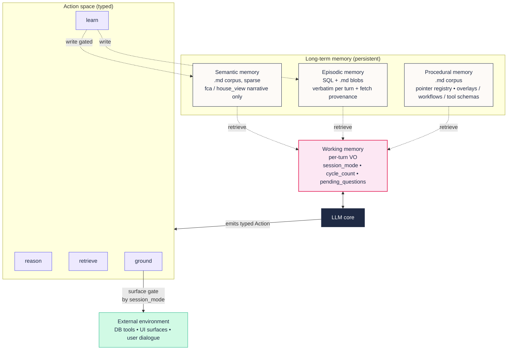
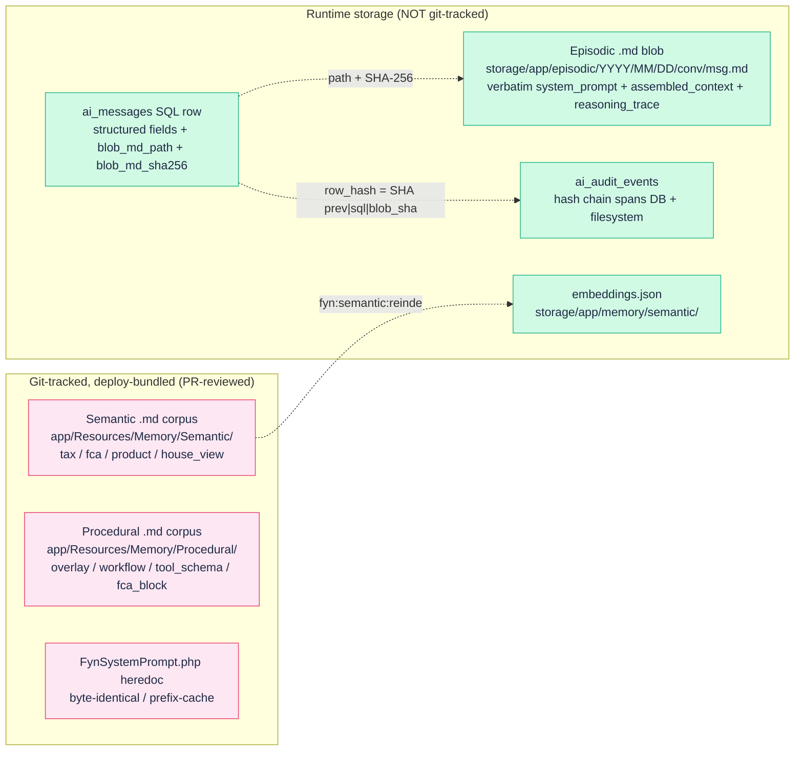
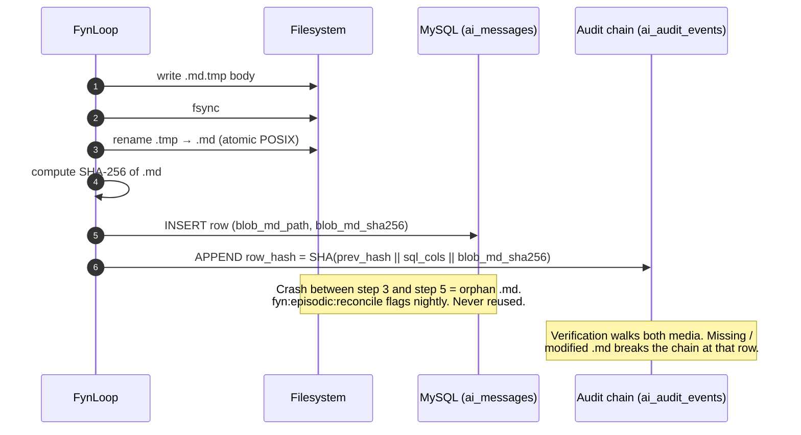
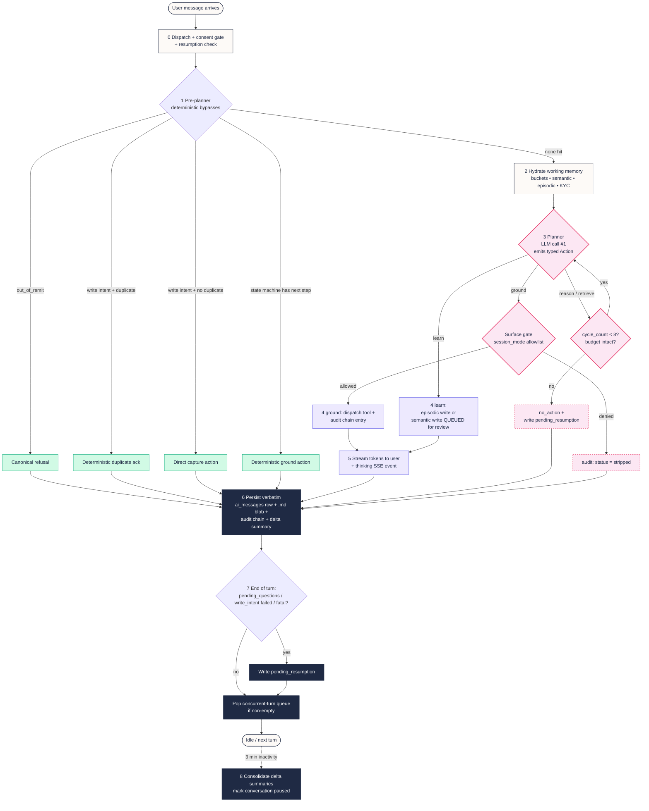
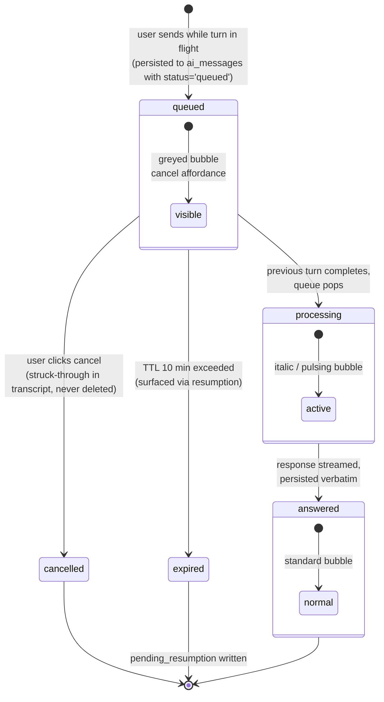
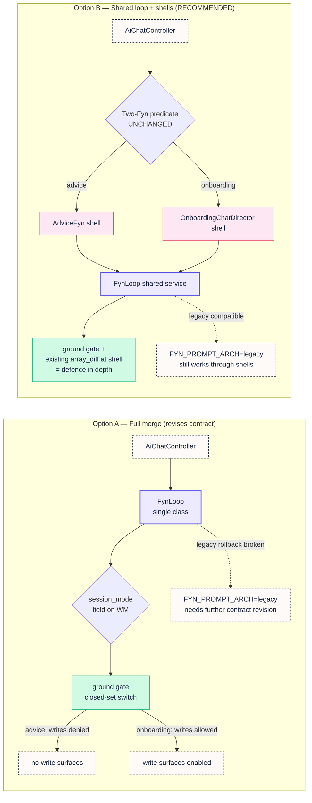

# Fynla CoALA implementation plan

**Status:** Revised v0.5 (procedural pointer registry — memory holds pointers, not copies; 2026-06-01). Prior: v0.4 (decision loop + concurrent-turn + two-Fyn collapse decision, 2026-05-26)

> **2026-07-10 pre-launch addendum:** CoALA Phases 1-6 are now implementation history rather than the final launch runtime prescription. Fyn retains the CoALA memory/action vocabulary, GroundGate, pointers, versioned corpora and signed episodes, but the agreed launch target is the hybrid evidence-first architecture in `docs/superpowers/specs/2026-07-10-fyn-evidence-first-advice-design.md`. Its executable Tasks 22A-22J are in `docs/superpowers/plans/2026-07-10-fyn-evidence-first-advice.md` and are folded into the pre-launch programme. In particular, an always-on planner and runtime per-user Markdown memory are superseded by complexity-gated planning and canonical typed/SQL memory. The 10 July Google Drive user-testing report is reconciled in `docs/superpowers/specs/2026-07-11-user-testing-report-reconciliation.md`; its Task 10A capture contract also makes precision part of provenance, so approximate ages, ISA types and ownership can never be laundered into precise canonical facts or memory. The phase detail below remains the delivery/audit record for the substrate already built.
**Owner:** Chris
**Plan kind:** Primary build artifact (spec: CoALA paper, Sumers et al. 2023, arXiv:2309.02427; PRD: Fyn product framing — separate doc)

---

## Amendments in this revision (read first)

v0.1 was written as if Fyn were close to greenfield. It isn't. The Two-Fyn unified-prompt architecture landed on `dev` on 2026-05-17 and a large chunk of what v0.1 proposed already ships. This revision:

- **Reframes Context, Architecture, and Phase ordering** against the canonical contract in `April/April24Updates/spec/00-canonical.md` and `CLAUDE.md` "Fyn AI — Two-Fyn architecture".
- **Calls out what already exists** as CoALA-shaped infrastructure (working-memory templating, hash-chained audit log, conversation summariser, KYC/prerequisite gating, per-mode tool allowlists, atomic cost gating).
- **Collapses Phases 2–3** of v0.1 into an "extend, don't rebuild" track.
- **Adds genuine Phase 1 scope** (effective-date semantic queries + FCA chunking + embeddings) which was glossed over.
- **Answers the v0.1 open decisions** where the codebase implies an answer, and reframes the rest with concrete trade-offs.
- **Adds a Constraints section** (prefix-cache invariance, Two-Fyn dispatch predicate, CLAUDE.md rules, MEMORY.md laws) that any CoALA refactor must NOT regress.

**v0.3 storage decision:**

- **Semantic memory:** `.md` files with YAML frontmatter, git-tracked, in-memory index at boot. Matches CSJ's existing fynlaBrain Obsidian pattern; PR-style review of every fact change for free.
- **Procedural memory:** `.md` files with YAML frontmatter, git-tracked, in-memory at boot. *Exception:* the static `FynSystemPrompt::text()` heredoc stays in PHP for Anthropic prefix-cache byte-invariance. Only overlays / workflow definitions / tool schemas move to `.md`.
- **Episodic memory:** **hybrid.** Structured indexable fields (role, persona, model_used, tool_calls JSON, tokens, hashes) stay in `ai_messages` / `ai_audit_events` / `ai_advice_logs`. Verbatim LONGTEXT blobs (`system_prompt`, `assembled_context`, future `reasoning_trace`) move to per-turn `.md` files referenced by path + SHA-256 from the SQL row. Resolves the deferred forensic-column purge debt (MEMORY.md `project_ai_messages_forensic_columns_need_purge.md`) by relocating the bloat to filesystem where cold-archive and GDPR erasure are file ops, not table operations.

**v0.4 additions (this revision):**

- **Full decision-loop specification** (new "Decision loop, concurrent turns, and resumption" section below). The CoALA Planning (Propose → Evaluate → Select) → Execution cycle, but with a deterministic pre-planner (cheap LLM bypasses kept), explicit planning budget, planner-skip when the onboarding state machine has a deterministic next action, and adaptive depth per the CoALA "planning vs. execution" guidance.
- **Concurrent-turn policy.** Second user message during an in-flight turn is queued (depth cap 3) as an `ai_messages` row with `status: queued`, rendered in a greyed state in the chat UI with a cancel affordance. After the first turn completes and is written to episodic memory, the queue pops and the next message runs as a normal turn. Three visual states: `queued` (greyed), `processing` (italic/pulsing), `answered` (normal). Edge case: if turn 1 ends with `pending_questions` populated, the planner must recognise turn 2 is NOT an answer to those questions (the user couldn't see them yet when they typed) and handle gracefully.
- **Half-finished session resumption.** Typed `pending_resumption` JSON column on `ai_conversations`. Predicates that trigger writing it: `onboarding_fyn_step != null`, last assistant turn had unanswered `pending_questions`, last user turn was a write-intent with no successful tool dispatch, conversation hit a fatal mid-stream error (`ai_abort_events`), or queued message status remained `queued` past session end. On login / new conversation: scan and surface "Earlier you asked about X but we didn't finish — resume?".
- **Two-Fyn collapse decision** (new "Two-Fyn collapse: full merge vs. shared loop" section below). The canonical contract today specifies one prompt, two write states enforced at dispatch + tool-gating. v0.4 documents the option to collapse to a single code path where the write boundary moves into the typed `Action` enum's `ground` surface gate. **This is a revision of the canonical contract, not a restoration.** Trade-off table provided; final choice deferred to a separate CSJ decision, not assumed.

**v0.5 amendment (2026-06-01) — the procedural pointer registry: memory holds pointers, not copies.**

The single most important canonical change since v0.4 (CSJ decision). Memory must never *duplicate* data that already has a live authoritative source. Freezing a tax figure, a product limit, a user's balance, or a recommendation into an `.md` fact creates drift, staleness, and duplicated maintenance — unacceptable for a financial product where "the number must be current" is a regulatory expectation, not a nicety.

- **The heart of procedural memory is now the *pointer registry*.** A pointer is a typed fetch-skill — `{ topic/trigger, source (md_fact | tax_config | model_query | service_call | engine_run), fetch (the exact call/key), effective_dating (owned by the source) }`. It tells the agent *which live source owns a piece of information and how to fetch it at the moment of need*; it does **not** carry the value. Procedural memory remains "how Fyn does things" — the pointer registry is the core of that "how"; overlays / workflows / tool schemas are the rest.
- **Semantic memory narrows to *source-less* durable knowledge only** — FCA rule narrative and house-view stances that have no live DB/service owner. Anything with a live owner (UK tax/allowance numbers → `TaxConfigService`; product limits → `tax_product_reference` / `TaxConfigService`; user info, accounts, values, plans, recommendations, decision traces → the models / engines / episodic store) is reached via a **pointer**, never frozen as a semantic fact.
- **This mostly *formalises* what Fyn already does.** `FynContextAssembler` already injects live `<financial_context>`, `<existing_records>`, and the tax year per turn; `AdviceFyn` already reads the recommendation engine, risk module, and every account live. v0.5 makes that principle explicit and universal, and routes it through a *named registry* in procedural memory rather than implicit assembler/tool wiring.
- **Provenance, not snapshots, keeps it auditable.** Because data is fetched live, each turn's *episode* records what was fetched + the source's version/`as-of` at that instant (extends the `semantic_snapshot_id` field to a fetch-provenance record). Fresh AND reconstructable for FCA: "on date T, Fyn served figure F from source S@vN."
- **Fetching is lazy and triggered** — a pointer fires only when the query needs it (gated by the existing classification / context-bucket system), so this does not run every engine every turn.
- **Consequences for the phases:** Phase 1 (semantic) sheds tax/allowance/product *figures* — it becomes FCA-narrative + house-view, plus the pointer *targets*. Phase 4 (procedural) leads with the pointer registry. The episode-provenance field is a Phase 2 column. The write-safety boundary is unaffected (still code — `SurfaceAllowlist` / `ground` gate; a pointer fetches, it never widens write permission).

The CoALA framing itself is unchanged — memory modules, typed action space, plan/execute loop. It remains the right architecture for Fyn. The plan just has to start from where the code is, not where it was a year ago.

---

## Context

This plan covers re-shaping Fynla's AI advice surface — **Fyn** — under the CoALA framework (Cognitive Architectures for Language Agents, Princeton, arXiv:2309.02427). The intent is to move Fyn from its current mixed state (a structured unified-prompt + per-turn context layer, plus a typed tool catalogue, plus a hash-chained audit log — but with no vector retrieval, no plan/execute split, and code-resident prompts) to an explicit CoALA shape: typed memory modules, a typed action enum, a deliberate plan→execute cycle, and gated learning.

Two driving requirements shape this work:

- **Reproducible, auditable advice.** FCA suitability rules and MIFID II logging require evidence that any recommendation can be traced to the inputs, knowledge, and workflow that produced it. Fynla already has `ai_audit_events` (hash-chained + HMAC) and per-message verbatim `system_prompt` + `assembled_context` capture. CoALA's contribution here is structure on top of that audit feed — typed actions, version-pinned procedures, and a semantic snapshot id — so the audit becomes mechanically reconstructable, not just preserved.
- **Improvable agent behaviour without code deploys.** Today, most behaviour changes still ship via PR to `dev` → `main`. There are runtime knobs (`FYN_PROMPT_ARCH`, `ONBOARDING_FYN_FLOW_ENABLED`, `AI_PROVIDER`, tier-aware token budgets), but prompts, FCA blocks, and tool schemas are PHP heredocs / class constants. Externalising the parts that change frequently (per-tier overlays, FCA fact corpus, "house view" guidance) into versioned stores lets product evolve faster while keeping the static layer byte-identical for Anthropic prefix-cache.

CoALA is the spec. This is the plan. The PRD (Fyn product framing — user journeys, advisor workflows, commercial framing) lives separately.

## Goals

- A typed `WorkingMemory` value object replacing the current ad-hoc `FynTurnContext` + `persona_state` JSON + `onboarding_parked_facts` JSON mosaic, with one explicit per-turn state shape.
- Versioned **semantic memory** as a git-tracked `.md` corpus (YAML frontmatter + body) for UK tax narrative, FCA handbook content, product reference, and house-view guidance — with effective-date temporal filtering and dense retrieval via an in-memory index built at boot.
- A **hybrid episodic memory** that keeps SQL for indexable / queryable / hash-chained structure (`ai_messages`, `ai_audit_events`, `ai_advice_logs`) and moves verbatim per-turn forensic blobs into date-sharded `.md` files referenced by path + SHA-256 from the SQL row. Resolves the deferred forensic-column purge debt by relocating bloat to filesystem.
- A **procedural memory** as a git-tracked `.md` store (overlays, workflow definitions, tool schemas, FCA blocks) with SemVer versioning, loaded into memory at boot. The static `FynSystemPrompt::text()` heredoc stays in PHP for prefix-cache byte-invariance; only the per-turn overlays move to `.md`.
- A two-stage **decision loop** (plan → execute) wrapping every Fyn turn, with action typing and cost telemetry attributable to action type and procedural version.
- Explicit, gated **learning actions** for promoting facts from episodic to semantic memory; never autonomous for regulatory content.

## Non-goals

- LLM fine-tuning. Procedural memory in this plan is limited to the agent's *code-level* procedures — prompts, workflow definitions, tool schemas, per-tier overlays — not model weights.
- Multi-agent orchestration **beyond the existing Two-Fyn dispatch**. The Two-Fyn split (read-only `AdviceFyn` vs write-capable `OnboardingChatDirector`) is canonical (CLAUDE.md "Fyn AI — Two-Fyn architecture") and must be preserved. CoALA does not require collapsing them.
- Migrating off the existing relational backends (`tax_configurations`, `ai_messages`, `ai_audit_events`). CoALA is agnostic to storage; this plan adds layers, not replacements.
- Cross-client episodic retrieval. Powerful but a GDPR/FCA question that deserves its own spec.
- Replacing `TaxConfigService` as the canonical numeric source for UK tax values. Per CLAUDE.md Rule #3 and MEMORY.md `feedback_never_hardcode_tax_values.md`, that interface stays. Semantic memory layers *on top* of it for narrative / FCA / house-view content.

## Architecture

CoALA prescribes three things: memory modules, an action space, and a decision loop. Each maps onto a module in the Fyn codebase, with much of the substrate already in place.



### Memory modules

#### Working memory

A single, structured state object held in application memory for the duration of a Fyn turn. Serialised into the LLM prompt via a template; deserialised from LLM output. **Not** the chat log.

```text
WorkingMemory {
  session_id: UUID
  client_id: UUID
  current_module: 'protection' | 'savings' | 'investments' | 'retirement' | 'estate' | 'goals' | 'coordination'
  client_summary: string                  // distilled client facts for the session
  retrieved_facts: SemanticFact[]         // pulled from semantic memory this turn
  retrieved_episodes: Episode[]           // pulled from episodic memory this turn
  current_draft: string | null            // in-flight advice text
  pending_questions: string[]             // questions to ask the client
  proposed_action: Action | null          // output of the planning stage
  observations: Observation[]             // recent grounding results
  tax_year: string                        // pinned at session start; see Resolved decisions
  procedural_version: SemVer              // pinned at session start
  cycle_count: integer                    // safety: cap loops per turn (recommend 8)
}
```

**Current equivalent in the codebase**

- `app/Services/AI/Fyn/FynTurnContext.php:15-55` — immutable VO covering bucket / mode / preview flags.
- `app/Services/AI/Fyn/FynContextAssembler.php:35-123` — composes `<context>…</context><user_message>…</user_message>` from `FynContextSelector` buckets, `MemoryRetrieverService`, and `AdvicePromptBuilder` reusable blocks.
- `app/Services/AI/Fyn/ContextBucket.php:15-21` — enum (IDENTITY / POSITION / READINESS / CAPTURE).
- `ai_conversations.persona_state` JSON + `ai_conversations.onboarding_parked_facts` JSON — per-conversation scratchpad.

This is *already* working-memory templating, not string concatenation. The CoALA refactor here is consolidation: replace the three-source state (VO + persona_state + onboarding_parked_facts) with one typed `WorkingMemory` shape, add `procedural_version`, `tax_year`, and `cycle_count`, and migrate `persona_state` (which is orphan/legacy from the removed `FynPersonaOrchestrator`).

#### Episodic memory (SQL + `.md` hybrid)

Append-only log of typed events. Structure stays in SQL (indexable, queryable, hash-chained). Verbatim forensic blobs live as date-sharded `.md` files referenced by path + SHA-256 from the SQL row.

**SQL row** (extended `ai_messages` or a new sibling — TBD by migration size):

```text
Episode {
  episode_id: UUID                        // primary key
  session_id: UUID                        // ai_conversations.id
  client_id: UUID                         // users.id
  timestamp: ISO8601
  module: string
  persona: 'advice' | 'data_capture'
  action_type: 'reason' | 'retrieve' | 'learn' | 'ground'  // post-Phase 5
  tool_calls: JSON                        // structured, for index/query
  tool_results: JSON                      // structured, for index/query
  input_tokens: int
  output_tokens: int
  model_used: string
  procedural_version: SemVer              // pinned at session start (new)
  semantic_snapshot_id: CHAR(64)          // SHA over active SemanticFact set (new)
  blob_md_path: string                    // 'episodic/2026/05/26/{conv_id}/{msg_id}.md'
  blob_md_sha256: CHAR(64)                // tamper-evidence over the .md file
  audit_row_hash: CHAR(64)                // ai_audit_events chain hash (incorporates blob_md_sha256)
}
```

**`.md` blob** (the verbatim forensic body):

```yaml
# storage/app/episodic/2026/05/26/{conversation_id}/{message_id}.md
---
episode_id: 7f3e9b2a-...
session_id: ...
client_id: ...
timestamp: 2026-05-26T14:32:17Z
persona: advice
module: retirement
procedural_version: fyn.advice.system_prompt_overlay.v2.4.0
semantic_snapshot_id: 9a1c...
model_used: claude-opus-4-7
---

## system_prompt
<verbatim FynSystemPrompt::text()>

## assembled_context
<verbatim FynContextAssembler output>

## reasoning_trace
<structured plan output, if Phase 5 planner ran>

## tool_calls (verbatim)
<JSON dump>

## tool_results (verbatim)
<JSON dump>
```

Retrieval by `client_id + recency` reads SQL only (no file I/O). Retrieval by `episode_id` lazy-loads the `.md` blob for forensic review. Dense retrieval over `reasoning_trace + observation` (Phase 6) indexes the `.md` body into the same embeddings store as semantic memory, keyed by `episode_id`.

**Current equivalent in the codebase**

- `ai_messages` (`database/migrations/2026_02_27_200002_create_ai_messages_table.php`, extended 2026-04-01, 2026-04-22, 2026-05-18) — verbatim per-turn capture with `role`, `content`, `persona`, `system_prompt`, `assembled_context`, `tool_calls` JSON, `tool_results` JSON, `input_tokens`, `output_tokens`, `model_used`, `metadata` JSON. **The `system_prompt` and `assembled_context` LONGTEXT columns are the relocation targets** — they move to the `.md` blob, the SQL row carries `blob_md_path` + `blob_md_sha256` instead.
- `ai_audit_events` (`2026_04_25_000013`) — hash-chained tamper-evident log of tool dispatches with HMAC signature. **Chain extended** so each `row_hash` is computed over `(prev_hash || sql_columns || blob_md_sha256)` — tamper-evidence spans DB and filesystem.
- `ai_advice_logs` (`2026_04_01_150000`) — per-advice-turn `query_type`, `classification`, `kyc_status`, `recommendations`, `tools_called`, `user_data_snapshot`. Stays SQL; structured fields only.
- `ai_conversations` summary index (`2026_05_02_000001`) — `summary`, `topics`, `entities_mentioned`, `intents_stated`, `summarised_at`. Stays SQL.
- `app/Services/AI/MemoryRetrieverService.php:49-77` — 4-layer gap-fill retriever. Stays SQL.

Episodic memory *exists*. The CoALA additions are: `procedural_version` column, `semantic_snapshot_id` column, the `.md` relocation of verbatim columns, audit-chain extension to cover the file SHA, dense-retrieval index for similar-case recall, and a clean cold-archive path (move old `.md` blob directories to cheap storage; SQL rows stay hot).

#### Semantic memory

> **v0.5:** Semantic memory holds only **source-less** durable knowledge — FCA rule narrative and house-view stances with no live DB/service owner. Data with a live owner (tax/allowance/product *figures*, user data, recommendations) is **not** a semantic fact; it is reached via a procedural **pointer** to the live source (see the v0.5 amendment). The schema below still applies to the `fca` and `house_view` categories; `tax` / `allowance` / `product` hold *narrative only* (no figures), with pointers carrying the live numbers.

Versioned, temporally bounded reference data, stored as a git-tracked `.md` corpus.

```yaml
# storage path: app/Resources/Memory/Semantic/{category}/{slug}.md
---
fact_id: 7f3e9b2a-...
category: tax | allowance | fca | product | house_view
source: "FCA Handbook COBS 9.2.1R" | "TaxConfigurationSeeder:2026" | ...
valid_from: 2026-04-06
valid_to: 2027-04-05      # null/omitted = open-ended
tax_year: 2026-27         # null/omitted where not tax-bound
version: 1.0.3
---

# Canonical fact title

Body text. Chunked for FCA (one rule per file). Markdown supported.
Cross-links via wikilinks `[[other-fact-slug]]` for related-fact retrieval.
```

Embeddings are computed at boot (or at deploy time via `php artisan fyn:semantic:reindex`) into `storage/app/memory/semantic/embeddings.json`, keyed by `fact_id`. Sidecar approach (not inline frontmatter) keeps the `.md` files clean for human authoring and Obsidian/VS Code editing.

Retrieval interface accepts `(query, effective_date, categories)` and returns ranked `SemanticFact` records. Hybrid scoring: keyword (over title + body) + dense cosine (over embeddings). Effective-date filter applied **before** ranking — the agent never sees expired rules.

**Current equivalent in the codebase**

- `tax_configurations` (`config_data` JSON blob per `tax_year`, `is_active` flag) — `TaxConfigService::getInheritanceTax()` etc. **Active-flag based, not date-based.** No `getAsOf(Carbon $date)` API.
- `tax_product_reference` — ISA/GIA/bond facts. **No `tax_year` or effective dates** — timeless rows.
- `actuarial_life_tables` — lookup by `(age, gender)`, `table_year` not used at runtime.
- `savings_market_rates` — has `effective_from` but consumers don't filter by date.
- **FCA handbook + "house view" guidance: PHP heredocs only.** `app/Services/AI/Prompts/ComplianceRules.php`, `FcaProcessInstructions.php`, `CoreIdentity.php`, `QueryKnowledge.php`, plus inline in `app/Services/AI/Fyn/FynSystemPrompt.php`.
- **No vector store, no embeddings.** Composer + `app/` searched: zero hits for `pgvector|pinecone|weaviate|chromadb|embedding`.

This is the **largest genuine gap**. Phase 1 stands up the `.md` corpus + in-memory index alongside the existing relational ref-data — `TaxConfigService` stays canonical for numeric tax values, semantic memory wraps narrative + FCA + product + house-view content with embeddings and effective-date filtering.

**Why `.md`:** matches CSJ's existing fynlaBrain Obsidian workflow (YAML frontmatter, wikilinks, human-editable); every fact edit goes through PR review by virtue of being a git file; effective-date diffs are trivial to inspect on a PR; no extra infrastructure to operate beyond what already deploys.

This is the difference between "RAG that mostly works" and "RAG that's safe to advise from".

#### Procedural memory

> **v0.5:** The **heart of procedural memory is the pointer registry** — the typed fetch-skills that route the agent to live sources (`tax_config` / `model_query` / `service_call` / `engine_run` / `md_fact`) for any data that has an authoritative owner, so nothing is duplicated or frozen (see the v0.5 amendment). Overlays / workflows / tool schemas (below) are the rest of procedural memory; the registry is its core. A pointer fetches data — it never widens write permission (that boundary stays in code, `SurfaceAllowlist` / `ground` gate).

Workflow and prompt definitions, version-controlled. Stored as a git-tracked `.md` corpus loaded into memory at boot.

```yaml
# storage path: app/Resources/Memory/Procedural/{kind}/{module}/{slug}.md
# e.g. app/Resources/Memory/Procedural/system_prompt_overlay/advice/billing.v1.0.3.md
---
procedure_id: fyn.advice.system_prompt_overlay.billing
kind: system_prompt_overlay | workflow | tool_schema | fca_block
module: advice | onboarding | shared
version: 1.0.3
active: true
effective_from: 2026-05-26T00:00:00Z
supersedes: fyn.advice.system_prompt_overlay.billing.v1.0.2
---

# Procedure body
# For system_prompt_overlay / fca_block: plain markdown / prose
# For workflow: structured YAML state-machine definition in a fenced block
# For tool_schema: JSON schema in a fenced block
```

Exactly one version per `(procedure_id)` is `active`; older versions remain on disk for replay. Activation = setting `active: true` in the new file and `active: false` in the previous version, in a single PR. The loader treats two active versions of the same `procedure_id` as a fatal startup error (fail-closed).

**Hard constraint**: the *static* system prompt at `FynSystemPrompt::text()` must stay byte-identical for the Anthropic prefix-cache hit that the unified architecture is built around (see `00-canonical.md` and MEMORY.md `reference_unified_prompt_has_no_billing_layer.md`). The static prompt **stays as a PHP heredoc** — it is NOT in the procedural `.md` store. The `.md` store holds only the per-turn overlays the assembler adds, the workflow definitions for onboarding, the tool schemas, and the FCA/house-view fact blocks. The static prompt is versioned via git on the file itself, with the resolved version (computed from the file's git SHA at deploy time) recorded on each episode.

**Current equivalent in the codebase**

- `app/Services/AI/Fyn/FynSystemPrompt.php` — single heredoc, deploy-required to change. **Stays in code (prefix-cache constraint).**
- `app/Services/AI/Prompts/*.php` — class-constant fragments. **Migration target** for `fca_block` Procedure files (one `.md` per logical block).
- `app/Services/AI/AiToolDefinitions.php` — PHP-array tool catalogue. **Migration target** for `tool_schema` Procedure files (likely one `.md` per tool, with the schema in a fenced JSON block — keeps the catalogue diffable per-tool).
- `app/Services/Onboarding/OnboardingStateMachine.php` + `users.onboarding_fyn_step/_path/_selection/_context` — already a `workflow` Procedure. The *machine code* stays in PHP; only the state-transition *data* moves to a `workflow` `.md` per onboarding flow.
- Runtime flags: `FYN_PROMPT_ARCH`, `ONBOARDING_FYN_FLOW_ENABLED`, `AI_PROVIDER` (env + `Cache` override). These stay as runtime flags — Procedure `.md` versioning is for content, not feature flags.

### Action space

All actions Fyn can take are typed. The planning stage's output is one of these:

```text
Action =
  | { type: 'reason',   prompt_template_id, working_memory_fields[] }
  | { type: 'retrieve', store: 'episodic' | 'semantic', query, filters }
  | { type: 'learn',    store, payload }
  | { type: 'ground',   surface, args }   // external action
```

The grounding `surface` enumerates allowable external actions: `send_message`, `request_advisor_signoff`, `write_case_note`, `fetch_market_data`, `generate_pdf`, `navigate_to_page`, plus every `create_*`/`update_*`/`delete_*`/`capture_*` tool in `AiToolDefinitions.php`. New surfaces require code changes — this is deliberate; the external boundary is where regulatory risk lives.

**Current equivalent in the codebase**

- `app/Services/AI/AiToolDefinitions.php` — flat function definitions (per-provider shape). No typed `Action` enum.
- `app/Services/AI/AdviceFyn.php:152-184` — `WRITE_TOOLS` denylist (30 names) stripped via `array_diff` for read-only state.
- `app/Services/Onboarding/OnboardingPromptBuilder.php:101-134` — `toolsForFocus` allowlist per onboarding step (e.g. savings → `[create_savings_account]`).
- `app/Agents/CoordinatingAgent.php:810-981` — single dispatcher, one `match` statement.
- `app/Services/AI/AdviceFyn.php` — `delegate_to_capture` + `capture_complete` handoff tools (the existing CoALA-shaped action surface for advice→capture journey).
- `WriteIntentClassifier`, `RecordDuplicateChecker`, `DuplicateAcknowledgement` — deterministic short-circuits before the LLM call (a "pre-planner").

The refactor here is wrapping the existing flat tool catalogue in the typed `Action` enum, exposing the LLM only to `reason` / `retrieve` / `learn` / `ground`, and unifying the `WRITE_TOOLS`/`toolsForFocus` gating under one allowlist-per-state matrix.

### Decision loop

Every Fyn turn is one or more decision cycles. A cycle:

1. **Plan** — call the LLM with working memory + a planning template. The model must emit a typed `Action`. If `reason` or `retrieve`, the loop iterates (planning sub-stage). If `learn` or `ground`, advance to execute.
2. **Execute** — dispatch the action. For `ground`, call the surface handler, capture the observation, append to working memory. For `learn`, perform the write with appropriate guards. Loop ends or returns to plan.

Two hard rules:

- A turn cannot exit without producing exactly one `ground` action (or terminating with `no_action`). Prevents Fyn from looping silently.
- Every `ground` action passes through a surface-specific safety gate before execution.

**Current equivalent in the codebase**

- One LLM call per turn with inline tool-use loop (`app/Traits/HasAiChat.php` streams until `stopReason !== 'tool_use'`).
- `QueryClassifier::classify` at `app/Services/AI/AdviceFyn.php:207` — runs *before* the LLM and emits `response_mode` + `engine_call_level`. This is a *classifier*, not a planner — it routes, doesn't decompose.
- `WriteIntentClassifier` + `RecordDuplicateChecker` short-circuits — fully bypass the LLM for clear write intents.
- Two-Fyn dispatch at `app/Http/Controllers/Api/AiChatController.php:171-179`: 3-part predicate (`onboarding_completed === false && onboarding_fyn_step !== null && config('onboarding.fyn_flow_enabled')`) chooses `OnboardingChatDirector::handleUserMessage` vs `AdviceFyn::handle`.
- `KycGateChecker` + `PrerequisiteGateService` — emit `prompt_text` blocking the agent until prerequisites met (already a "block-until-ready" loop).

The CoALA refactor here is the *explicit* plan/execute split as a first-class concept, sitting *above* the existing classifier and Two-Fyn dispatch. The classifier becomes a pre-planning optimisation (skip the LLM planner when intent is unambiguous); the dispatch predicate stays unchanged.

## Storage layer (NEW in v0.3)

A single-page summary of where each memory module lives, why, and what protocols govern reads and writes. Detailed schemas are in the Architecture section above.



| Module      | Storage                                        | Versioning      | Edit path                    | Reload     | Backed up by                              |
|-------------|------------------------------------------------|-----------------|------------------------------|------------|-------------------------------------------|
| Working     | RAM only (per-turn VO)                          | n/a             | code                         | deploy     | n/a                                       |
| Semantic    | `app/Resources/Memory/Semantic/**/*.md`        | git + frontmatter `version` | PR             | deploy + `fyn:semantic:reindex` | git + deploy bundle               |
| Episodic    | `ai_messages` SQL + `storage/app/episodic/**/*.md` | append-only + hash chain | runtime (Fyn writes)        | n/a        | SiteGround daily backup (DB + filesystem) |
| Procedural  | `app/Resources/Memory/Procedural/**/*.md`      | git + frontmatter `version` + `active` flag | PR | deploy + 60s mtime hot-reload   | git + deploy bundle               |
| Procedural (static prompt) | `app/Services/AI/Fyn/FynSystemPrompt.php` heredoc | git only | PR                          | deploy     | git + deploy bundle                       |

### Write protocols

**Semantic and Procedural (offline, PR-driven):**
1. Author or edit `.md` in a PR.
2. CI parses YAML frontmatter, validates mandatory fields, detects duplicate `fact_id`/`procedure_id` or duplicate `active: true` versions.
3. Merge to `dev` → deploy to csjones.co → `php artisan fyn:semantic:reindex` if semantic content changed.
4. Merge `dev` → `main` → deploy to fynla.org → reindex.

**Episodic (online, Fyn writes per turn):**
1. Compose `.md` body (frontmatter + verbatim sections).
2. Write to `storage/app/episodic/{YYYY}/{MM}/{DD}/{conv_id}/{msg_id}.md.tmp`.
3. `fsync`.
4. Atomic `rename()` to drop `.tmp`.
5. Compute SHA-256.
6. Insert `ai_messages` row with `blob_md_path` + `blob_md_sha256`.
7. Append `ai_audit_events` chain entry whose `row_hash = SHA256(prev_hash || sql_columns || blob_md_sha256)`.
8. Failure between 4 and 7 leaves an orphan; `fyn:episodic:reconcile` (nightly) flags orphans, never reuses them.

### Read protocols

**Semantic:** at boot, `SemanticCorpusLoader` walks `app/Resources/Memory/Semantic/`, parses frontmatter, validates, indexes by `fact_id`. At first request, embeddings are loaded from `storage/app/memory/semantic/embeddings.json` (fail-closed if missing). Retrieval is in-memory hybrid scoring; no disk I/O on the hot path.

**Procedural:** at boot, `ProceduralCorpusLoader` walks `app/Resources/Memory/Procedural/`, parses, validates uniqueness of active `procedure_id`. Hot-reload checks file mtime every 60s and atomically swaps the singleton on detected change (fail-closed on validation error — old corpus stays active). The static `FynSystemPrompt::text()` is a PHP heredoc, untouched.

**Episodic:** SQL-only on the list/index path. The `.md` blob is lazy-loaded on detail view, via `Storage::disk('local')->get($blob_md_path)`. Audit-chain verification (`ai:audit:verify-chain`) reads every referenced `.md` and recomputes SHA — slow but only run on demand.

### Atomic write protocol (visual)



### Cold archive and erasure

- **Cold archive (12-month threshold):** `php artisan fyn:episodic:cold-archive` moves `.md` blobs from `storage/app/episodic/` to `storage/app/episodic-cold/`. SQL rows unchanged; `blob_md_path` resolver checks both directories. Slower retrieval on cold blobs is acceptable — they're forensic-only at that point.
- **Hard delete (6-year threshold, FCA SYSC 9.1):** delete SQL row + cold blob in one operation. Hash-chain verification past the deletion point intentionally fails for that user's entries — this is correct behaviour, since the regulatory window has closed.
- **GDPR right-to-erasure:** `php artisan fyn:user:erase {user_id}` cascade-deletes the user's SQL rows AND walks both hot and cold blob directories to remove their `.md` files. Single command; partial erasure is a regulatory failure.

## Decision loop, concurrent turns, and resumption (NEW in v0.4)

The Architecture section's "Decision loop" subsection defines the CoALA Plan → Execute cycle conceptually. This section is the operational specification: the full flow Fyn runs per user message, with deterministic bypasses, budget caps, concurrent-turn handling, and broken-session resumption.

The flow is the same whether Fyn is in advice mode or onboarding mode (CSJ directive). The mode is a single `session_mode` field on working memory; the difference between modes is enforced at the `ground` action's surface allowlist — not by a separate code path.



### The full per-message flow

```
0. Dispatch and resume check
   - Auth gate (existing).
   - Consent gate at entry + 2s in-stream recheck (existing).
   - Load session working memory: WorkingMemory VO + session_mode (advice | onboarding).
   - On session start (first turn of a (re)opened conversation):
       a. Scan ai_conversations.pending_resumption for this user.
       b. If hit, surface "Earlier you asked about X but we didn't finish — resume?"
          before processing the new message. User chooses resume/discard/start-fresh.
       c. Scan ai_messages for rows with status = queued belonging to this user.
          If present, surface "You sent a message that didn't get processed — continue?"

1. Deterministic pre-planner (LLM bypasses — keep what works)
   In order, first hit wins:
     a. QueryClassifier → out_of_remit → canonical refusal, persist, done.
     b. WriteIntentClassifier + RecordDuplicateChecker → duplicate ack, persist, done.
     c. WriteIntentClassifier (no duplicate) → direct capture action (current
        handleInlineCapture path, but now invoked as a typed ground action with
        capture_intent surface).
     d. session_mode === 'onboarding' AND OnboardingStateMachine has a deterministic
        next action → emit that ground action directly. NO LLM PLANNER CALL.
     e. None hit → fall through to step 2.

2. Working memory hydration (the per-turn assembler block)
   - ContextBucket selection (IDENTITY / POSITION / READINESS / CAPTURE).
   - Semantic memory retrieve(query, effective_date, categories) — Phase 1.
   - Episodic memory retrieve(client_id, limit, since) for similar past cases —
     Phase 6 (Phase 2 ships keyword recency only).
   - MemoryRetrieverService 4-layer gap-fill (authoritative DB → parked facts →
     extract → conversation index) — existing.
   - KYC / prerequisite state resolved into TYPED working-memory fields
     (e.g. kyc.income.known = false), not just a prompt blob.
   - tax_year pinned from session start (already in WorkingMemory).
   - procedural_version pinned from session start.

3. Planning stage (LLM call #1, budgeted)
   - SINGLE LLM call. Returns one of:
       { action: 'reason',   prompt_template_id, fields[] }
       { action: 'retrieve', store, query, filters }
       { action: 'learn',    store, payload }
       { action: 'ground',   surface, args }
       { action: 'no_action', reason }
   - For ground: surface MUST be in session_mode's allowlist (closed-set switch,
     fail-closed). Advice mode's allowlist excludes every write surface
     mechanically — this is the new safety boundary.
   - Hard cycle cap: 8 actions per turn (CoALA "planning budget" §7).
   - Planning budget: max 2 reason actions, max 3 retrieve actions per turn.

4. Execution stage
   - reason  → updates working memory; may loop back to plan (counts vs cycle cap).
   - retrieve → reads long-term memory into working memory; may loop back.
   - learn   → write to episodic / semantic; semantic writes ALWAYS human-gated
              (Phase 6); episodic writes are the verbatim persistence path.
   - ground  → dispatch via the gated surface handler (CoordinatingAgent::executeTool
              reused, wrapped in the gate); ai_audit_events chain entry written with
              row_hash including the .md blob SHA-256.

5. Stream response to user
   - Token stream from the most recent reason action's output (CoALA: reasoning
     produces the user-facing text).
   - During steps 2–4 (before any reason output exists), emit a `thinking` SSE
     event so the UI shows a "Fyn is thinking…" indicator instead of silent latency.

6. Per-turn persistence (mandatory, regulatory)
   - Verbatim ai_messages row + .md episodic blob (system_prompt, assembled_context,
     reasoning_trace, tool_calls, tool_results). NEVER replaced by a summary.
   - Audit chain entry per ground/learn action.
   - Delta summary append to ai_conversations.summary (real-time, not hourly-only).
   - ai_daily_usage atomic counter increment.

7. End-of-turn handling
   - If turn ended with pending_questions populated, OR a write_intent had no
     successful tool dispatch, OR a fatal error → write pending_resumption.
   - Pop the concurrent-turn queue (see below).

8. Inactivity timer (3 minutes after last turn)
   - Consolidate the conversation's delta summaries into a final summary.
   - Mark conversation status as paused (not closed).
   - Conversation can be reopened later via the resumption check at step 0.
```

### Concurrent-turn policy

The user may send a second message while turn 1 is still in steps 2–6 above. Policy:



- **Queue, don't reject.** The second message is persisted as an `ai_messages` row with `status: queued` immediately on receipt. Audit-honest (the message IS part of the transcript) and disconnect-safe (survives tab close).
- **Depth cap = 3.** Beyond three queued messages, reject with a non-error response: "Please wait for my reply before sending more." Prevents an impatient user from stacking 10 messages and committing every turn to sequential processing.
- **Three visual states:**
  - `queued` — greyed bubble, cancel affordance present.
  - `processing` — italic / pulsing bubble while the loop is running for this row.
  - `answered` — normal bubble, response below.
- **Cancel.** Click the greyed bubble → confirm → `status: cancelled`. Cancelled rows remain in the transcript (struck-through or marked) for audit honesty. Never deleted.
- **Working memory between turns.** When the queue pops, turn 2 runs the normal flow from step 0 onwards. Turn 1's outcome is already written to episodic memory, so turn 2 sees it via working-memory hydration — no special inter-turn state plumbing required.
- **Edge case — turn 1 ended with pending_questions.** If turn 1's reasoning emitted a clarifying question and turn 2 is already queued, turn 2 is **NOT an answer to that question** (the user couldn't see it when they typed turn 2). The planner must recognise this on turn 2's entry: detect `working_memory.pending_questions` non-empty AND turn 2 was sent before turn 1's `done` event timestamp → handle gracefully, e.g. "I was going to ask about X, but to answer your follow-up about Y first…". Left unhandled, Fyn would treat turn 2 as the clarification answer and produce a non-sequitur — a real failure mode.
- **Disconnect resilience.** A `queued` row at session start is one of the predicates that triggers the resumption check at step 0. User closes the tab mid-queue, comes back later → "You sent a message that didn't get processed — continue?".

### Planning-stage cost and adaptive depth

CoALA §7 ("Planning vs. execution") makes the cost trade-off explicit. Our defaults:

- **Cheap turns get one LLM call.** Most advice turns are answer-from-known-state: planner emits a single `reason` action with a prompt template that produces the user-facing text. One LLM call total. This is most turns.
- **Deep turns iterate.** When the planner emits `retrieve` (semantic or episodic) followed by `reason`, that's two LLM calls — acceptable when the retrieve genuinely needs to inform the answer.
- **Cycle cap.** Hard cap at 8 actions per turn. If exceeded, dispatcher emits `no_action` with a canonical "I need more time on this — let me come back to you" response and writes to `pending_resumption` so the user can pick up the question on next turn.
- **Onboarding skips the planner.** When `session_mode === 'onboarding'` and `OnboardingStateMachine` has a deterministic next action, the pre-planner dispatches it directly without an LLM planning call (see step 1d above). This is the cost-discipline that pays for the rest of the loop.
- **Telemetry.** Per-turn cost attribution (`cycle_id`, `stage`, `action_type`, `procedural_version`) lands in Phase 5 — we measure planning-stage spend explicitly and tune budgets from observed data, not by guesswork.

### Failure modes — explicit fallbacks

| Failure | Behaviour |
|---|---|
| Planner emits invalid action (schema fail) | Log to `ai_audit_events` as `status: stripped`. Emit canonical refusal. |
| Action surface not in session_mode allowlist | Reject mechanically at the gate. Audit-chain entry with `status: stripped`. NEVER fall back to "try anyway". |
| Tool dispatch fails | Planner receives the error as an observation in working memory. May re-plan once. After second failure, emit canonical apology, write `pending_resumption`. |
| Cycle cap exceeded | Emit canonical "I need more time on this" response. Write `pending_resumption`. |
| Token budget exhausted mid-cycle | Emit partial response with `truncated: true` flag. Persist working memory; write `pending_resumption`. |
| Semantic retrieval returns no results | Working memory records `retrieval.empty = true`. Planner is required to say "I don't have authoritative guidance on that" — never confabulate. |
| Episodic retrieval finds duplicate write intent | Short-circuit to deterministic duplicate ack (step 1b). No planner call. |
| User withdraws consent mid-stream | Stream terminates within 2s per existing `AiChatController` recheck. `pending_resumption` written if turn was incomplete. |

## Two-Fyn collapse: full merge vs. shared loop with thin shells (NEW in v0.4)

The CoALA decision loop above is the same regardless of how we organise the code that runs it. We can either:

- **Option A — Full merge.** Delete `AdviceFyn` and `OnboardingChatDirector` classes. A single `FynLoop` service runs the cycle. `session_mode` is a field on working memory. Write safety is enforced by the typed `Action.ground` surface gate (closed-set switch keyed on `session_mode`, fail-closed). Revises the canonical Two-Fyn contract in `April/April24Updates/spec/00-canonical.md`.
- **Option B — Shared loop with thin shells.** `AdviceFyn` and `OnboardingChatDirector` remain as classes but become thin shells that delegate every turn to the shared `FynLoop`. Each shell sets its `session_mode` before dispatch. The dispatch predicate in `AiChatController::sendMessage` is unchanged. Write safety is enforced both at dispatch (existing `array_diff`) AND at the loop's `ground` gate (new). Belt-and-braces. Preserves the canonical contract verbatim.



### Trade-off table

| Dimension | Option A — Full merge | Option B — Shared loop with shells |
|---|---|---|
| Code volume | Lower (one class instead of two) | Slightly higher (loop + two shells) |
| Safety boundary | One gate (the `ground` surface allowlist), enforced once | Two gates (dispatch + ground), defence in depth |
| Canonical contract (`00-canonical.md`) | **Revised** — "ONE PROMPT, TWO WRITE STATES" becomes "ONE PROMPT, ONE LOOP, MODE-GATED WRITES" | Preserved verbatim |
| `FYN_PROMPT_ARCH=legacy` rollback | Breaks — legacy builders assume two classes. Either drop the rollback (further contract change) or keep both flows alive (negates the code-volume win). | Unaffected — legacy can still route through the two shells. |
| Eval re-baseline cost | Significant — 35 invariants in `01-invariants.md` reference the two-class shape; the `09-canonical-behaviour` 10-scenario set; 75 golden conversations in `fyn-rubrics.md §B`. Most still pass conceptually but every assertion that mentions `AdviceFyn` / `OnboardingChatDirector` by name needs rewriting. | Minimal — class names unchanged; tests still target `AdviceFyn::handle` and `OnboardingChatDirector::handleUserMessage`. |
| Migration risk | Higher — single big-bang refactor. Mitigated by a feature flag (`FYN_LOOP_UNIFIED=true`) for parallel-running but that doubles the code during the rollout window. | Lower — incremental. Ship the loop, route AdviceFyn through it first, then OnboardingChatDirector, then the shells become trivial. |
| Adherence to CoALA spirit | Higher — the paper presents one agent, not two. | Slightly lower but functionally equivalent; CoALA doesn't dictate class structure. |
| Time to ship | Longer — needs eval re-baseline before merge. | Shorter — can ship incrementally inside Phase 5. |
| Future flexibility | If we ever want a third mode (e.g. "reviewer Fyn" — out of scope but flagged) it slots in as a third `session_mode` value with no new class. | Adding a third mode needs a new shell class plus the mode value. |

### Recommendation

**Option B (shared loop with thin shells), with the explicit intent to revisit Option A after Phase 6 ships.** Reasons:

1. The eval re-baseline cost of Option A is real. 75 golden conversations were built against the Two-Fyn contract; rewriting them now while we're also building the loop, the semantic memory corpus, and the typed action enum is too many moving parts at once.
2. The defence-in-depth from two gates (dispatch + ground) is genuinely useful during the rollout window. If we get the loop's `ground` gate wrong, the dispatch gate still catches write-leak.
3. The `FYN_PROMPT_ARCH=legacy` permanence directive (CSJ, 2026-05-18) is incompatible with Option A. Choosing Option A means revisiting that directive too.
4. Once Phase 6 has shipped and the loop is proven in production, the shells can be deleted as a tidy refactor with the eval set rebaselined deliberately — not as a high-stakes change inside the CoALA roll-out.

If you'd rather go Option A now, the gate at the `ground` action must be the first thing built, with its own dedicated PR, its own dedicated test suite, and merged before any planner work lands. The mechanical write-safety guarantee can't slip through the cracks during a multi-phase build.

## Phased delivery

Each phase is independently shippable. Each ends with a definition of done that is observable in production, not just complete in code. Phases are re-sequenced from v0.1 to reflect what already exists.

### Phase 1 — Semantic memory and retrieval (foundation, biggest greenfield piece)

The largest genuine gap. Build the semantic memory `.md` corpus + in-memory index alongside `TaxConfigService` — not replacing it.

- Stand up the corpus directory: `app/Resources/Memory/Semantic/{tax|allowance|fca|product|house_view}/*.md`. Git-tracked, PR-reviewed.
- Build the `.md` loader: parse YAML frontmatter, validate (every file must have `fact_id`, `category`, `source`, `version`; `valid_from` mandatory for `tax`/`allowance`/`fca`), index by `fact_id` into a singleton service. Fail-closed at boot if duplicate `fact_id` or malformed frontmatter.
- Add `php artisan fyn:semantic:reindex` — reads the corpus, generates embeddings (Anthropic embeddings API or xAI — TBD in Phase 1 sub-plan), writes `storage/app/memory/semantic/embeddings.json` keyed by `fact_id`. Runs at deploy time and on demand.
- Build `SemanticMemory::retrieve(query, effective_date, categories)` interface with sparse (keyword over title + body) + dense (cosine over embeddings) hybrid scoring. Effective-date filter applied **before** ranking.
- Seed three corpora:
  - **`fca` category**: chunk and migrate the bodies of `app/Services/AI/Prompts/ComplianceRules.php`, `FcaProcessInstructions.php`, `CoreIdentity.php`, `QueryKnowledge.php` into one `.md` per logical rule with citations. Estimated ~30–80 files.
  - **`product` category**: migrate `tax_product_reference` rows into `.md` files (one per `product_category × tax_aspect`) with `valid_from`/`valid_to` frontmatter. Estimated ~50–150 files.
  - **`house_view` category**: stand up directory empty, ready for content authoring after Phase 1 ships.
- Add a `tax` retrieval shim that calls `TaxConfigService` underneath for numeric values. The semantic memory `tax` category holds *narrative* (e.g. "how the IHT taper works in practice"), never the numbers — single source of truth stays `TaxConfigService` (CLAUDE.md Rule #3).
- Wire the per-turn assembler (`FynContextAssembler`) to call `SemanticMemory::retrieve()` for FCA/product/house-view content, replacing the static heredoc paths into `app/Services/AI/Prompts/*.php`.
- **Keep the static `FynSystemPrompt::text()` byte-identical**. FCA content moves *into the per-turn assembler's `<context>` block*, not into the static prompt. Prefix-cache invariance must hold.
- Compute and record `semantic_snapshot_id` per turn: SHA-256 over the sorted list of `(fact_id, version)` tuples the retriever returned. Recorded on the episode SQL row.

**Done when:** any answer Fyn gives involving an FCA rule, product narrative, or house-view stance is sourced from a `.md` file in the corpus with `valid_from`/`valid_to` honoured. Audit check: re-run a query with an earlier `effective_date` and observe different (correct) content. Numeric tax values continue to flow via `TaxConfigService` per CLAUDE.md Rule #3. Prefix-cache hit rate (when measurable per Phase 5) does not regress. `php artisan fyn:semantic:reindex` runs cleanly on both csjones.co and fynla.org deploy pipelines.

### Phase 2 — Episodic memory: SQL+.md hybrid, extend, retain, index

Most of the data structure exists. This phase splits the existing verbatim columns out to `.md` and adds the missing structured fields.

- Add columns to `ai_messages` (or a new sibling `ai_episodes` — TBD by migration impact): `procedural_version` VARCHAR, `semantic_snapshot_id` CHAR(64), `blob_md_path` VARCHAR(255), `blob_md_sha256` CHAR(64). Keep `tool_calls` / `tool_results` JSON in SQL (structured, queryable).
- Build the `EpisodeBlobWriter` service implementing the **atomic write protocol**:
  1. Compose the `.md` body (frontmatter + verbatim sections).
  2. Write to `storage/app/episodic/{YYYY}/{MM}/{DD}/{conversation_id}/{message_id}.md.tmp`.
  3. `fsync` the file.
  4. Atomic `rename()` to drop the `.tmp` suffix (POSIX rename is atomic on the same filesystem).
  5. Compute SHA-256, write the SQL row (including `blob_md_sha256`), and append the `ai_audit_events` chain entry whose `row_hash` includes `blob_md_sha256`.
  6. Failure between step 4 and 5 leaves an orphan `.md` (reconciled by a janitor command, never reused).
- Extend `ai_audit_events.row_hash` computation to include `blob_md_sha256` so tamper-evidence spans DB and filesystem. Update `ai:audit:verify-chain` to fetch and re-hash referenced `.md` files when verifying.
- Cutover plan for existing `ai_messages.system_prompt` + `assembled_context` data: backfill into `.md` blobs via `php artisan fyn:episodic:backfill-blobs` (one-shot), populate `blob_md_path` + `blob_md_sha256`, leave the old LONGTEXT columns in place but stop writing them. Drop columns in a later migration once retention period for old rows expires (or after one full backup cycle confirms blobs are safe).
- Build a structured `Episode` projection over the SQL + `.md` pair for compliance UI consumption (read SQL row; lazy-load `.md` body only on detail view).
- Surface episodic history in the case management UI as the regulated session log (read-only). Detail view renders the `.md` blob with section anchors (`#system_prompt`, `#assembled_context`, `#reasoning_trace`).
- **Address the deferred retention debt** (MEMORY.md `project_ai_messages_forensic_columns_need_purge.md`) — now a filesystem operation. Write `php artisan fyn:episodic:cold-archive` that moves `.md` blobs older than 12 months from `storage/app/episodic/` to `storage/app/episodic-cold/`. SQL rows stay hot; `blob_md_path` still resolves (with a slower path). After 6 years, SQL row + cold blob both delete (FCA SYSC 9.1 — see Resolved decisions).
- Add `find_episodes(client_id, limit, since)` as a typed retrieval interface alongside the existing `MemoryRetrieverService` 4-layer fall-through. Defer dense similarity retrieval to Phase 6 (needs embeddings infrastructure from Phase 1).
- GDPR right-to-erasure for a user: `php artisan fyn:user:erase {user_id}` cascade-deletes SQL rows AND removes their `.md` blobs in one transaction-like sequence. Currently only SQL cascade exists.

**Done when:** every Fyn interaction since cutover is reconstructable from the (SQL row, `.md` blob) pair alone. Compliance has a queryable, indexed log via SQL and a forensic verbatim view via the `.md` blob. `ai:audit:verify-chain` validates the cross-medium hash chain. Retention and erasure jobs are active and observable.

### Phase 3 — Consolidated working memory VO

Smaller than v0.1 — the templating infrastructure already exists.

- Define a single typed `WorkingMemory` shape (extends/replaces `FynTurnContext`).
- Migrate `ai_conversations.persona_state` (orphan/legacy from removed `FynPersonaOrchestrator`) into the new shape or drop it. Confirm no live consumers first.
- Fold `ai_conversations.onboarding_parked_facts` into the shape's `client_summary` / `retrieved_facts` channels with a typed contract.
- Add `cycle_count` (safety cap), `procedural_version` (pin at session start), `tax_year` (pin at session start) fields.
- No change to `FynSystemPrompt::text()` byte-identical guarantee.

**Done when:** prompt construction is single-source — one VO, one assembler, one path. Reviewing any LLM call shows exactly which working-memory fields contributed. `persona_state` and `onboarding_parked_facts` columns are deprecated or formally repurposed.

### Phase 4 — Procedural memory and version pinning

Externalise the parts of procedure that need to vary without deploys, while preserving prefix-cache invariance for the static layer. Storage is the git-tracked `.md` corpus.

- Stand up the corpus directory: `app/Resources/Memory/Procedural/{system_prompt_overlay|workflow|tool_schema|fca_block}/{module}/*.md`.
- Build the `.md` loader: parse YAML frontmatter, validate (`procedure_id`, `kind`, `module`, `version`, `active`, `effective_from` mandatory). Fail-closed at boot on duplicate active versions of the same `procedure_id`.
- Move `app/Services/AI/AiToolDefinitions.php` tool definitions into `tool_schema` `.md` files (one `.md` per tool, JSON schema in a fenced block). Boot loader assembles them into the in-memory tool catalogue. Provider-shape wrapping (Anthropic vs xAI) happens at assembly time, not in the `.md`.
- Move per-tier overlays + FCA blocks + house-view content into `system_prompt_overlay` / `fca_block` `.md` files. The static `FynSystemPrompt::text()` does **not** move (prefix-cache constraint, see Architecture > Procedural memory).
- Formalise `OnboardingStateMachine` config as `workflow/onboarding/{flow_name}.v{N}.md` files containing the state-transition table in a fenced YAML block. The machine *code* stays in PHP; only the transition *data* moves.
- Admin UI for **viewing** procedures (read-only Phase 4 — no wiki-style editing; see resolved decisions). Renders the `.md` file with frontmatter as a header table and body as markdown.
- Stamp `procedural_version` on every episode (Phase 2 column). When multiple procedures contribute to a turn, store as a JSON array of `procedure_id@version`.
- **Hot-reload strategy**: filesystem `mtime` check on a 60s interval (or cache-bust on deploy). Reload is atomic — new corpus is loaded into a parallel singleton, swap on success, fail-closed on validation error.

**Done when:** overlay/workflow/tool-schema changes ship via the `.md` corpus + PR, not via code commits to PHP class constants. Static prompt + state-machine *code* still ship via PR (same path, different files). Every episode references the exact procedure versions that produced it (one `procedure_id@version` per contributing procedure). Prefix-cache hit rate does not regress.

### Phase 5 — Decision loop as explicit orchestration

Wrap Fyn's turn in the plan/execute structure per the **"Decision loop, concurrent turns, and resumption" section above**. The deterministic pre-planner stays — keep what works.

- Implement the typed `Action` enum (`reason`, `retrieve`, `learn`, `ground`, `no_action`) and planner output schema.
- Implement the `FynLoop` service following the full per-message flow (steps 0–8 above). Per the **"Two-Fyn collapse" section's recommendation**, ship as a shared loop that `AdviceFyn::handle` and `OnboardingChatDirector::handleUserMessage` both delegate to (Option B). Defer Option A (full class merge) until after Phase 6.
- Build the `ground` action's surface gate as a closed-set switch keyed on `session_mode`. Closed set, fail-closed, every dispatch audited. Ship this PR first, with its own dedicated test suite — it's the new write-safety boundary regardless of which collapse option ultimately wins.
- Implement the concurrent-turn queue: `ai_messages.status` column (`queued | processing | answered | cancelled`), depth cap 3, three frontend visual states, cancel affordance.
- Implement the resumption check: `ai_conversations.pending_resumption` JSON column, written at end-of-turn when predicates fire (`pending_questions` populated, failed write_intent, fatal mid-stream error, queued message past session end), surfaced on session start.
- Implement the inactivity timer (3-minute consolidation of delta summaries into a paused-conversation final summary). Reuse `ConversationSummariserJob` infrastructure with a new trigger.
- Add per-action cost telemetry: tag every LLM call with `(session_id, cycle_id, stage, action_type, procedural_version)`. Extend `ai_messages.metadata` JSON or add a sibling `ai_cost_attribution` table.
- Add **prompt-cache hit/miss telemetry** to `ai_messages.metadata` (currently absent despite unified prompt being designed for prefix-cache).
- Add GBP cost computation alongside token counts (currently tokens-only).
- Wire the `thinking` SSE event so the UI shows a "Fyn is thinking…" indicator during steps 2–4 before any reason output exists.

**Done when:** every Fyn turn is observable as a sequence of typed actions. Cost telemetry attributes spend by `action_type` and `procedural_version`, not only by session. Prefix-cache hit rate is reported per turn. Concurrent-turn queueing works end-to-end (cancel, disconnect, resumption). The deterministic pre-planner remains and `OnboardingStateMachine`-driven turns continue to skip the LLM planner. The `ground` surface gate is mechanically enforcing the write-safety boundary in advice mode.

### Phase 6 — Learning actions (gated)

Add the writes-back-to-memory path.

- Post-session summariser (extend `ConversationSummariserJob`): emit proposed `SemanticFact` additions or amendments from a completed session. Queued for human review; **no auto-merge for regulatory content** (CLAUDE.md Rule #3, MEMORY.md `feedback_never_hardcode_tax_values.md`).
- Procedural-update path: when a session encounters a workflow failure, the planner can emit a `learn` action proposing a procedure amendment. Queued for engineering review; never auto-applied.
- Dense similarity retrieval over `reasoning_trace + observation` — the "similar past cases" recall channel (Phase 1's embeddings infrastructure enables this).

**Done when:** there is a human-reviewed promotion path from session-derived facts into semantic memory, and no autonomous procedural edits ship. Similar-case recall is wired into the planner.

## Module boundaries

Suggested package structure (adapt to existing Fynla repo layout — Laravel PHP, not greenfield):

**Code:**
- `app/Services/AI/Memory/Working` — `WorkingMemory` VO and assembler (consolidates `FynTurnContext` + `FynContextAssembler`).
- `app/Services/AI/Memory/Episodic` — `EpisodeBlobWriter` (atomic write protocol), `EpisodeProjection`, `EpisodeRetriever`. Wraps `ai_messages` + `ai_audit_events` + `ai_advice_logs` SQL plus the `.md` blob filesystem.
- `app/Services/AI/Memory/Semantic` — `SemanticCorpusLoader` (parses `.md` corpus at boot), `SemanticRetriever` (hybrid sparse+dense), embeddings index.
- `app/Services/AI/Memory/Procedural` — `ProceduralCorpusLoader` (parses `.md` corpus at boot, hot-reload on mtime change), version resolver, overlay assembler.
- `app/Services/AI/Actions` — typed `Action` enum, dispatcher (wraps `CoordinatingAgent::executeTool`), surface handlers.
- `app/Services/AI/Loop` — planner, executor, cycle controller (sits above the existing Two-Fyn dispatch, not in place of it).
- `app/Services/AI/Telemetry` — cost attribution, prompt-cache stats, event tracking by action.

**Data (git-tracked, deploy-shipped):**
- `app/Resources/Memory/Semantic/{tax|allowance|fca|product|house_view}/*.md` — semantic facts.
- `app/Resources/Memory/Procedural/{system_prompt_overlay|workflow|tool_schema|fca_block}/{module}/*.md` — procedures.

**Data (runtime, NOT git-tracked):**
- `storage/app/episodic/{YYYY}/{MM}/{DD}/{conversation_id}/{message_id}.md` — episodic blobs (hot).
- `storage/app/episodic-cold/...` — cold-archived blobs (>12 months).
- `storage/app/memory/semantic/embeddings.json` — generated by `php artisan fyn:semantic:reindex`.

Memory modules export read/write interfaces, never their underlying storage. The `.md`-vs-SQL choice is internal to each module; the loop and dispatcher see typed Episode / SemanticFact / Procedure objects only.

## Cost telemetry

Phase 5 introduces enough structure to make AI cost tracking attributable rather than aggregate. Each LLM call is tagged:

- `session_id` — the client conversation (`ai_conversations.id`).
- `cycle_id` — the decision cycle within the session.
- `stage` — `plan` or `execute`.
- `action_type` — `reason`, `retrieve`, `learn`, `ground`.
- `procedural_version` — which overlay/workflow was running.
- `prompt_cache_hit_tokens` / `prompt_cache_miss_tokens` — Anthropic prefix-cache instrumentation.
- `model_used` — already tracked.
- `gbp_cost` — computed from tokens + model price table.

**Currently tracked** (do not duplicate): per-message `input_tokens` / `output_tokens` / `model_used`; per-conversation rollup; per-user-day atomic counter (`ai_daily_usage`); provider switch (`xai` / `anthropic`).

**Not currently tracked, added by this plan**: per-tool / per-action / per-procedure cost; GBP; cache hit/miss; admin cost UI.

This makes it possible to answer: which workflow is most expensive per resolved client question? Which action types correlate with longer cycles? Is retrieval cheaper than reasoning for the same observed quality? Is the unified prompt actually hitting the prefix-cache as designed? None of these are answerable today.

## Constraints we must preserve (NEW)

This section did not exist in v0.1. Any CoALA refactor MUST respect these — they are CSJ-owned laws or hard architectural invariants.

- **Two-Fyn dispatch contract** (CLAUDE.md "Fyn AI — Two-Fyn architecture", `April/April24Updates/spec/00-canonical.md`). One chat surface, two dispatch states, predicate-gated at `AiChatController::sendMessage`. AdviceFyn is read-only; OnboardingChatDirector is the only writer. Write intents in advice mode flow `delegate_to_capture` → `AdviceFyn::wrapStream` → `handleInlineCapture`. **Do not collapse the two Fyns into a single agent.**
- **`FynSystemPrompt::text()` byte-identical** for Anthropic prefix-cache (`00-canonical.md`, MEMORY.md `reference_unified_prompt_has_no_billing_layer.md`). Per-turn variation lives in the `FynContextAssembler` block, never in the static layer.
- **`TaxConfigService` is canonical** for UK numeric tax values (CLAUDE.md Rule #3, MEMORY.md `feedback_never_hardcode_tax_values.md`). Semantic memory layers narrative/FCA/product content on top; it does **not** become a second source of tax bands.
- **No frontend persona signals** (CLAUDE.md "No `persona_state_change` SSE event. No 'capturing' pill"). The decision loop runs server-side; the UI must remain ignorant of which state is active.
- **`AdviceFyn::WRITE_TOOLS` denylist + Onboarding `toolsForFocus` allowlist** — every persistent record-creation tool stays in the denylist for advice state. Including `create_what_if_scenario` (persists a row).
- **Hash-chain integrity on `ai_audit_events`** — any episodic refactor must keep `prev_hash` / `row_hash` / `signature` chaining intact and `ai:audit:verify-chain` green.
- **AI chat consent at registration only** (MEMORY.md `feedback_ai_chat_consent_no_toggle.md`). No UI toggle. Consent gating in `AiChatController` must not regress.
- **MEMORY.md `feedback_advice_fyn_is_read_only.md`** — zero write tools in AdviceFyn. Any new `learn` action surface must route through capture handoff, not direct write.
- **CLAUDE.md Rule #11 (Design System) and Rule #16 (Icons — Functional Only)** apply to any admin UI / cost dashboard / procedure viewer this plan ships.
- **Pages wrap in `AppLayout` / `PublicLayout`** (CLAUDE.md Rule #14). No chrome-less procedure-viewer or cost dashboard.
- **MEMORY.md `feedback_fyn_reaches_every_surface.md`** — if it's in the app, Fyn must navigate/surface/query/advise/edit it. The CoALA refactor must not silently delete an existing capability while moving HOW it's delivered.
- **`FYN_PROMPT_ARCH=legacy` is the emergency rollback path** but currently has a known regression (MEMORY.md `reference_legacy_refuses_advice_capture_journey.md`). This plan should not deepen the rollback gap — every new behaviour should work under both arches or be cleanly feature-flagged.

**Storage-layer invariants (new in v0.3):**

- **Atomic write protocol for episodic `.md` blobs.** Write `.tmp` → fsync → atomic rename → commit SQL row. Failure between rename and SQL commit yields an orphan `.md` (reconciled by janitor; never reused). No exception to this protocol.
- **Hash chain spans DB and filesystem.** `ai_audit_events.row_hash` is computed over `(prev_hash || sql_columns || blob_md_sha256)`. `ai:audit:verify-chain` must fetch the referenced `.md` files and re-hash them — verification fails on missing files, modified files, or SHA mismatch. Cold-archived blobs must remain reachable by the verifier.
- **`.md` corpora are fail-closed.** Procedural and semantic loaders must fail to boot if frontmatter is malformed, mandatory fields are missing, or two active versions of the same `procedure_id`/`fact_id` exist. Never silently skip.
- **Filesystem layout invariants.** Episodic blobs are date-sharded by UTC date of `timestamp`, then by `conversation_id`. Never flat. Directory naming must stay stable — retention, archive, and GDPR-erasure scripts depend on the path structure being a contract.
- **SiteGround filesystem constraints.** Manual file upload pipeline (CLAUDE.md "Manual File Upload Only"): `.md` corpora (semantic + procedural) ship in the deploy bundle; episodic blob storage lives in `storage/` and survives deploys. The deploy script must NOT touch `storage/app/episodic/`. The fynla.org production vhost drops conditional Apache directives (MEMORY.md `feedback_siteground_prod_vhost_no_conditionals.md`) — any access control over `.md` corpora must be in Laravel middleware, not `.htaccess`.
- **GDPR right-to-erasure spans both media.** `fyn:user:erase` must remove both SQL rows and the user's episodic `.md` blobs; partial erasure is a regulatory failure.
- **Backup coverage.** SiteGround daily backups include the `storage/` directory by default. Confirm before Phase 2 ships and document the verification.

**Decision-loop invariants (new in v0.4):**

- **The `ground` surface gate is fail-closed.** Closed-set switch keyed on `session_mode`. An action whose surface is not in the active mode's allowlist is rejected mechanically — never executed, never "tried anyway". Audited as `status: stripped`.
- **Verbatim episodic write is mandatory, every turn.** The agent-facing recall summary (Phase 6 + inactivity-timer consolidation) is an *additional* layer, not a replacement. FCA SYSC 9.1 demands the full transcript; summarising it away is a regulatory failure.
- **Planning budget is bounded per turn.** Hard cycle cap = 8 actions. Max 2 reason calls, max 3 retrieve calls. Exceeding triggers a `no_action` exit with `pending_resumption` written — never a silent loop.
- **Pre-planner short-circuits MUST persist the user message and assistant response.** When a turn exits before the LLM planner (out_of_remit, duplicate ack, direct capture, state-machine dispatch), the user message and the canonical response are written to `ai_messages` with the same persona/audit semantics as a planner-driven turn. The transcript must never have a gap where the user spoke and the response was implicit.
- **Concurrent-turn queue: depth cap 3, cancel preserves transcript honesty.** Cancelled rows are marked `cancelled` and rendered struck-through; never deleted. The transcript shows what the user said, what they recalled, and what was actually answered.
- **`pending_questions` ≠ "the user's next message is the answer".** If turn 1 ends with `pending_questions` populated AND turn 2 was sent before turn 1's `done` SSE event, turn 2 is NOT an answer to those questions — the user couldn't see them yet. The planner must detect this and respond appropriately. Treating turn 2 as the answer to a question it never saw is a UX failure with no fallback.
- **Resumption is opt-in, never silent.** When the resumption check fires on session start, the user is shown the question / pending action and chooses resume / discard / start-fresh. Fyn must not silently re-emit an old pending question as if no time had passed.
- **Inactivity-timer summarisation does not delete forensic data.** The 3-minute timer consolidates delta summaries into a final summary in `ai_conversations.summary` — it does NOT touch `ai_messages` rows or `.md` blobs. Forensic data is immutable.

## Risks and open questions

- **Semantic memory drift at tax-year boundaries.** Mitigation: pre-budget-day review checklist; CI job that warns if any `tax`-category `.md` file has no `valid_to` within six months of the next tax year start. (For numeric tax: `TaxConfigService` handles this via the `is_active` flag on `tax_configurations`; the gap is semantic-memory narrative content.)
- **Episodic store growth, filesystem dimension.** A high-engagement client could produce thousands of `.md` blobs a year. Date-sharded layout (`YYYY/MM/DD/conversation_id/`) keeps directory entry counts bounded (max ~hundreds per day-conversation pair). Mitigation: Phase 2 cold-archive job moves blobs >12 months to `storage/app/episodic-cold/`; SQL rows stay hot; 6-year hard delete per FCA SYSC 9.1.
- **`.md` corpus growth and boot time.** Semantic + procedural corpora load into memory at boot. At expected scale (~200–500 semantic facts, ~30–100 procedure files) load is trivial. Re-evaluate if corpus exceeds ~10k files. Embeddings generation is the slow path — only re-run on `php artisan fyn:semantic:reindex`, not at every boot.
- **Atomic-write failure modes.** Process crash between `rename()` and SQL commit leaves an orphan `.md` blob. Mitigation: `php artisan fyn:episodic:reconcile` walks `storage/app/episodic/` and flags blobs with no matching SQL row. Run nightly. Orphans are never reused (paths include the SQL `message_id`).
- **Cross-medium hash-chain failure modes.** A missing or modified `.md` blob breaks chain verification. Distinguishes tamper from operational error: a janitor script that records `(blob_md_path, expected_sha, actual_state)` per failure lets ops see "blob deleted by accident" vs "blob content modified". Re-deriving a lost blob from upstream sources is not possible; tamper-evidence is the design — if a blob is lost, the chain shows it.
- **Planner-induced loops.** A misbehaving planner could iterate on `reason` / `retrieve` indefinitely. Mitigation: hard cycle cap per turn (`cycle_count` field, suggest 8), with the dispatcher emitting `no_action` and an alert if exceeded.
- **The grounding surface is the regulatory boundary.** Internal actions are cheap to get wrong; grounding actions are not. Every surface needs its own gate — advisor sign-off for externally visible advice, schema validation for case-note writes, rate limiting for outbound APIs. `ai_audit_events` already records every dispatch; extend the gate matrix per surface.
- **Prefix-cache regression risk.** Phase 1 wires FCA content through the per-turn assembler. If the assembler block size or ordering changes, prefix-cache hit rate could drop. Mitigation: Phase 5 cache hit/miss telemetry must ship before Phase 1's assembler rewrites are merged to `main`, so regressions are observable.
- **`persona_state` migration risk.** The column is orphan/legacy from the removed `FynPersonaOrchestrator` but still backfilled. Confirm no live consumers via grep + observability before dropping/repurposing in Phase 3.
- **PR review velocity for `.md` corpora.** Every semantic / procedural change goes through PR review (CSJ as sole reviewer per CODEOWNERS). High-velocity corpus updates (e.g. a budget-day refresh of 50 `tax`-category facts) could bottleneck. Acceptable trade-off given regulatory content; revisit only if PR throughput becomes a real problem.

**Decision-loop risks (new in v0.4):**

- **Planning-stage latency.** Adding an LLM planner call before the user-visible reasoning means turns are slower than today's single-LLM-call flow. Mitigation: the deterministic pre-planner short-circuits ~30–50% of turns (out_of_remit, duplicates, direct-capture write intents, onboarding state-machine), and the `thinking` SSE event covers the perceived latency on the rest. Measure before optimising further.
- **Two LLM calls per turn for cost-sensitive users.** Planner + reasoner = double the prompt-prefix overhead. Anthropic prefix-cache mitigates most of this (the static prompt is identical across both calls), but the per-turn assembler block is paid twice. Phase 5 telemetry will show whether the doubled spend is justified by quality gain.
- **`ground` gate is now a critical security boundary.** Today, write safety is the dispatch-level `array_diff`. After Phase 5, it's also the gate. A bug in the gate's closed-set switch (e.g. missing surface from the allowlist when adding a new tool) would silently break the boundary in one direction or the other. Mitigation: gate has its own dedicated test suite + every new tool requires a paired test for "is this tool in the correct mode's allowlist?". Add to PR checklist.
- **Concurrent-turn queue grows unbounded if the worker dies.** Three queued messages times N active users times M minutes of downtime = a thundering herd when the worker restarts. Mitigation: queue depth cap (3) + queued-message TTL (suggest 10 min — if a queued message hasn't been processed in 10 min, mark as `expired` and surface via the resumption check rather than auto-process).
- **Resumption surfacing UX.** The check at session start is a friction point — every new conversation could open with "do you want to resume X?". Mitigation: only fire the check when `pending_resumption` has been written within the last 7 days (configurable), and offer "discard" as a one-click option.
- **Inactivity timer races with new turn arrival.** User sends a turn at minute 2:59 of the inactivity window. The summariser might be mid-run when the new turn lands. Mitigation: the summariser writes to `ai_conversations.summary` with an updated_at check (optimistic lock); if the conversation moved on, the summary write is discarded and re-triggered after the new turn completes.
- **Eval rebaseline for `01-invariants.md` and `fyn-rubrics.md §B`.** Whichever collapse option we pick, the eval set still describes a Two-Fyn world. Even Option B (shared loop with shells) needs the invariants updated to reference the loop's behaviour, not just the shell-class behaviour. Budget time for this before Phase 5 merges to `main`.

## Resolved open decisions (formerly "Open decisions before Phase 1 starts")

- **Which existing store(s) back semantic memory?**
  **Answer (v0.3, supersedes v0.2):** **Git-tracked `.md` corpus on disk + in-memory index at boot.** No database backing. Layout: `app/Resources/Memory/Semantic/{category}/{slug}.md`. YAML frontmatter (`fact_id`, `category`, `source`, `valid_from`, `valid_to`, `tax_year`, `version`). Embeddings computed by `php artisan fyn:semantic:reindex` into `storage/app/memory/semantic/embeddings.json` keyed by `fact_id`. Brute-force cosine ANN over the in-memory embeddings (expected corpus <500 files; brute-force is sub-millisecond). Rationale: matches CSJ's existing fynlaBrain Obsidian workflow; PR-style review of every fact change for free; no extra infrastructure to operate; effective-date diffs trivial on a PR; SiteGround shared-hosting friendly. Revisit if corpus exceeds ~10k files (boot time concern) or query latency exceeds 100ms p95.
- **Tax-year and effective-date semantics for in-session retrieval: pin at session start, or re-resolve per cycle?**
  **Answer:** **Pin at session start.** Set `WorkingMemory.tax_year` from `TaxConfigService::getActive()->tax_year` once when the session opens; carry through every cycle. Document the edge case: a session that opens at 23:59 on 5 April keeps the old tax year until next session. This matches the current `TaxConfigService` request-scoped cache behaviour and is what advisors expect (consistent advice within a single conversation).
- **Naming convention for `procedure_id`.**
  **Answer:** **Module-prefixed, dotted, SemVer-suffixed.** Examples: `fyn.advice.system_prompt_overlay.v2.4.0`, `fyn.onboarding.workflow.savings.v1.2.0`, `fyn.shared.fca_block.suitability.v1.0.3`, `fyn.shared.tool_schema.v3.0.0`. Module prefix (`fyn.{advice|onboarding|shared}`) makes the dispatch state unambiguous; SemVer suffix makes upgrade paths legible.
- **Episode retention policy.**
  **Answer:** **6 years for advice records; 12 months for verbatim forensic columns.** Per FCA SYSC 9.1 (records of suitability assessment, 5 years minimum + 1 year buffer), the structured episode (action, observation, recommendations, tools_called, snapshot ids) is retained 6 years. The verbatim `system_prompt` + `assembled_context` LONGTEXT columns are cold-archived after 12 months — they're forensic, not regulatory, and bloat the hot table. Verify with compliance before Phase 2 ships.
- **Where does the planner live? Single LLM call returning typed action vs cheap classifier feeding a specialist.**
  **Answer:** **Both, layered.** Keep the existing deterministic classifiers (`QueryClassifier`, `WriteIntentClassifier`, `RecordDuplicateChecker`) as the pre-planning short-circuit for unambiguous turns — they're cheap and they work. Add the LLM-based typed-action planner *above* them for ambiguous turns. A/B during Phase 5 to confirm the split is worth the latency.
- **How strictly is the procedural store edited?**
  **Answer:** **PR-style for Phase 4, wiki-style not before Phase 6.** All procedure changes go through git review for the foreseeable future — auditable, reviewable, revertable. The admin UI is read-only in Phase 4. Wiki-style editing is deferred until after Phase 6 ships and there's a proven track record of safe procedure changes; even then, it ships only for non-regulatory content (`house_view`, never `fca`).

## Out of scope but worth flagging

- A **reviewer Fyn** — a second agent that critiques draft advice before grounding — maps cleanly onto CoALA. It's just another agent with its own working memory and a shared semantic/episodic store. **Defer until Phase 6 is stable**, and respect the Two-Fyn dispatch contract: a reviewer is a third dispatch state, not a replacement for AdviceFyn or OnboardingChatDirector.
- **Cross-client episodic retrieval** (anonymised similar-case recall) is powerful but raises GDPR and FCA questions that deserve their own spec.
- **Procedural learning at the LLM-weights level** (fine-tuning on episode summaries) is plausible in 12+ months once the data is large and clean enough. Out of scope for this plan.
- **Mobile (iOS Capacitor) implications** — the mobile dashboard caches per-user for 5 minutes and the chat surface streams over SSE with WKWebView quirks. Phase 5 cost telemetry surfaces should account for mobile-cached responses (zero LLM cost when served from cache). Detailed mobile handling deferred to Phase 5 sub-plan.

---

**Next actions**

1. Re-read this revised plan against `April/April24Updates/spec/00-canonical.md` and confirm no constraint in the "Constraints we must preserve" section is misstated. Decide whether the canonical contract is being revised (Option A — full collapse) or preserved (Option B — shared loop with shells). v0.4 recommends Option B; final call is CSJ's.
2. Draft the Phase 1 sub-plan: semantic memory schema migration, retrieval API contract, embedding model choice (Anthropic vs xAI vs OpenAI for embeddings — note the project already uses both Anthropic and xAI for chat), seed-data inventory by category, and the FCA-chunking pass over `app/Services/AI/Prompts/*`.
3. Stand up the one-page Fyn PRD under this architecture so product framing and technical framing stay aligned. PRD should reference this plan's Constraints section directly.
4. Before any Phase 1 code lands on `main`: ship Phase 5's prompt-cache telemetry on its own so we have a baseline against which to measure the semantic-memory wiring's prefix-cache impact.
5. Build the `ground` action surface gate (Phase 5 critical path) in its own dedicated PR with its own dedicated test suite, before any planner work lands. This is the new mechanical write-safety boundary regardless of Option A vs B.
6. Decide the concurrent-turn queue TTL (suggested 10 min) and resumption surfacing window (suggested 7 days) — both are minor UX knobs with non-trivial behaviour at scale.
