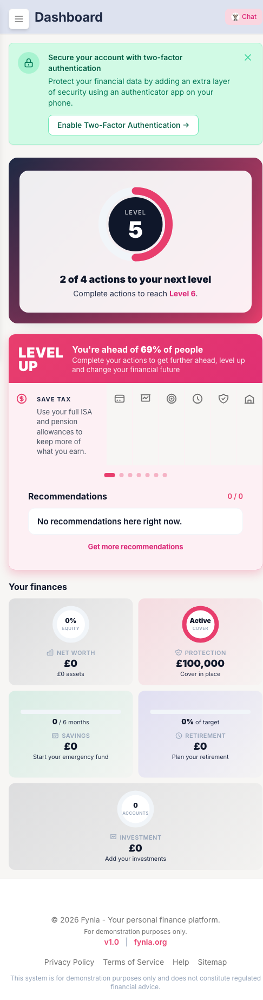
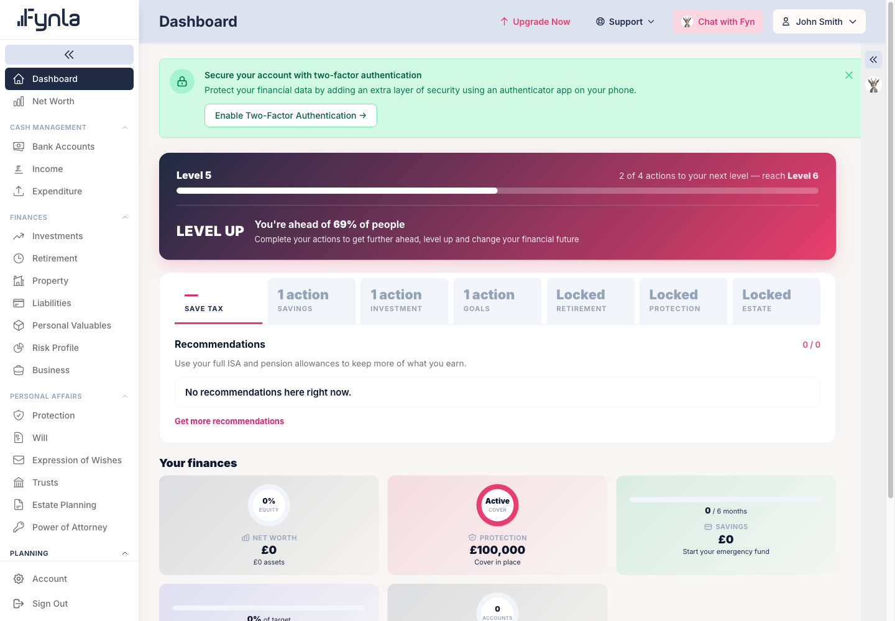
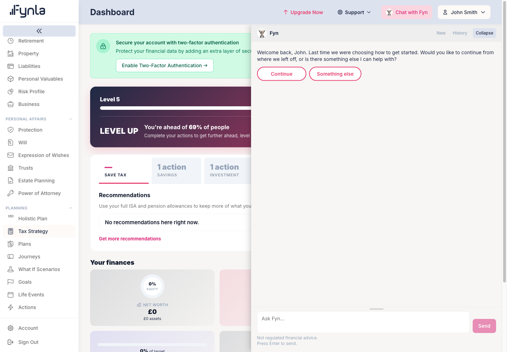
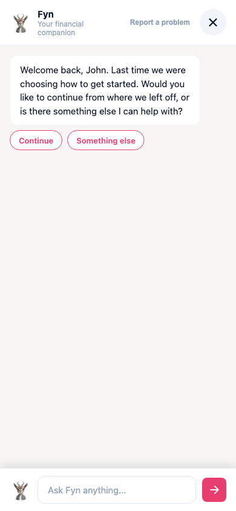
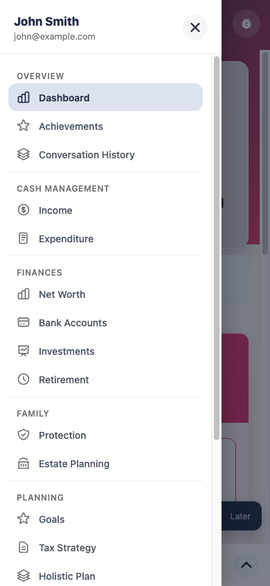

# Fynla — application map: overview (baseline)

| | |
|---|---|
| Scope | The whole application at inventory depth: every client, every route file, every backend layer, every background process, every test suite. Per-screen forms, field tables and CRUD tables are deferred to the section maps listed in `INDEX.md`. |
| Commit | `28194e804` on `dev` |
| Mapped on | 2026-09-14 |
| Mapped by | Claude Code session, `app-map` skill, first run |
| Supersedes | `docs/reference/System Map.md` (vault `appMapping/currentState/*`) as the entry point; those documents were not used as evidence |
| Issues raised | MB-01 to MB-13 in `September/September14Updates/mappingBugs2026-09-14.md` |

Every statement below cites a file and line read in this run, a command run in this run, or a browser interaction performed in this run. Where a claim could not be checked it says "I COULD NOT VERIFY".

## 1. Overview

### In plain English

Fynla is a website and phone app that helps a UK household see all of its money in one place and work out what to do next. A person types in (or tells the assistant, Fyn) what they own, owe, earn and spend, and Fynla turns that into a net worth picture, a check on their insurance cover, their pension outlook, their inheritance tax exposure, their goals, and a ranked list of actions. A free tier lets a household record a limited number of accounts; a paid tier removes those limits and unlocks the deeper planning tools. The same information is shown on the desktop website, on a mobile web version, and in a native iPhone app, all fed by one shared server.

### How it fits together

There is one Laravel backend and three user-facing clients. The desktop site is a Vue single-page application. The mobile web version is a separate Vue bundle served under `/m`. The iPhone app is SwiftUI and talks to the same server at fynla.org. Public marketing pages are rendered on the server before the single-page application is reached. Every client authenticates with a bearer token and calls the same `/api` routes; a small `/api/v1` set exists for mobile and native-only concerns such as push devices and Apple purchases. Behind the routes sit controllers, then module "agents" that orchestrate calculation services, then a store layer that owns writes, then the database. A scheduler runs alerts, reminders, subscription housekeeping, the Fyn memory hygiene tasks and a marketing content pipeline.

### Flow diagrams

- `docs/diagrams/map-overview-whole-app-flow.excalidraw` — clients, middleware, routes, controllers, agents and services, Fyn, stores and models, background machinery and external services, with the arrows that actually exist in code.
- `docs/diagrams/map-overview-module-graph.excalidraw` — the twenty user-facing and supporting areas and the agent or service group behind each.
- `docs/diagrams/map-overview-cross-module-dependencies.excalidraw` — which service groups import which, counted from `use App\Services\<Group>\` statements.

Vault copies are in `fynlaBrain/Diagrams/` and listed in the Diagrams Index.

### What it looks like

The screens below were driven in Playwright this run against the local build (`http://localhost:8000`, user `john@example.com`).


*The server-rendered homepage, captured after signing out. Loading `/` while signed in redirected to `/dashboard` (`redirect.authed`, `routes/web.php:96`), which was also observed this run.*


*Web login: after email and password, a six-digit code is required. The code was read from the database with the tinker command in `CLAUDE.md` and entered; the browser landed on `/dashboard`.*


*Web dashboard: two-factor prompt, the level card ("2 of 4 actions to your next level"), focus areas, and the "Your finances" tiles.*


*The side navigation with every group opened by clicking it.*


*Clicking "Tax Strategy" for a user who has not finished onboarding opens Fyn with a "Welcome back" resumption prompt instead of navigating. That is deliberate: `resources/js/components/SideMenu.vue:457-466`.*


*`/m` after the same login flow at 390 pixels wide: level card, next milestone, focus areas, today's insight, finance tiles, and the Fyn dock.*


*The `/m` menu, opened by clicking the hamburger.*

### Surfaces

Status is at the surface level only. "Working" means it was driven in the browser this run. "Present" means the route or feature folder exists in that client's code and was read; it was not executed. "Absent" means no route or feature exists in that client.

| Feature | Web | `/m` | iOS | Notes |
|---|---|---|---|---|
| Login with email, password, six-digit code | Working | Working | Present (`ios-native/Fynla/Features/Authentication`) | Web `/login` route `resources/js/router/index.js:443`; `/m` `resources/mobile/router.js:56`; iOS calls `api/auth/verify-code` and `resend-code` |
| Dashboard with level card and finance tiles | Working | Working | Present (`Features/Dashboard`) | Web composes from stores (`views/Dashboard.vue:1300-1360`); `/m` and iOS call `api/v1/mobile/dashboard` (`routes/api_v1.php:118`) |
| Fyn chat with resumption prompt | Working (panel opened, "Welcome back" shown) | Working (dock shown with same prompt) | Present (`Features/Fyn`, `Core/Streaming`) | One endpoint for all: `POST api/ai-chat/conversations/{id}/messages` (`routes/api.php:1508`) |
| Net worth and its categories | Present (`/net-worth/*`, 15 child routes) | Present (`/net-worth`, `/net-worth/:category`, property, mortgage, liability detail) | Present (`Features/NetWorth`) | |
| Protection | Present (`/protection`, policy detail) | Present | Present | |
| Savings (Bank Accounts) | Present | Present | Present | |
| Investment | Present (`/net-worth/investments` and four detail children) | Present (`/investment`, account detail) | Present | |
| Retirement | Present (`/net-worth/retirement`, `/pension/:type/:id`) | Present | Present | |
| Estate: IHT, Will builder, Power of Attorney, Trusts | Present (`/estate`, `/estate/inheritance-tax`, `/estate/will-builder`, `/estate/lpa/create/:type`, `/trusts`) | Present (`/estate`, `/estate/bequests`); will builder and LPA wizard absent from the mobile router | Present (`Features/Estate`) | Section map must confirm what `/m` and iOS show for wills and LPAs |
| Goals and life events | Present (`/goals`) | Present (`/goals`, `/goals/:id`) | Present (`Features/Goals`) | |
| Tax strategy | Present (`/tax-strategy`) | Present | Present (`Features/TaxStrategy`) | |
| Holistic plan | Present (`/holistic-plan`) | Present | Present (`Features/HolisticPlan`) | |
| Income and expenditure | Present (`/valuable-info?section=…`) | Present (`/income`, `/income/:owner/:source`, `/expenditure`) | Present (`Features/Income`, `Features/Expenditure`) | |
| Risk profile | Present (`/risk-profile` and two children) | Absent (`app/Constants/GateRoutes.php` maps `RISK_PROFILE` mobile to `null`) | Absent (no feature folder; `/m` test `InvestmentRiskProfileHandoff.spec.js` implies a hand-off to web) | |
| Plans, Journeys, What-if, Actions | Present (`/plans/*`, `/planning/journeys`, `/planning/what-if/*`, `/actions/*`) | Absent from `resources/mobile/router.js` | Absent (no feature folder) | Web only |
| Achievements and conversation history pages | Absent as routes (level card on dashboard; history via the Fyn panel "History" button) | Present (`/achievements`, `/conversation-history`) | Present (`Features/Achievements`) | |
| Settings, personal information, family, spouse sharing | Present (`/settings/*`) | Present (`/personal-information`, `/settings`, `/spouse-sharing`, `/notifications`) | Present (`Features/Settings`, `Features/Profile`, `Features/Privacy`) | |
| Subscription and checkout | Present (`/checkout`, `/teaser`, settings) | Present (`/subscription`) | Present (`Features/Subscription`, StoreKit) via `api/v1/native/*` | iOS purchases have no products in App Store Connect (see memory); I COULD NOT VERIFY the paywall this run |
| Admin, advisor, insights CMS, marketing pipeline | Present (`/admin/*` 20 routes, `/advisor`) | Absent | Absent | Web only by design |
| Preview personas | Present (`/preview/*` 20 routes, `public: true, previewMode: true`) | Absent | Absent | |
| Public marketing and learn pages | Working: server-rendered PHP (`public/pages/`, Azlan Raj's set); the 56 Vue copies are blocked by the router guard and never render (MB-09, Appendix E) | `/m/landing` blade | n/a | Help link from the signed-in footer drove a full load to the PHP help page this run |

### Depends on / depended on by

Counted from `use App\Services\<Group>\` and `use App\Agents\` imports across `app/Services`, `app/Agents` and `app/Http/Controllers` this run.

| Direction | Group | What crosses the boundary | Evidence |
|---|---|---|---|
| Everything consumes | `Stores` | The write boundary: 25 service groups import a `*Store` | Import count, `app/Services/Stores/` |
| Agents consume | Investment (14), AI (12), Estate (11), Retirement (9), Savings (9), Coordination (8), Protection (7), Goals (5) | Module calculators | `app/Agents/*.php` imports |
| AI consumes | Coordination (20), Stores (11), Onboarding (7), CoordinatingAgent | Recommendations and write handlers for Fyn | `app/Services/AI/**` imports |
| Onboarding consumes | AI (24), Stores (16) | Fyn onboarding director writes through stores | `app/Services/Onboarding/**` imports |
| Coordination consumes | Stores (12), Tax, Protection, Plans, Goals, Estate, and five module agents | Cross-module plan composition | `app/Services/Coordination/**` |
| Plans consume | Investment (12), Stores (7), Estate, Goals, and six agents | Per-module plan documents | `app/Services/Plans/**` |
| Mobile consumes | Gamification (4), Coordination (3), six agents, Dashboard | Mobile dashboard aggregation | `app/Services/Mobile/MobileDashboardAggregator.php` |
| Estate consumes | Stores (18), Shared (5), Retirement (5), Settings (5), Goals (3) | Pension and household data for IHT | `app/Services/Estate/**` |
| Retirement consumes | Investment (5), Risk (2) | Portfolio exposure for pensions | `app/Services/Retirement/**` |
| Tiers consume | Stores (7), Payment (2), Estate, NetWorth, Billing | Entitlement resolution | `app/Services/Tiers/**` |
| Controllers consume | Eight agents directly | `Controllers/Api` import every agent | `app/Http/Controllers/Api/*.php` |

## 2. Detailed sections

### 2.1 Entry points and public pages

**In plain English.** A visitor first meets pages that the server builds and sends as finished HTML: the homepage, pricing, features, the learn articles, the Save Tax campaign. Once they log in, everything else is one page that rewrites itself as they click. On a phone, a separate lighter version lives under `/m`.

**Status:** Working for the homepage and login (driven this run). Duplicate for the marketing pages (MB-09). Does not make sense for six mockup routes (MB-10).

**How it works**

| Step | Layer | File | What happens |
|---|---|---|---|
| 1 | Web routes | `routes/web.php:96-470` | 60 closure routes wrapped in `redirect.authed` include `public/pages/*.php` and return HTML with a 5-minute cache header. Signed-in users are bounced to the dashboard by the middleware. |
| 2 | Web routes | `routes/web.php:28-31` | `/insights/{slug}` returns the SPA shell after `InsightsSeoMetaInjector` writes meta tags. |
| 3 | Web routes | `routes/web.php:35-49`, `:56-75` | Lifecycle magic links (`signed`), web hand-off consume, RSS feeds, newsletter confirm and unsubscribe. |
| 4 | Web routes | `routes/web.php:77-85` | `/storage/{path}` streams the public disk; refuses `..`. |
| 5 | Web routes | `routes/web.php:660-749` | Save Tax mockups and dashboard mockups (MB-10). |
| 6 | Web routes | `routes/web.php:551-558` | `/m` → `mobile-host` blade, `/m/landing` → `mobile-landing`, `/m/app/{any?}` → `mobile-app` (the built `/m` bundle). |
| 7 | Web routes | `routes/web.php:600-602` | `/{any}` catch-all returns `resources/views/app.blade.php`, which loads `resources/css/app.css` and `resources/js/app.js` (`app.blade.php:93`). |
| 8 | SPA router | `resources/js/router/index.js` | 161 `path:` entries. Guard at `:1755-1807`: `requiresAuth` sends guests to `Login`; `public` routes send signed-in users to `Dashboard`; `requiresAdmin` checks `auth/isAdmin`; tier-gated routes redirect to `/teaser` with the capability name. |
| 9 | Mobile router | `resources/mobile/router.js` | 36 entries under base `<VITE_ROUTER_BASE>m/app/`; `meta.auth` routes require `store.token` (`:106-111`). |

**Tests:** `tests/E2E/public/*.spec.js` (3), `tests/E2E/smoke/desktop.spec.js`, `mobile.spec.js`, `tests/frontend/router/publicRoutePolicy.test.js`, `tests/frontend/public/pricing.test.js`. Run this session: the Vitest suite (see § 2.11).

### 2.2 Request pipeline, authentication and gates

**In plain English.** Every request passes a fixed set of checks: security headers, input cleaning, who you are, whether you are a demo persona (writes are blocked), whether an adviser is acting for you, and whether your subscription allows the feature. Only then does the request reach the code that does the work.

**Status:** Unverified except login, which was driven this run on both web and `/m`.

**How it works**

| Step | Layer | File | What happens |
|---|---|---|---|
| 1 | Global middleware | `app/Http/Kernel.php:96-107` | `TrustHosts`, `TrustProxies`, CORS, maintenance, post size, `CaptureNativeDeviceLabel`, trim, empty-to-null, `SecurityHeaders`, `CaptureAwcCookie` (affiliate cookie). |
| 2 | `web` group | `Kernel.php:115-124` | Cookies, session, CSRF, `RedirectPhoneToMobile`, `RebasePublicPageUrls`. |
| 3 | `api` group | `Kernel.php:126-136` | `ApiCacheHeaders` (no-store), Sanctum stateful, throttle `api`, `SanitizeInput`, `TouchSessionActivity`, `AdvisorImpersonationMiddleware`, `PreviewWriteInterceptor`, `CheckSubscription`. |
| 4 | Priority | `Kernel.php:72-88` | Native client identification runs before Sanctum so malformed native requests get a stable client error. |
| 5 | Preview | `app/Http/Middleware/PreviewWriteInterceptor.php:49-85` | `EXCLUDED_ROUTES` lists the writes a preview persona may still perform (login, register, verification, password reset, onboarding, document upload, AI chat, device registration, StoreKit, advisor enter and exit, bug report). Everything else is intercepted for preview users. Rule 7 in `CLAUDE.md`. |
| 6 | Subscription | `app/Http/Middleware/CheckSubscription.php:20-55` | Skipped entirely when `config('app.payment_enabled')` is false (`.env` has `PAYMENT_ENABLED=true` locally). Always-allowed prefixes: payment, auth, webhooks, preview, onboarding, bug-report, gdpr, admin, advisor. Read-only for expired users: `api/user/`, `api/settings/`. `CAPABILITY_ROUTE_MAP` ties eight route prefixes to capabilities such as `holistic_plan` and `what_if`. |
| 7 | Tier data | `database/seeders/TierConfigurationSeeder.php:28-118` | Two tiers. Free: prices 0, count caps savings 2, investment 2, pension 2, property 1, mortgage 10, goal 2, life event 1, estate `teaser`, Fyn 100k tokens a week. Premium: 699p a month or 5999p a year, no caps, everything `full`, Fyn 500k tokens a week. Resolved at runtime by `app/Services/Tiers/TierResolver.php` and `app/Services/Stores/TierGate.php`. |
| 8 | Route-level gates | `routes/api.php:915`, `:1095` | `estate.full` (48 routes) and `holistic.full` (10 routes) middleware. `permission:admin.access` guards 143 admin routes; `permission:admin.tax_config` 8; `advisor` 14. |
| 9 | Auth routes | `routes/api.php:153-231` | Register, registration hand-off, login, verify code, resend, restore soft-deleted account, beacon logout, MFA verify and recovery, password reset (six steps), then authenticated: logout, user, change password, MFA management (5), sessions (3), GDPR consents, export and erasure (13). Each unauthenticated step has its own named throttle (`auth-3`, `auth-5`, `auth-10`). |
| 10 | Route loading | `app/Providers/RouteServiceProvider.php:174-184` | `api.php` under `api`, `api_v1.php` under `api/v1`, and `e2e.php` under `__e2e` only when `APP_ENV=e2e`. |

**Unused registrations:** aliases `admin`, `role`, `mfa.verified` are registered but no route uses them (MB-13).

**Tests:** `tests/Architecture/GateRoutesTest.php`, `PreviewBlockSitesCheckBypassTest.php`, `PreviewModeToolCatalogueTest.php`; `tests/E2E/auth/registration.spec.js`; `tests/E2E/freemium/*` (2); Feature tests under `tests/Feature/Auth` (not enumerated this run).

### 2.3 Routes and controllers

**In plain English.** The server exposes about eight hundred addresses. Roughly seven hundred are the JSON API the apps use; the rest are the public pages. Each API address is handled by one of 147 controller classes, and every controller on disk is wired to at least one address except the abstract base and a test helper.

**Status:** Unverified (inventory read, not executed, except the routes hit during login and dashboard load).

**How it works**

| Fact | Value | Evidence |
|---|---|---|
| Effective routes | 805 | `php artisan route:list --json` this run |
| Under the `api` middleware group | 715 | same, middleware column |
| Sanctum-protected | 678 | same |
| Under `web` group | 87 | same |
| Closure routes | 75, all public pages or health checks | same, action `Closure` |
| Controllers on disk | 147; 145 routed | `git ls-files app/Http/Controllers` compared with route actions |
| Not routed | `Controller.php` (abstract base), `TestSupport/E2EController.php` (loaded only under `APP_ENV=e2e`, `RouteServiceProvider.php:181`) | same |
| Form Requests | 103 | `git ls-files app/Http/Requests` |
| API Resources | 36 | `git ls-files app/Http/Resources` |
| Largest route groups | admin pipeline 29, `learn` pages 23, admin insights 18, GDPR 15, protection policies 15, investment rebalancing 14, mobile v1 14, retirement pensions 12 | route prefix count this run |

The full group layout of `routes/api.php` with line numbers is in Appendix D.

**Routes with no caller in any client** are listed in MB-08 and Appendix C.

### 2.4 Agents and services

**In plain English.** Each money topic has an "agent" that answers "analyse this household" by calling the right calculators. A coordinating agent combines them into cross-topic advice. Calculations never write to the database directly; a separate store layer owns writes and keeps derived figures consistent.

**Status:** Unverified (read; the architecture suite that asserts these boundaries passed this run, see § 2.11).

**How it works**

| Piece | Files | What the code shows |
|---|---|---|
| Agents | `app/Agents/` 9 files: `BaseAgent`, `Protection`, `Savings`, `Investment`, `Retirement`, `Estate`, `Goals`, `TaxOptimisation`, `Coordinating` | Controllers under `app/Http/Controllers/Api` import all eight concrete agents. Agents import `Stores` 21 times and the module service groups. |
| Services | 542 files in 47 groups under `app/Services/` | Largest: Estate 34, Investment 27, Retirement 16, Pipeline 15, Documents 14, Payment 13, Goals 12, Plans 12, Savings 11, Tax 10. |
| Stores | `app/Services/Stores/` | `*Store.php` for actuarial tables, currency rates, goals, investment accounts, liabilities, life events, mortgages, pensions, property, savings market rates, savings, retirement profile, tax config, tier configuration; plus `TierGate`, `IngestSource`, `Normalisers/`, `Recalc/`, `ReferenceData/`, `Snapshots/`. Eight `.md` files sit beside the stores as documentation. |
| Dashboard aggregation | `app/Services/Dashboard/DashboardAggregator.php:17-22` | Injects five agents (Protection, Savings, Investment, Retirement, Estate) and calls `analyze()` on each inside a try/catch. Served by `GET api/dashboard`, which no client calls (MB-08). |
| Mobile aggregation | `app/Services/Mobile/MobileDashboardAggregator.php` | Imports six agents, Gamification, Coordination and Dashboard; serves `api/v1/mobile/dashboard`, which `/m` and iOS call. |
| Coordination | `app/Services/Coordination/` 15 files | `RecommendationsAggregatorService`, `PriorityRanker`, `HolisticPlanner`, `CompositePlanService`, `ComposedTaxPlanService`, `CrossModuleStrategyService`, `HouseholdFinancialContext`, `RecommendationPersonaliser`, `RecommendationCompletionService`, `ConflictResolver`, `CashFlowCoordinator`, `StrategyPlanComposer`, `PlanSources/`. |
| Tax | `app/Services/Tax/` 10 files; `TaxConfigService` is the single source of tax values (Rule 2). `tests/Architecture/HardcodedValuesArchitectureTest.php` enforces it and passed this run. | |
| Test-only services | `Marketing/PensionEstimateService.php`, `Pipeline/CaptionBuilder.php`, `Stores/CurrencyDisplayService.php` | No production caller (MB-12). |

### 2.5 Data

**In plain English.** The database holds 170 tables. Most map one-to-one to a model class; the rest are framework tables, snapshots of past values, and audit or log tables.

**Status:** Unverified (schema read from the live local database, not exercised).

| Fact | Value | Evidence |
|---|---|---|
| Tables in the local database | 170 | `SHOW TABLES` via tinker this run |
| Models | 150 (`app/Models`, including `Estate/`, `Investment/`, `Insights/`, `News/`, `Pipeline/` sub-namespaces and two `Concerns` traits) | `git ls-files app/Models` |
| Migrations | 335 | `git ls-files database/migrations` |
| Seeders | 29, including `TaxConfigurationSeeder`, `TaxProductReferenceSeeder`, `TierConfigurationSeeder`, `PreviewUserSeeder`, `PremiumTestPersonaSeeder`, `ActuarialLifeTablesSeeder`, `SavingsMarketRatesSeeder`, five `*ActionDefinitionSeeder` | `git ls-files database/seeders` |
| Value snapshots | `db_pension`, `dc_pension`, `investment_account`, `liability`, `mortgage`, `property`, `savings_account`, `state_pension` `_value_snapshots` tables | `SHOW TABLES` |
| Observers | 19 on disk; 13 registered in `app/Providers/EventServiceProvider.php:111-140`, 5 in `AppServiceProvider.php` (`DocumentArticle`, `InsightArticle`, `RecommendationTracking`, `SurvivingSpouseExpenditure`, `UserOnboardingStep`); `RiskRecalculationObserver` registered nowhere (MB-07) | grep this run |
| `UserDataCacheObserver` | attached to 25 models so any financial write invalidates the user's cached aggregates | `EventServiceProvider.php:113-139` |
| Entity events | 27 `Created/Updated/Deleted/Restored` events for investment accounts, mortgages, DB and DC pensions, state pension, property, savings; mortgage events recalculate the property's outstanding balance, property events sync the owner's rental income | `EventServiceProvider.php:72-106`, `app/Events/` |
| Broadcast channel | one private channel `App.Models.User.{id}` | `routes/channels.php:16` |
| Existing ERDs | 13 `docs/diagrams/erd-*.excalidraw` | `ls docs/diagrams` |

### 2.6 Web single-page application

**In plain English.** The desktop site is one Vue application. It loads screens on demand, keeps a copy of the user's data in memory (Vuex), and talks to the server through 62 small service files.

**Status:** Working for login, dashboard and side navigation (driven this run). Dead for 153 files (MB-01).

| Fact | Value | Evidence |
|---|---|---|
| Entry | `resources/js/app.js` via `app.blade.php:93` | read |
| Router entries | 161 | `grep -c "path: '" resources/js/router/index.js` |
| Layouts | `AppLayout.vue`, `PublicLayout.vue`, `AdvisorLayout.vue` | `ls resources/js/layouts` |
| Views | 168 files | `git ls-files resources/js/views` |
| Components | 546 files | `git ls-files resources/js/components` |
| Services | 62 files; axios base is `<origin><routerBase>/api` | `resources/js/services/api.js:62-64` |
| Store modules | 35 | `ls resources/js/store/modules` |
| Reachable from entry | 702 of 855 non-test `.vue`/`.js` files | reachability script this run (imports plus component tags, comments stripped) |
| Unreachable | 153 files, Appendix A | same |
| Client calls with no route | `/estate/analyze`, `/savings/goals`, `/savings/expenditure-profile`, `/user/spouse`, `/investment/goal-progress/*`, `/investment/performance-attribution/*` | MB-02 to MB-05 |
| Side navigation, as rendered | Dashboard, Net Worth; Cash Management (Bank Accounts, Income, Expenditure); Finances (Investments, Retirement, Property, Liabilities, Personal Valuables, Risk Profile, Business); Personal Affairs (Protection, Will, Expression of Wishes, Trusts, Estate Planning, Power of Attorney); Planning (Holistic Plan, Tax Strategy, Plans, Journeys, What If Scenarios, Goals, Life Events, Actions); Account, Sign Out | Playwright snapshot this run; `resources/js/components/SideMenu.vue` |

### 2.7 Mobile web (`/m`)

**In plain English.** The phone version is a separate, smaller build of the same ideas. It is served as pre-built files, so a change to the desktop code does not reach it until the mobile bundle is rebuilt.

**Status:** Working for login, verification, dashboard and menu (driven this run at 390 pixels).

| Fact | Value | Evidence |
|---|---|---|
| Source | `resources/mobile/` 95 files; entry `main.js`; own `api.js`, `router.js`, `store.js`, `tokens.js` | `ls resources/mobile` |
| Build | `vite.mobile.config.js:36` → `public/m-build/` (present locally: `assets/`, `manifest.json`) | read |
| Router | 36 entries; `/module/:slug` redirects to the real module view (retired scaffold, comment at `router.js:57-59`) | `resources/mobile/router.js` |
| Views | 18 top-level plus `views/modules/` (NetWorth, NetWorthCategory, PropertyDetail, MortgageDetail, LiabilityDetail, Protection, ProtectionPolicy, Savings, SavingsAccount, Retirement, RetirementPensionDetail, Investment, InvestmentAccountDetail, Estate, EstateBequests, Goals, GoalDetail) | `ls resources/mobile/views` |
| Reachability | all 58 non-test files reachable | script this run |
| API paths called | 63 distinct; all match a route (two are parameterised: `spouse-permission/${action}`, `share/${shareType}`) | script this run |
| Menu, as rendered | Overview (Dashboard, Achievements, Conversation History); Cash Management (Income, Expenditure); Finances (Net Worth, Bank Accounts, Investments, Retirement); Family (Protection, Estate Planning); Planning (Goals, Tax Strategy, Holistic Plan); Account (Personal Information, Subscription, Settings); Share Fynla, Sign out | Playwright snapshot this run |
| Shared with web | only `store/modules/auth.js` (per `CLAUDE.md`); I COULD NOT VERIFY the import this run | |

### 2.8 Native iOS

**In plain English.** The iPhone app is written in Swift. It uses the same server as the website, at the live address, even for testing.

**Status:** Unverified. Not built or run this run.

| Fact | Value | Evidence |
|---|---|---|
| Files | 423 under `ios-native/` | `git ls-files ios-native` |
| Server | both `Production.xcconfig` and `Staging.xcconfig` set `FYNLA_API_BASE_URL = https://fynla.org` | `ios-native/Configurations/*.xcconfig:3-4` |
| Feature folders | Achievements, Authentication, BugReport, Dashboard, Estate, Expenditure, Fyn, Gamification, Goals, HolisticPlan, Income, Investment, Navigation, NetWorth, Privacy, Profile, Protection, Retirement, Savings, Settings, Subscription, TaxStrategy | `ls ios-native/Fynla/Features` |
| Core folders | API, Authentication, Biometrics, Components, DeepLinks, DesignSystem, Diagnostics, Formatting, FynEditing, Keychain, Migration, Navigation, Push, Sharing, StoreKit, Streaming, VersionPolicy | `ls ios-native/Fynla/Core` |
| API paths called | 85 distinct `path: "…"` literals; all match a route (one parameterised share path) | script this run |
| Native-only routes | `routes/api_v1.php:44-116`: health, session exchange and refresh, StoreKit account token, purchase authorisation, entitlement, transactions, reconcile, status; guarded by `native.client`, `native.version`, `native.session` | read |
| Mobile v1 routes used by both `/m` and iOS | dashboard, achievements (v1, v2, milestones, completed), devices, notification preferences, share, web hand-offs, token refresh | `routes/api_v1.php:118-179` |

### 2.9 Fyn, the AI assistant

**In plain English.** Fyn is the chat assistant. It has one door for every client. Behind the door it is either in "onboarding" mode, where it can enter and change the user's information, or in "advice" mode, where it can only read and explain. The user never sees the switch.

**Status:** Working for opening the panel and receiving the resumption prompt on web and `/m` this run. The turn itself was not sent (no message was posted to the model).

| Piece | File | What the code shows |
|---|---|---|
| One endpoint | `routes/api.php:1501-1522` | `ai-chat` group: token usage, conversations list, create, contextual create, show, delete, send message (`throttle:ai-chat`, `idempotent`), stream queued message, cancel queued, resumption get and clear, action, onboarding status and start. |
| Dispatch predicate | `app/Services/AI/ContextualConversation/ConversationModeResolver.php:12-29` | Onboarding mode when `onboarding.fyn_flow_enabled` is true, the conversation source is not `surface_action`, and either the source is `fyn_onboarding` or (`onboarding_completed === false` or `active_campaign !== null`) and `onboarding_fyn_step !== null`. Called from `AiChatController.php:267`. |
| Two states | `AiChatController.php:270-273` | `OnboardingChatDirector::handleUserMessage` or `AdviceFyn::handle`; the same generator loop streams either. |
| Consent | `AiChatController.php:275-300` | Consent is rechecked at most every `ai_chat.consent_recheck_interval_seconds` during a stream. |
| Provider | `.env` `AI_PROVIDER=xai`; `app/Services/AI/XaiClient.php` | Tool catalogue is assembled from the procedural corpus (`XaiToolDefinitions.php:14-20`, `:30-59`): navigation, analysis, tax, plan generation, billing tools always; what-if, creation, modification, profile and Save Tax campaign tools only outside preview; pointer `fetch_*` tools always. An Anthropic-format catalogue `AiToolDefinitions.php` (480 lines) exists beside it; `tests/Architecture/ToolCatalogueParityTest.php` asserts parity and passed this run. |
| Prompt | `app/Services/AI/Fyn/FynSystemPrompt.php`, `FynContextAssembler.php`, `app/Services/AI/Prompts/` (ComplianceRules, CoreIdentity, EmptyDataGuard, FcaProcessInstructions, QueryKnowledge, UserContentSanitiser) | read at directory level; contents not mapped this run |
| Memory | `app/Services/AI/Memory/` (Episodic, Procedural, Recall, Semantic), corpus in `fyn-memory/{episodic,procedural,semantic}` | directory listing |
| Loop | `app/Services/AI/Loop/` (`FynLoop`, `Planner`, `ConcurrentTurnQueue`, `ResumptionService`, `SessionMode`), `Ground/GroundGate` | directory listing |
| Audit | `ai_audit_events` hash chain, `AuditChainService`, `ai:audit:verify-chain` weekly | `app/Console/Kernel.php:53`, `SHOW TABLES` |
| Background | `ai:conversations:summarise-stale` every 3 minutes (pause) and every 30 minutes; `fyn:episodic:reconcile` daily, `cold-archive` weekly; `AiIdempotencyCleanupJob` daily; `AiAuditRetentionJob` weekly | `app/Console/Kernel.php:33-70` |
| Frontend | web `store/modules/aiChat.js` (SSE consumer), `/m` `resources/mobile/fyn/contextualConversation.js`, iOS `Features/Fyn` and `Core/Streaming` | file listing |

The canonical contract is `.claude/skills/fyn-architecture/SKILL.md`; this run confirmed the predicate and the two-state dispatch in code as cited above.

### 2.10 Background machinery

**In plain English.** Every day the server sends reminders and alerts, expires lapsed subscriptions, deletes accounts whose owners asked for deletion, tidies old data, and moves marketing content through a publishing pipeline. Some of this runs every few minutes.

**Status:** Unverified (schedule read; nothing was triggered).

| Kind | Count | Where |
|---|---|---|
| Artisan commands | 67 on disk; 36 scheduled; 31 manual | `git ls-files app/Console/Commands`, `app/Console/Kernel.php:20-107` |
| Scheduled jobs | `PublishScheduledInsightsJob` every 5 minutes; `AiIdempotencyCleanupJob` daily 03:30; `AiAuditRetentionJob` weekly | `Kernel.php:56-63` |
| Daily alerts | daily insight 08:00, lifecycle 08:30, policy renewals 09:00, protection 09:15, mortgage rate 09:30, savings 10:00, estate 10:30, business filing 10:45 | `Kernel.php:37-47` |
| Subscription and account housekeeping | renewal reminders 09:00, expire 00:05, scheduled deletions 00:10, grace deletions 00:15, deletion reminders 00:20, purge monthly, check-overdue 01:00, reconcile pending payments every 10 minutes, Apple notification recovery every 10 minutes | `Kernel.php:20-26`, `:48-53` |
| Marketing pipeline | four detectors every `pipeline.poll_frequency_minutes` (default 5), drive watch daily, clip auto-approve, schedule posts hourly, optimal times weekly, weekly report, quarterly video audit | `Kernel.php:72-107` |
| Jobs | 14 (`app/Jobs`): six pipeline jobs, `ConversationSummariserJob`, `FireAwinConversionJob`, `ProcessAppleNotification`, `RunMonteCarloSimulation`, `RecalculateRiskProfileJob` (dead, MB-07), three schedule-only jobs | dispatch-site scan this run |
| Mail | 38 mailables; every one has a send site except the seven lifecycle mails (MB-06) | scan this run |
| Notifications | 9; all sent from the alert commands or spouse permission | scan this run |
| Lifecycle engine | `config/lifecycle.php`, `app/Services/Lifecycle/LifecycleEngine.php`, two campaigns (churned, lapsed) | read |
| Queue | `.env` `QUEUE_CONNECTION=sync` locally, so every job runs inline | read |

### 2.11 Tests

**In plain English.** The code has several test suites. Two of them were run for this map: the architecture suite, which checks that the code keeps to the rules above, and the frontend unit suite.

| Suite | Files | Run this session | Result |
|---|---|---|---|
| `tests/Architecture` (Pest) | 48 | yes | `./vendor/bin/pest tests/Architecture` → 153 passed, 1 skipped, 30 deprecated, 4304 assertions, 106s |
| Vitest (`resources/**/__tests__`, `tests/frontend`) | 143 files | yes | `npx vitest run` → 143 files passed, 1329 tests passed, 223s |
| `tests/Unit` | 475 | no | |
| `tests/Feature` | 535 (+10 under `Feature/Fyn/Eval` in the `Eval` suite) | no | |
| `tests/Integration` | 4 | no | |
| `tests/Browser/scenarios` (BS-NN, the Rule 14 contract) | 24 | no | |
| `tests/E2E` (Playwright) | 24 specs; base URL `http://127.0.0.1:8000` | no | `playwright.config.js:3` |
| iOS | `FynlaTests`, `FynlaUITests` | no | |

Tests written in this run: none. The overview has no single contract to test beyond the architecture suite, which already exists.

## 3. Findings

| Id | Status | Where | What is wrong |
|---|---|---|---|
| MB-01 | Dead | 153 files under `resources/js` (Appendix A) | Unreachable from the app entry |
| MB-02 | Dead | `store/modules/estate.js:295`, `services/estateService.js:22` | Calls `POST api/estate/analyze`, which does not exist; never dispatched |
| MB-03 | Dead | `services/savingsService.js:114-137`, `store/modules/savings.js:356` | Three methods for two routes that do not exist |
| MB-04 | Dead | `services/userProfileService.js:195` | `GET api/user/spouse` does not exist; no caller |
| MB-05 | Dead + Dead end | `components/Investment/GoalProjection.vue`, `PerformanceAttribution.vue`, `BenchmarkComparison.vue` | Dead components calling unregistered API prefixes |
| MB-06 | Dead | `app/Mail/Lifecycle/` seven mailables, `config/lifecycle.php:12-15` | No campaign sends them |
| MB-07 | Dead | `app/Observers/RiskRecalculationObserver.php`, `app/Jobs/RecalculateRiskProfileJob.php` | Never registered or dispatched; still documented in `app/Services/CLAUDE.md` |
| MB-08 | Dead (route side) | about 35 routes, Appendix C | No caller in any client, including `GET api/dashboard` and its aggregator |
| MB-09 | Duplicate | `routes/web.php:96-470` and the SPA public routes | Marketing pages rendered two ways |
| MB-10 | Does not make sense | `routes/web.php:660-702`, `:744-749` | Six mockups live without an environment guard |
| MB-11 | Does not make sense | Appendix B | Four unreferenced commands; twelve one-off migrations still registered |
| MB-12 | Dead | three services | Referenced only from tests |
| MB-13 | Dead | `app/Http/Kernel.php` aliases `admin`, `role`, `mfa.verified` | No route uses them |

Categories that came up empty this run: Broken (no failing test, no failed interaction, no runtime error seen).

## 4. Coverage and gaps

| Area | Checked | I COULD NOT VERIFY |
|---|---|---|
| Route files | all six read; effective table dumped | Behaviour of any controller beyond login, verification and dashboard load |
| Controllers, services, models | inventoried and reverse-swept by class name | Function bodies; that is section-map work |
| Frontend reachability | web and `/m` computed from imports plus component tags with comments stripped | Components registered by a string that is not their file basename; none were found but the method cannot rule them out |
| Client-to-route matching | web, `/m`, iOS and public pages | Paths built by string concatenation that my regexes did not capture (the web service scan found 444 literal paths) |
| Playwright | web: homepage, login, code, dashboard, all nav groups, Tax Strategy click, Fyn panel; `/m`: login, code, dashboard, menu | Every other screen; no form was filled beyond login; no Fyn turn was sent |
| Tests | Architecture and Vitest run | Unit, Feature, Integration, Browser, E2E, iOS not run |
| iOS | configuration and API paths read | Nothing built or launched |
| Vault documents | not used as evidence | |

## 5. Glossary

| Term | Meaning in this document |
|---|---|
| Agent | A PHP class in `app/Agents` that orchestrates one module's calculations; not an AI agent |
| Fyn | The chat assistant; one endpoint, two internal modes |
| `/m` | The mobile web version, a separate Vue build served under `/m/app` |
| Native | The SwiftUI iPhone app in `ios-native/` |
| SPA | Single-page application: the desktop site, which loads once and rewrites itself |
| Preview persona | A seeded demo household visitors can explore without an account; its writes are blocked |
| Tier | Free or Premium; decides count caps and which planning tools open |
| Store | A class in `app/Services/Stores` that owns writes for one entity type |
| Observer | A class that runs when a model is saved or deleted, used here to keep cached and derived figures fresh |
| SSE | Server-sent events, the streaming format Fyn replies in |
| MFA | Multi-factor authentication, the optional authenticator-app step |
| IHT | Inheritance tax |
| LPA | Lasting power of attorney |
| Dead | Code no reachable path leads to (this run's evidence standard in `.claude/skills/app-map/SKILL.md`) |

## Appendix A — 153 unreachable web SPA files (MB-01)

Computed from `resources/js/app.js`, `router/index.js` and `App.vue` following imports and component tags, with HTML and JS comments stripped. Test files excluded.

- `components/Actions/ActionSummaryCard.vue`
- `components/Actions/RecommendationFilters.vue`
- `components/Admin/AdminInvestmentActions.vue`
- `components/Admin/AdminProtectionActions.vue`
- `components/Admin/AdminRetirementActions.vue`
- `components/Admin/InvestmentActionModal.vue`
- `components/Admin/ProtectionActionModal.vue`
- `components/Admin/RetirementActionModal.vue`
- `components/Dashboard/ActionsOverviewCard.vue`
- `components/Dashboard/AffordabilityOverviewCard.vue`
- `components/Dashboard/AlertsPanel.vue`
- `components/Dashboard/AreasToCompleteCard.vue`
- `components/Dashboard/AreasToConsiderCard.vue`
- `components/Dashboard/CrossModuleInsights.vue`
- `components/Dashboard/DashboardCard.vue`
- `components/Dashboard/DashboardSparkline.vue`
- `components/Dashboard/EmptyDashboard.vue`
- `components/Dashboard/GoalsCard.vue`
- `components/Dashboard/GoalsOverviewCard.vue`
- `components/Dashboard/GoalsProjectionChartDashboard.vue`
- `components/Dashboard/GoalsProjectionChartMini.vue`
- `components/Dashboard/HouseholdNetWorth.vue`
- `components/Dashboard/InvestmentsOverviewCard.vue`
- `components/Dashboard/LifeTimelineCard.vue`
- `components/Dashboard/NetWorthOverviewCard.vue`
- `components/Dashboard/NetWorthSummary.vue`
- `components/Dashboard/ProfileCompletionCards.vue`
- `components/Dashboard/SpousalOptimisations.vue`
- `components/Dashboard/TaxOptimisationCard.vue`
- `components/Estate/AssetForm.vue`
- `components/Estate/AssetsLiabilities.vue`
- `components/Estate/CashFlow.vue`
- `components/Estate/CashFlowProjectionChart.vue`
- `components/Estate/EstateProjectionComparison.vue`
- `components/Estate/GiftCard.vue`
- `components/Estate/GiftForm.vue`
- `components/Estate/GiftingStrategy.vue`
- `components/Estate/IHTLiabilityGauge.vue`
- `components/Estate/LifePolicyStrategy.vue`
- `components/Estate/NRBRNRBTracker.vue`
- `components/Estate/PensionAmendmentBanner.vue`
- `components/Estate/TrustForm.vue`
- `components/Estate/TrustPlanning.vue`
- `components/Estate/TrustPlanningStrategy.vue`
- `components/Gamification/LevelCard.vue`
- `components/Goals/ChartTypeToggle.vue`
- `components/Goals/EventIconsOverlay.vue`
- `components/Goals/EventTooltip.vue`
- `components/Goals/GoalCard.vue`
- `components/Goals/GoalContributionStreak.vue`
- `components/Goals/GoalCountdown.vue`
- `components/Goals/GoalMilestoneTracker.vue`
- `components/Goals/GoalsAnalysis.vue`
- `components/Goals/GoalsByModule.vue`
- `components/Goals/GoalsList.vue`
- `components/Insights/InsightCtaPanel.vue`
- `components/Investment/AccountStrategyCard.vue`
- `components/Investment/AllocationComparison.vue`
- `components/Investment/AssetAllocationChart.vue`
- `components/Investment/AssetLocationOptimizer.vue`
- `components/Investment/BedAndISATransfers.vue`
- `components/Investment/BenchmarkComparison.vue`
- `components/Investment/BondWrapperInfoModal.vue`
- `components/Investment/CGTHarvestingOpportunities.vue`
- `components/Investment/ContributionPlanner.vue`
- `components/Investment/CorrelationMatrix.vue`
- `components/Investment/EfficientFrontier.vue`
- `components/Investment/FeeSavingsCalculator.vue`
- `components/Investment/GeographicAllocationMap.vue`
- `components/Investment/GoalForm.vue`
- `components/Investment/GoalProjection.vue`
- `components/Investment/ISAOptimizationStrategy.vue`
- `components/Investment/InvestmentOverviewCard.vue`
- `components/Investment/InvestmentReadinessGate.vue`
- `components/Investment/MonteCarloResults.vue`
- `components/Investment/PerformanceAttribution.vue`
- `components/Investment/PerformanceLineChart.vue`
- `components/Investment/PlanSections/ActionPlanSection.vue`
- `components/Investment/PlanSections/CurrentSituationSection.vue`
- `components/Investment/PlanSections/FeeAnalysisSection.vue`
- `components/Investment/PlanSections/GoalProgressSection.vue`
- `components/Investment/PlanSections/RecommendationsSection.vue`
- `components/Investment/PlanSections/RiskAnalysisSection.vue`
- `components/Investment/PlanSections/TaxStrategySection.vue`
- `components/Investment/PortfolioOptimization.vue`
- `components/Investment/PortfolioOptimizer.vue`
- `components/Investment/PortfolioOverview.vue`
- `components/Investment/RebalancingActions.vue`
- `components/Investment/RebalancingCalculator.vue`
- `components/Investment/StrategyRecommendationCard.vue`
- `components/Investment/TaxFees.vue`
- `components/Investment/TaxOptimization.vue`
- `components/Investment/TaxOptimizationOverview.vue`
- `components/Investment/TaxOptimizationRecommendations.vue`
- `components/Investment/WhatIfScenariosBuilder.vue`
- `components/Investment/WrapperOptimizer.vue`
- `components/Journey/JourneyProgressHero.vue`
- `components/Legal/StrategyDisclaimer.vue`
- `components/NetWorth/NetWorthOverview.vue`
- `components/NetWorth/Property/AmortizationScheduleView.vue`
- `components/NetWorth/Property/PropertyTaxCalculator.vue`
- `components/Onboarding/FocusAreaGrid.vue`
- `components/Onboarding/JourneyPreview.vue`
- `components/Onboarding/ProfileReviewPanel.vue`
- `components/Plans/Estate/EstateJointView.vue`
- `components/Plans/Investment/AccountFeeProjectionChart.vue`
- `components/Preview/KeepDataOrFreshModal.vue`
- `components/Protection/CoverageGapChart.vue`
- `components/Protection/CoverageTimelineChart.vue`
- `components/Protection/PremiumBreakdownChart.vue`
- `components/Protection/ProtectionOverviewCard.vue`
- `components/Protection/RecommendationCard.vue`
- `components/Public/CalculatorCard.vue`
- `components/Retirement/AccumulationChart.vue`
- `components/Retirement/AnnualAllowanceTracker.vue`
- `components/Retirement/DrawdownSimulator.vue`
- `components/Retirement/IncomeProjectionChart.vue`
- `components/Retirement/RequiredCapitalDetail.vue`
- `components/Retirement/SalarySacrificeDisplay.vue`
- `components/Retirement/StrategiesTab.vue`
- `components/Retirement/StrategyCard.vue`
- `components/Retirement/TaxBreakdownCard.vue`
- `components/Risk/CapacityForLossSection.vue`
- `components/Risk/RiskFactorsPanel.vue`
- `components/Risk/TimeHorizonSection.vue`
- `components/Savings/InterestRateComparisonChart.vue`
- `components/Savings/MissingDataCard.vue`
- `components/Savings/SaveGoalModal.vue`
- `components/Savings/SavingsDecisionPath.vue`
- `components/Savings/SavingsGoals.vue`
- `components/Shared/ISAAllowanceSummary.vue`
- `components/Shared/InfoGuideButton.vue`
- `components/Shared/InfoTooltip.vue`
- `components/Shared/PostcodeLookup.vue`
- `components/UserProfile/AssetsOverview.vue`
- `components/UserProfile/BalanceSheetTab.vue`
- `components/UserProfile/BalanceSheetView.vue`
- `components/UserProfile/CashFlowTab.vue`
- `components/UserProfile/CashflowView.vue`
- `components/UserProfile/DomicileInformation.vue`
- `components/UserProfile/IncomeStatementTab.vue`
- `components/UserProfile/LiabilitiesOverview.vue`
- `components/UserProfile/PersonalAccounts.vue`
- `components/UserProfile/ProfitAndLossView.vue`
- `components/UserProfile/TaxSummaryCard.vue`
- `components/WhatIf/ScenarioDetail.vue`
- `composables/useLifeStageFields.js`
- `constants/featureGating.js`
- `services/dashboardService.js`
- `services/portfolioOptimizationService.js`
- `store/utils/crudActionFactory.js`
- `views/Investment/AccountPerformancePanel.vue`
- `views/Investment/PortfolioStrategyPanel.vue`
## Appendix B — artisan commands not on the schedule (MB-11)

| Signature | Class | References outside its own file |
|---|---|---|
| `migrate:estate-to-networth` | `MigrateEstateToNetWorth.php` | 2 |
| `migrate:verify` | `VerifyDataMigration.php` | 2 |
| `data:encrypt` | `EncryptExistingData.php` | 2 |
| `gamification:backfill` | `GamificationBackfill.php` | 2 |
| `tier:sync-revolut` | `SyncRevolutTierVariations.php` | 1 |
| `family:reconcile-spouse-links` | `ReconcileSpouseFamilyLinks.php` | 0 |
| `pipeline:process` | `PipelineProcess.php` | 1 |
| `pipeline:google-preflight` | `Pipeline/GooglePreflight.php` | 4 |
| `pipeline:setup-tracker` | `Pipeline/SetupTracker.php` | 3 |
| `apple-store:bridge-health` | `AppleStoreBridgeHealth.php` | 2 |
| `subscriptions:audit-tier-collapse` | `AuditTierCollapse.php` | 1 |
| `estate:backfill-mirror-parties` | `BackfillMirrorWillParties.php` | 1 |
| `estate:backfill-bequests` | `BackfillWillBequests.php` | 0 |
| `mortgages:backfill-derived-columns` | `BackfillMortgageDerivedColumns.php` | 1 |
| `pensions:backfill-derived` | `BackfillPensionDerivedColumns.php` | 1 |
| `properties:backfill-derived-columns` | `BackfillPropertyDerivedColumns.php` | 2 |
| `properties:backfill-outstanding-mortgage` | `BackfillPropertyOutstandingMortgage.php` | 1 |
| `savings:backfill-derived` | `BackfillSavingsDerivedColumns.php` | 1 |
| `ai:usage:backfill` | `BackfillAiDailyUsage.php` | 1 |
| `fyn:episodic:backfill-blobs` | `FynEpisodicBackfillBlobs.php` | 5 |
| `fyn:episodic:purge` | `FynEpisodicPurge.php` | 3 |
| `fyn:pointers:reindex` | `FynPointersReindex.php` | 10 |
| `fyn:procedural:validate` | `FynProceduralValidate.php` | 18 |
| `fyn:semantic:promote` | `FynSemanticPromote.php` | 2 |
| `fyn:semantic:reindex` | `FynSemanticReindex.php` | 13 |
| `fyn:user:erase` | `FynUserErase.php` | 10 |
| `preview:reset` | `ResetPreviewData.php` | 4 |
| `eval:record` | `EvalRecordCommand.php` | 3 |
| `eval:show` | `EvalShowCommand.php` | 0 |
| `eval:purge` | `EvalPurgeCommand.php` | 0 |
| `eval:setup-azlan` | `EvalSetupAzlanCommand.php` | 2 |

## Appendix C — API routes with no caller found (MB-08)

Superseded on 2026-09-14 by the route-by-route dossier `docs/app-map/reports/mb-08-orphan-routes.md` (25 rows: 22 delete, 1 live after all, 2 for decision). See MB-08 for the grouped list with the dead-only callers noted. Method: every string literal passed to an HTTP call in reachable web files, all `/m` files, `public/pages` and every Swift `path:` literal, normalised and compared with `php artisan route:list`. Webhooks, health checks, eval-only and admin backup routes were excluded from the comparison.

## Appendix D — group layout of `routes/api.php`

```
153  Route::prefix('auth')->group(function () {
174      Route::prefix('password-reset')->group(function () {
183      Route::middleware('auth:sanctum')->group(function () {
189          Route::prefix('mfa')->group(function () {
198          Route::prefix('sessions')->group(function () {
205          Route::prefix('gdpr')->group(function () {
233  Route::prefix('insights')->group(function () {
254  Route::prefix('news')->group(function () {
263  Route::prefix('preview')->group(function () {
269      Route::middleware('auth:sanctum')->group(function () {
276  Route::middleware('auth:sanctum')->prefix('onboarding')->group(function () {
291  Route::middleware('auth:sanctum')->prefix('journeys')->group(function () {
303  Route::middleware('auth:sanctum')->prefix('life-stage')->group(function () {
311  Route::middleware('auth:sanctum')->prefix('user')->group(function () {
332      Route::prefix('family-members')->group(function () {
344      Route::prefix('personal-accounts')->group(function () {
359  Route::middleware('auth:sanctum')->prefix('info-guide')->group(function () {
366  Route::middleware('auth:sanctum')->prefix('spouse-permission')->group(function () {
375  Route::middleware('auth:sanctum')->group(function () {
381  Route::middleware('auth:sanctum')->prefix('tax-strategy')->group(function () {
387  Route::middleware('auth:sanctum')->prefix('net-worth')->group(function () {
400  Route::middleware('auth:sanctum')->prefix('joint-account-logs')->group(function () {
406  Route::middleware('auth:sanctum')->prefix('notifications')->group(function () {
414  Route::middleware(['auth:sanctum'])->prefix('properties')->group(function () {
428      Route::prefix('{propertyId}/mortgages')->group(function () {
438  Route::middleware(['auth:sanctum'])->prefix('mortgages')->group(function () {
447  Route::middleware(['auth:sanctum'])->prefix('business-interests')->group(function () {
459  Route::middleware(['auth:sanctum'])->prefix('chattels')->group(function () {
469  Route::middleware('auth:sanctum')->prefix('dashboard')->group(function () {
477  Route::middleware('auth:sanctum')->prefix('protection')->group(function () {
489      Route::prefix('policies/life')->group(function () {
496      Route::prefix('policies/critical-illness')->group(function () {
503      Route::prefix('policies/income-protection')->group(function () {
510      Route::prefix('policies/disability')->group(function () {
517      Route::prefix('policies/sickness-illness')->group(function () {
525  Route::middleware('auth:sanctum')->prefix('savings')->group(function () {
536      Route::prefix('accounts')->group(function () {
550  Route::middleware('auth:sanctum')->prefix('goals')->group(function () {
587  Route::middleware('auth:sanctum')->prefix('life-events')->group(function () {
604  Route::middleware('auth:sanctum')->prefix('investment')->group(function () {
623      Route::prefix('accounts')->group(function () {
635      Route::prefix('holdings')->group(function () {
649      Route::prefix('optimization')->middleware('throttle:10,1')->group(function () {
668      Route::prefix('rebalancing')->group(function () {
695      Route::prefix('contribution')->group(function () {
707      Route::prefix('tax-optimization')->group(function () {
734      Route::prefix('asset-location')->group(function () {
755      Route::prefix('performance')->group(function () {
773      Route::prefix('goals')->group(function () {
796      Route::prefix('fees')->group(function () {
815      Route::prefix('risk')->group(function () {
837      Route::prefix('model-portfolio')->group(function () {
853      Route::prefix('efficient-frontier')->group(function () {
872      Route::prefix('scenarios')->group(function () {
897  Route::middleware(['auth:sanctum'])->prefix('estate/liabilities')->group(function () {
907  Route::middleware(['auth:sanctum'])->prefix('estate')->group(function () {
915  Route::middleware(['auth:sanctum', 'estate.full'])->prefix('estate')->group(function () {
921      Route::prefix('assets')->group(function () {
928      Route::prefix('gifts')->group(function () {
941      Route::prefix('trusts')->group(function () {
962      Route::middleware('estate.full')->group(function () {
965          Route::prefix('will-builder')->group(function () {
983          Route::prefix('bequests')->group(function () {
991          Route::prefix('lpa')->group(function () {
1011  Route::middleware('auth:sanctum')->prefix('retirement')->group(function () {
1041      Route::prefix('pensions/dc')->group(function () {
1056      Route::prefix('pensions/db')->group(function () {
1071  Route::middleware('auth:sanctum')->prefix('plans')->group(function () {
1088  Route::middleware('auth:sanctum')->prefix('household')->group(function () {
1095  Route::middleware(['auth:sanctum', 'holistic.full'])->prefix('holistic')->group(function () {
1114  Route::middleware('auth:sanctum')->prefix('recommendations')->group(function () {
1131  Route::middleware('auth:sanctum')->prefix('gamification')->group(function () {
1139  Route::middleware('auth:sanctum')->prefix('tax-info')->group(function () {
1146  Route::middleware('auth:sanctum')->prefix('tax')->group(function () {
1153  Route::prefix('payment')->group(function () {
1163  Route::middleware('auth:sanctum')->prefix('payment')->group(function () {
1177  Route::middleware('auth:sanctum')->prefix('referral')->group(function () {
1187  Route::middleware('auth:sanctum')->prefix('settings')->group(function () {
1194  Route::middleware(['auth:sanctum', 'permission:admin.access'])->prefix('admin')->group(function () {
1205      Route::middleware('permission:users.edit')->group(function () {
1225      Route::prefix('ai-audit')->group(function () {
1252      Route::middleware(['permission:admin.backup'])->group(function () {
1257      Route::middleware(['permission:admin.backup', 'throttle:3,1'])->group(function () {
1270      Route::prefix('eval-recordings')->group(function () {
1310  Route::middleware(['auth:sanctum', 'permission:admin.access'])->prefix('admin/insights')->group(function () {
1334  Route::middleware(['auth:sanctum', 'permission:admin.access'])->prefix('admin/documents')->group(function () {
1350  Route::middleware(['auth:sanctum', 'permission:admin.access'])->prefix('admin')->group(function () {
1362  Route::middleware(['auth:sanctum', 'permission:admin.access'])->prefix('admin/pipeline')->group(function () {
1400  Route::middleware(['auth:sanctum', 'permission:admin.access', 'throttle:30,1'])->prefix('admin/retirement-actions')->group(function () {
1410  Route::middleware(['auth:sanctum', 'permission:admin.access', 'throttle:30,1'])->prefix('admin/investment-actions')->group(function () {
1420  Route::middleware(['auth:sanctum', 'permission:admin.access', 'throttle:30,1'])->prefix('admin/protection-actions')->group(function () {
1457  Route::middleware(['auth:sanctum', 'permission:admin.tax_config'])->prefix('tax-settings')->group(function () {
1469  Route::middleware(['auth:sanctum', 'throttle:30,1'])->prefix('documents')->group(function () {
1491  Route::middleware(['auth:sanctum'])->prefix('what-if-scenarios')->group(function () {
1501  Route::middleware(['auth:sanctum', 'throttle:60,1'])->prefix('ai-chat')->group(function () {
1565      Route::middleware(['throttle:20,1'])->prefix('eval')->group(function () {
1567          Route::middleware('auth:sanctum')->group(function () {
```

## Appendix E — Vue public page routes the router guard never lets render (MB-09)

Paths in `isServerRenderedPage` (`resources/js/router/index.js:1662-1676`) are always served by `public/pages/*.php`; the Vue component named for each is dead.

| Route | Vue component |
|---|---|
| `/` | `resources/js/views/Public/LandingPage.vue` |
| `/calculators` | `resources/js/views/Public/CalculatorsPage.vue` |
| `/security` | `resources/js/views/Public/SecurityPage.vue` |
| `/about` | `resources/js/views/Public/AboutPage.vue` |
| `/pricing` | `resources/js/views/Public/PricingPage.vue` |
| `/how-it-works` | `resources/js/views/Public/HowItWorksPage.vue` |
| `/features` | `resources/js/views/Public/FeaturesPage.vue` |
| `/faq` | `resources/js/views/Public/FaqPage.vue` |
| `/stage/starting-out` | `resources/js/views/Public/stages/StartingOutPage.vue` |
| `/stage/building-foundations` | `resources/js/views/Public/stages/BuildingFoundationsPage.vue` |
| `/stage/protecting-and-growing` | `resources/js/views/Public/stages/ProtectingAndGrowingPage.vue` |
| `/stage/planning-your-future` | `resources/js/views/Public/stages/PlanningYourFuturePage.vue` |
| `/stage/enjoying-your-wealth` | `resources/js/views/Public/stages/EnjoyingYourWealthPage.vue` |
| `/features/net-worth-dashboard` | `resources/js/views/Public/features/NetWorthDashboardFeature.vue` |
| `/features/ice-letters` | `resources/js/views/Public/features/IceLettersFeature.vue` |
| `/features/protection-gap` | `resources/js/views/Public/features/ProtectionGapFeature.vue` |
| `/features/monte-carlo` | `resources/js/views/Public/features/MonteCarloFeature.vue` |
| `/features/when-can-i-retire` | `resources/js/views/Public/features/WhenCanIRetireFeature.vue` |
| `/features/pension-tracker` | `resources/js/views/Public/features/PensionTrackerFeature.vue` |
| `/features/iht-planning` | `resources/js/views/Public/features/IhtPlanningFeature.vue` |
| `/why-fynla/our-approach` | `resources/js/views/Public/why-fynla/OurApproachPage.vue` |
| `/why-fynla/one-platform` | `resources/js/views/Public/why-fynla/OnePlatformPage.vue` |
| `/why-fynla/independent` | `resources/js/views/Public/why-fynla/IndependentPage.vue` |
| `/why-fynla/alternatives` | `resources/js/views/Public/why-fynla/AlternativesPage.vue` |
| `/learn` | `resources/js/views/Public/learn/LearnHubPage.vue` |
| `/learn/what-is-an-isa` | `resources/js/views/Public/learn/WhatIsAnIsaPage.vue` |
| `/learn/what-is-drawdown` | `resources/js/views/Public/learn/WhatIsDrawdownPage.vue` |
| `/learn/should-i-overpay-my-mortgage` | `resources/js/views/Public/learn/ShouldIOverpayMortgagePage.vue` |
| `/learn/should-i-consolidate-pensions` | `resources/js/views/Public/learn/ShouldIConsolidatePensionsPage.vue` |
| `/learn/guide/starting-out` | `resources/js/views/Public/learn/guide/StartingOutGuidePage.vue` |
| `/learn/glossary` | `resources/js/views/Public/learn/GlossaryPage.vue` |
| `/learn/what-is-salary-sacrifice` | `resources/js/views/Public/learn/WhatIsSalarySacrificePage.vue` |
| `/learn/what-is-an-lpa` | `resources/js/views/Public/learn/WhatIsAnLpaPage.vue` |
| `/learn/what-is-a-sipp` | `resources/js/views/Public/learn/WhatIsASippPage.vue` |
| `/learn/what-is-inheritance-tax` | `resources/js/views/Public/learn/WhatIsInheritanceTaxPage.vue` |
| `/learn/when-should-i-make-a-will` | `resources/js/views/Public/learn/WhenShouldIMakeAWillPage.vue` |
| `/learn/should-i-use-a-lisa-or-isa` | `resources/js/views/Public/learn/ShouldIUseALisaOrIsaPage.vue` |
| `/learn/when-can-i-afford-to-retire` | `resources/js/views/Public/learn/WhenCanIAffordToRetirePage.vue` |
| `/learn/guide/building-foundations` | `resources/js/views/Public/learn/guide/BuildingFoundationsGuidePage.vue` |
| `/learn/guide/protecting-and-growing` | `resources/js/views/Public/learn/guide/ProtectingAndGrowingGuidePage.vue` |
| `/learn/guide/planning-your-future` | `resources/js/views/Public/learn/guide/PlanningYourFutureGuidePage.vue` |
| `/learn/guide/enjoying-your-wealth` | `resources/js/views/Public/learn/guide/EnjoyingYourWealthGuidePage.vue` |
| `/learn/tax/pension-annual-allowance` | `resources/js/views/Public/learn/tax/PensionAnnualAllowancePage.vue` |
| `/learn/tax/iht-thresholds` | `resources/js/views/Public/learn/tax/IhtThresholdsPage.vue` |
| `/learn/tax/capital-gains-tax` | `resources/js/views/Public/learn/tax/CapitalGainsTaxPage.vue` |
| `/learn/tax/tax-year-checklist` | `resources/js/views/Public/learn/tax/TaxYearChecklistPage.vue` |
| `/learn/tax/isa-allowance` | `resources/js/views/Public/learn/tax/IsaAllowanceTaxPage.vue` |
| `/compare/fynla-vs-financial-planning-platform` | `resources/js/views/Public/compare/FynlaVsProjectionLabPage.vue` |
| `/compare/fynla-vs-financial-investment-platform` | `resources/js/views/Public/compare/FynlaVsVoyantPage.vue` |
| `/compare/fynla-vs-financial-centralisation-platform` | `resources/js/views/Public/compare/FynlaVsMoneyhubPage.vue` |
| `/compare/fynla-vs-spreadsheets` | `resources/js/views/Public/compare/FynlaVsSpreadsheetsPage.vue` |
| `/compare/best-financial-planning-tools-uk` | `resources/js/views/Public/compare/BestFinancialPlanningToolsPage.vue` |
| `/compare/fynla-vs-moneyhelper` | `resources/js/views/Public/compare/FynlaVsMoneyHelperPage.vue` |
| `/advisors` | `resources/js/views/Public/AdvisorsPage.vue` |
| `/contact` | `resources/js/views/Public/ContactPage.vue` |
| `/help` | `resources/js/views/Help.vue` |
