# Auth, registration and sessions — application map

| | |
|---|---|
| Scope | Creating an account, signing in (email code, authenticator app, recovery code), signing out, password reset and change, two-factor setup, active sessions, login lockout, roles and permissions, GDPR consents, data export, account deletion and restoration, cookie consent, and the token models of the three clients. Out of scope: the Save Tax campaign registration hand-off beyond its token (section 02), checkout (section 15), spouse permission (section 04). |
| Commit | `28194e804` on `dev` |
| Mapped on | 2026-09-14 |
| Mapped by | Claude Code session, `app-map` skill |
| Supersedes | none |
| Issues raised | MB-18 to MB-22, plus notes in § 3 (in `September/September14Updates/mappingBugs2026-09-14.md`) |

Every statement cites a file and line read this run, a command run this run, or a browser interaction performed this run. Where a claim could not be checked it says "I COULD NOT VERIFY".

## 1. Overview

### In plain English

A person joins Fynla by giving their name, email and a password, then typing a six-digit code that is emailed to them. Until the code is entered no account exists. Every later sign-in also needs a code, either from email or, if the person has set it up, from an authenticator app on their phone. Too many wrong passwords lock the account for a growing number of minutes. Signed-in devices appear on a Security page where any of them can be signed out. A person can export everything Fynla holds about them, and can delete their data or their whole account; a deleted account is kept for seven years and can be restored by signing in with the old password.

Four things do not work as intended. On the mobile web version, anyone who has turned on the authenticator app cannot sign in at all, and a deleted account cannot be restored. On the desktop website, a restorable account whose owner uses an authenticator app cannot be restored either, because the restore box never shows the field for the code. And a wrong authenticator or recovery code on the desktop closes the sign-in box with no explanation.

### How it fits together

All three clients call the same `/api/auth/*` routes with a bearer token issued by Laravel Sanctum. The desktop site keeps its token in session storage and signs the person out after fifteen idle minutes or when the tab closes; the mobile web version keeps a separate, rotating token in local storage; the iPhone app exchanges its login token for a native session with a short-lived access token, a long-lived refresh token and a ninety-day absolute limit, optionally protected by Face ID. Behind the routes, one controller handles registration, login and codes, and separate controllers handle two-factor, password reset, sessions, restoration and GDPR. Codes and challenge tokens live in the cache for minutes; sessions, attempts, consents and exports have their own tables.

### Flow diagrams

- `docs/diagrams/map-auth-registration-flow.excalidraw` — the register form to the landing page, with the restorable-email branch.
- `docs/diagrams/map-auth-login-flow.excalidraw` — the four outcomes of a login, the lockout gate, and where `/m` and the web stop short.
- `docs/diagrams/map-auth-recovery-and-lifecycle.excalidraw` — password reset, MFA setup, deletion and restoration.
- `docs/diagrams/map-auth-native-session-lifecycle.excalidraw` — the iOS token exchange and rotation, and the `/m` token model.

### What it looks like

All screenshots below were taken this run on the local build with a brand-new account, `map-tester-2026-09-14@example.com` (user 85).

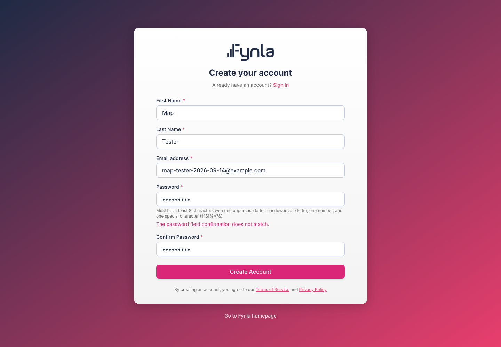
*Register with mismatched passwords: the server's message is shown under the password field.*

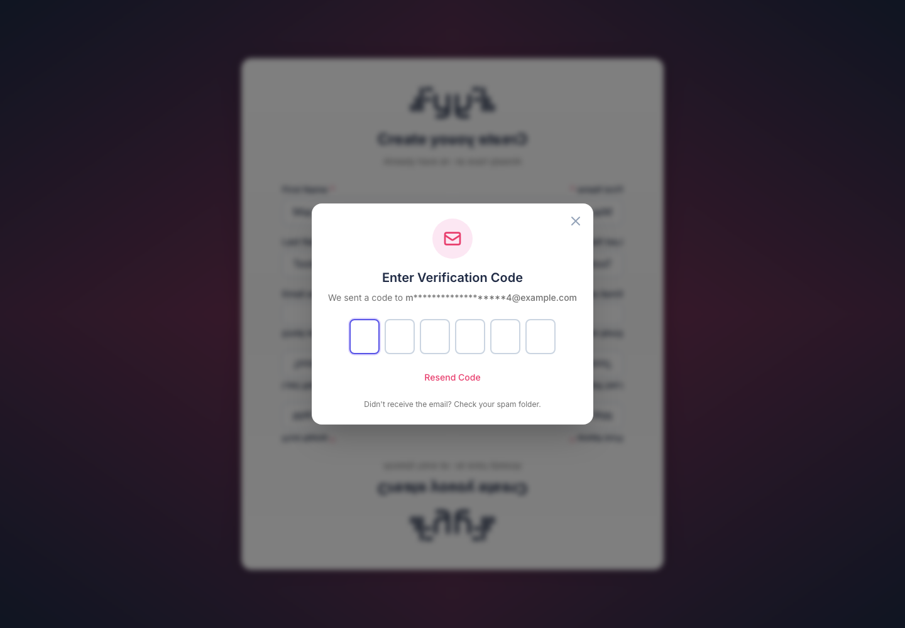
*After submitting, the six-digit code modal. The code was read from `pending_registrations.verification_code` and typed; the browser landed on the onboarding welcome.*

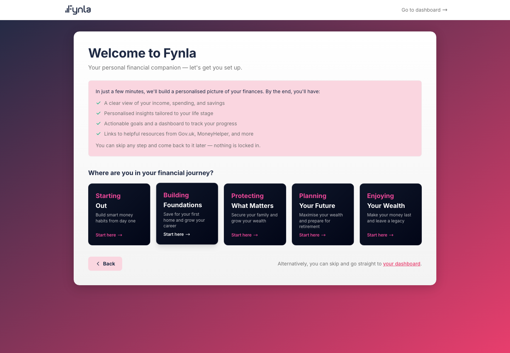
*Where a new account lands: `/onboarding?newUser=1`, the life-stage picker.*

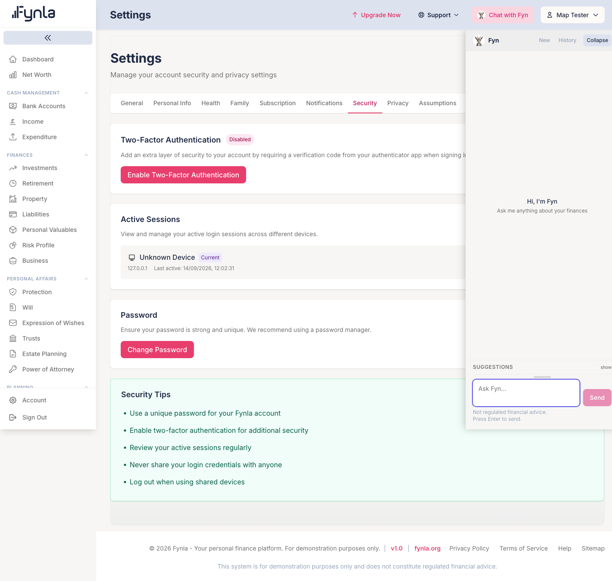
*`/settings/security`: two-factor, active sessions (one row, "Current"), password, tips.*

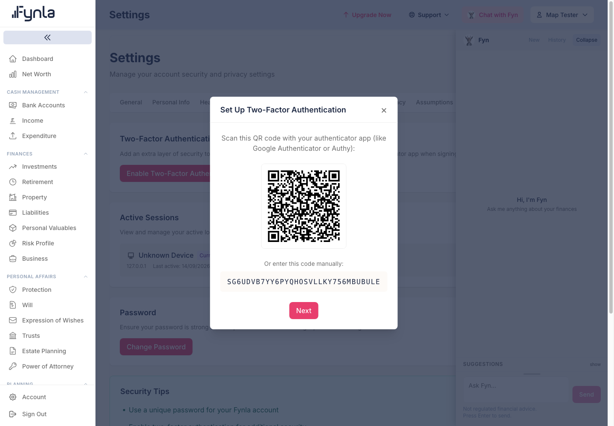
*Two-factor setup step one: QR code and manual key.*

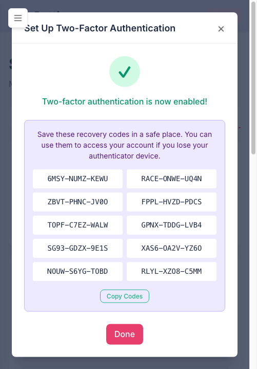
*Step three after a correct authenticator code: ten recovery codes. Confirmed in the database: `mfa_enabled = true`, ten hashed codes, encrypted secret.*

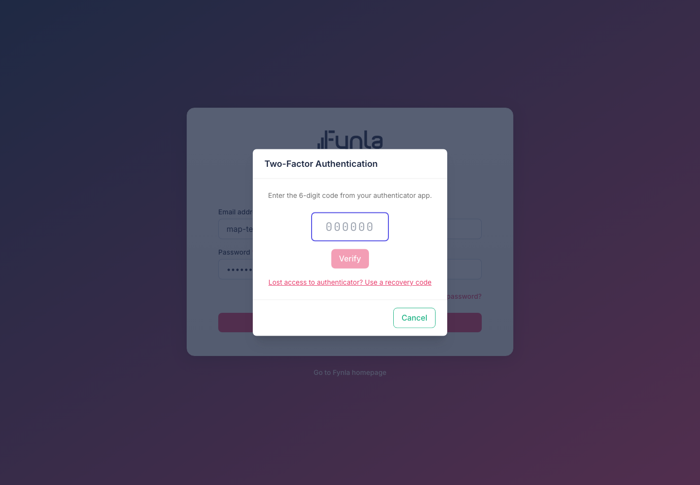
*Signing in with two-factor on: the authenticator modal replaces the email code.*

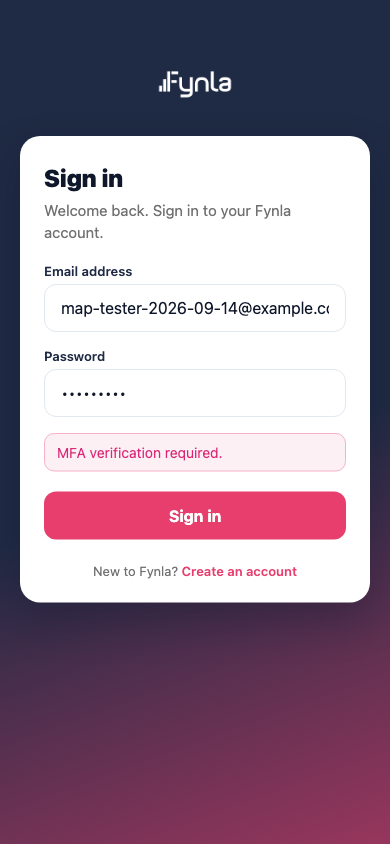
*The same account on `/m`: "MFA verification required." is shown as an error and nothing else happens (MB-18).*

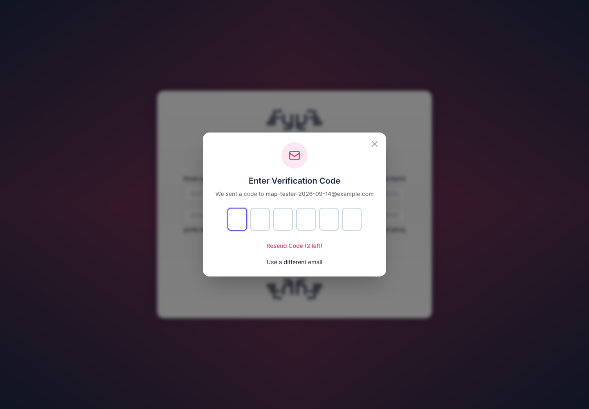
*Forgot password, step two. The code came from `password_reset_sessions.email_code`; because two-factor is on, an authenticator step followed, then the new password.*

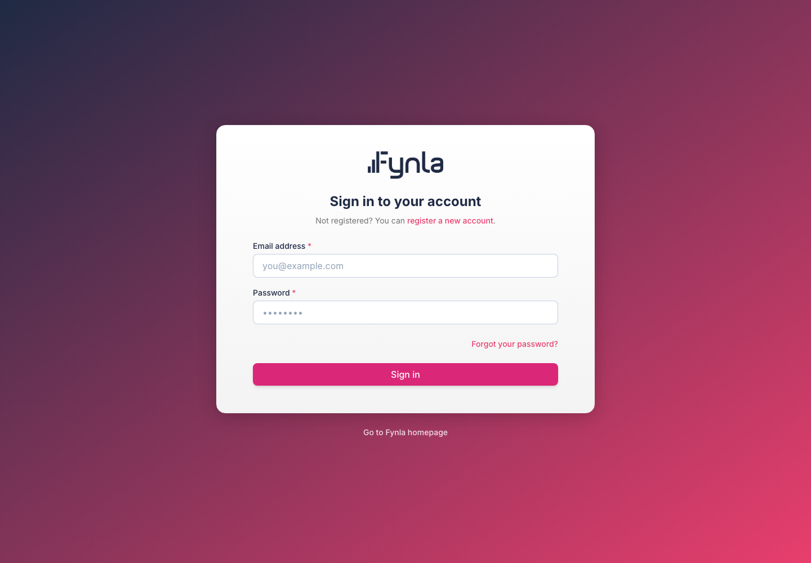
*After the reset: the modal closed, the new password worked, and every token for the user was revoked.*

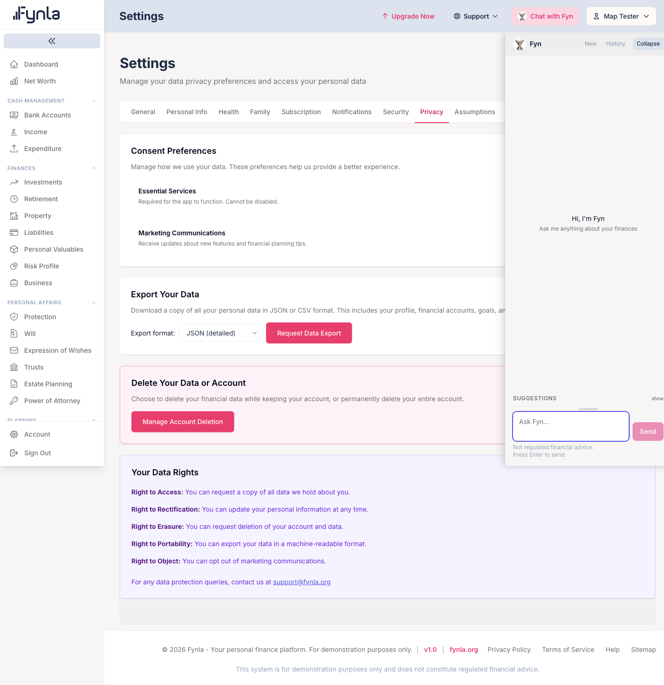
*`/settings/privacy`: consents, export, deletion, rights.*

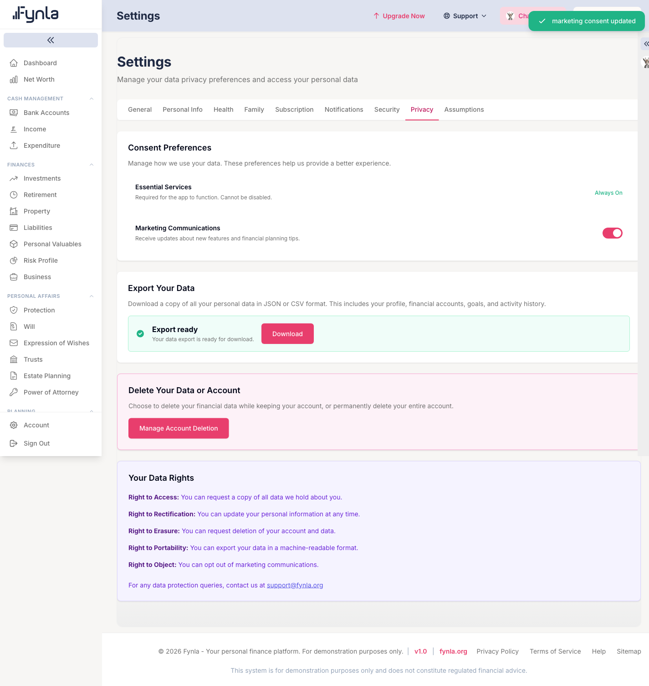
*After "Request Data Export": the JSON file was written synchronously (12,927 bytes, expires in 7 days) and the button became "Download".*

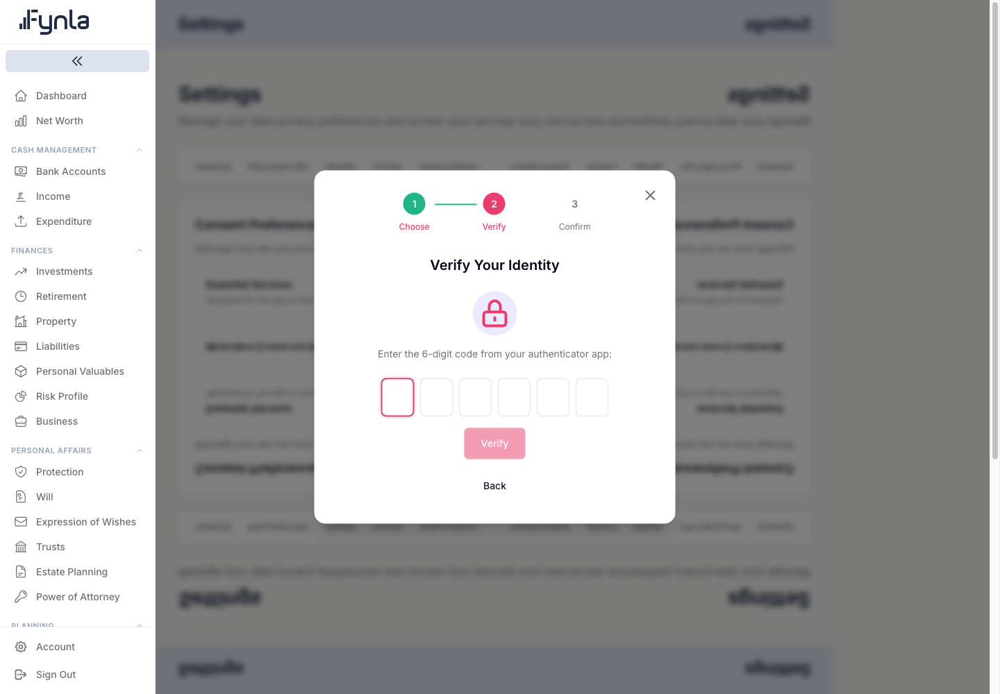
*Deletion wizard step two for a two-factor user: authenticator code.*

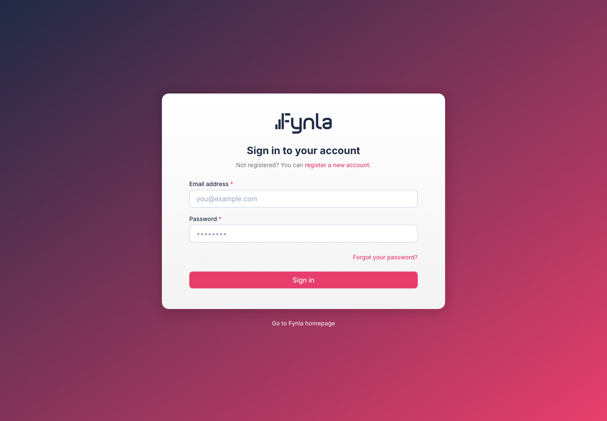
*After typing "Delete my Account": signed out. In the database: `deleted_at` set, `purge_eligible_at` 2033-09-14, tokens and sessions removed.*

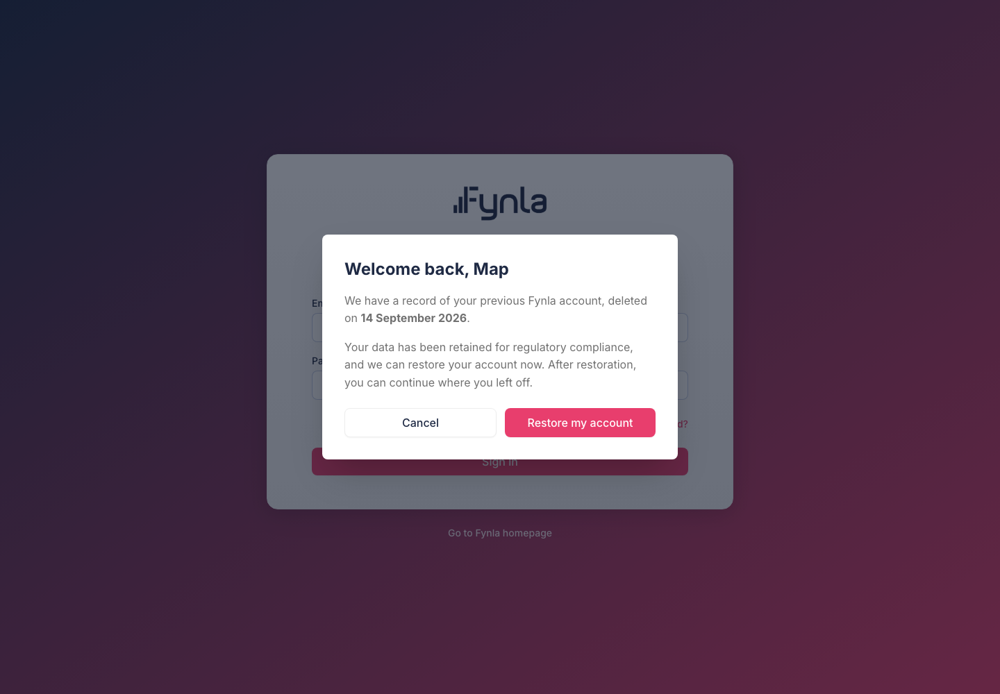
*Signing in with the deleted account's password: the restore offer. Clicking "Restore my account" returned "Authenticator or recovery code required." and no field to enter it (MB-20). The same call with a code, made directly against the API, restored the account.*

### Surfaces

| Feature | Web | `/m` | iOS | Notes |
|---|---|---|---|---|
| Register (form, emailed code) | Working (driven) | Absent: the "Create an account" link goes to the web `/register` (`resources/mobile/views/Login.vue:27,96-97`) | Present (`RegistrationView.swift`, `AuthClient.swift:123-150`) | |
| Login with emailed code | Working (driven) | Working (driven earlier this session with `john@example.com`) | Present (`AuthClient.swift:164-176`) | |
| Login with authenticator code | Working (driven) | **Broken** (driven, MB-18) | Present (`MultiFactorView.swift`, `AuthClient.swift:195`) | |
| Login with recovery code | Working (driven, one attempt failed first, see § 2.3) | Broken (same branch as MB-18) | Present (`AuthClient.swift:207`) | |
| Wrong authenticator or recovery code | **Broken** (driven, MB-21: modal closes, no message) | n/a | I COULD NOT VERIFY | |
| Account lockout | Unverified (code read) | Unverified | Unverified | `LoginLockoutService.php:12-36` |
| Password reset (email code, MFA step, new password) | Working (driven) | Absent (no forgot-password link in `resources/mobile/views/Login.vue`) | Present (`PasswordResetFlow.swift`, `AuthClient.swift:230-290`) | |
| Change password (signed in) | Present (`ChangePasswordModal.vue`, `POST auth/change-password`) | Absent | I COULD NOT VERIFY | Not driven |
| Two-factor setup, disable, regenerate | Working (setup driven); disable and regenerate Unverified | Absent | I COULD NOT VERIFY (no MFA setup view found under `Features/Authentication`) | |
| Active sessions list and revoke | Present (list driven, one row shown); revoke Unverified | Absent | n/a (native sessions are per device) | |
| Sign out | Working (driven) | Working (driven earlier) | Present (`DELETE api/v1/native/auth/session`) | `/m` must use `auth/mobileLogout` (`store/modules/auth.js:143-162`) |
| Consents (marketing) | Working (driven, row written) | Absent | Present (`Features/Privacy`) | |
| Data export | Working (driven) | Absent | I COULD NOT VERIFY | |
| Delete data or account | Working (account deletion driven) | Absent | Present (`Features/Privacy`, calls `api/auth/gdpr/*` per overview scan) | |
| Restore a deleted account | **Broken** for MFA users (driven, MB-20); Unverified for non-MFA users | **Dead end** by code read (MB-19) | Present (`RestoreAccountFlow.swift`, `AuthClient.swift:308-320`) | |
| Cookie consent banner | Present (`CookieBanner.vue`, `POST api/cookie-consent`) | Present (public page and `/m` per `CookieConsentService.php:34`) | n/a | Not driven |
| Native session exchange and refresh | n/a | n/a | Present (`AuthClient.swift:337-371`) | Backend tests green this run (§ 2.10) |

### Depends on / depended on by

| Direction | Module or service | What crosses the boundary | Evidence |
|---|---|---|---|
| Consumes | Mail (`VerificationCode`, `PasswordResetCode`, `DeletionVerificationCode`) | codes to the user | `AuthController.php:137,345,856`, `PasswordResetService.php:19`, `GDPRController.php:651` |
| Consumes | Tiers (`TierResolver`, `TierConfigurationStore`) | tier flags in the `/auth/user` payload | `AuthController.php:446-500` |
| Consumes | Gamification (`PointsService::recordLogin`) | login points and streak | `AuthController.php:697,748` |
| Consumes | Onboarding (`FunnelAnswersMapper`) | seeds the profile from Save Tax funnel answers | `AuthController.php:645` |
| Consumes | Consent (`ConsentService`, `CookieConsentService`) | consents at registration | `AuthController.php:665-676` |
| Consumes | Payment (`ReferralService`) | referral link on registration | `AuthController.php:678-689` |
| Consumes | Account (`AccountDeletionService`) | deletion, scheduling, restoration | `GDPRController.php:551-567`, `RestoreAccountController.php:161` |
| Consumed by | every authenticated route | `auth:sanctum` and the `TouchSessionActivity` middleware | `app/Http/Kernel.php:126-136` |
| Consumed by | Admin (`permission:*` middleware, `HasPermission`) | roles and permissions | `HasPermission.php:34-46`, `PermissionService.php` |
| Consumed by | Advisor impersonation | `AdvisorImpersonationMiddleware` swaps the user | `Kernel.php:133` |
| Consumed by | Fyn | `ai_chat` consent gates the chat stream | `AiChatController.php:203` (overview § 2.9) |

## 2. Detailed sections

### 2.1 Registration

**In plain English.** Filling in the form does not create an account. It creates a "pending registration" and emails a code. Only a correct code within a day creates the account, with the free tier and the standard consents recorded. Five wrong codes cancel the registration.

**Status:** Working on web (driven end to end this run).

**How it works**

| Step | Layer | File | What happens |
|---|---|---|---|
| 1 | Route | `routes/api.php:159` | `POST api/auth/register`, throttle `auth-5` (5 per minute per path and IP, `RouteServiceProvider.php:44-46`) |
| 2 | Validation | `app/Http/Requests/RegisterRequest.php:109-143` | names required, email required, password `min:8`, confirmed, one upper, one lower, one digit, one non-alphanumeric; optional `plan` (`premium`) with `billing_cycle`, `signup_source` from an allowlist, `funnel_answers` with fixed vocabularies |
| 3 | Controller | `AuthController.php:74-97` | a soft-deleted restorable account with this email returns `account_deleted_restorable` instead of registering; a live account returns 422 `email_exists` |
| 4 | Controller | `:100-113` | `PendingRegistration::createOrUpdate` (hashed password, 24-hour expiry `PendingRegistration.php:25,91`); re-registering overwrites the pending row |
| 5 | Mail | `:116-128` | `VerificationCode` mail, type `registration`, sent inline |
| 6 | Response | `:130-142` | 201 with `pending_id`, masked email, and a `handoff_token` when a campaign sent the user |
| 7 | Verify | `AuthController.php:552-700` | `POST api/auth/verify-code` type `registration`: expired or missing pending row → 422 `registration_unavailable`; five failed attempts delete the row; on success `User::create` with role `user`, `tier = free`, referral code, signup source, funnel answers |
| 8 | Side effects | `:645-689` | `FunnelAnswersMapper::mapToProfile`; consents `terms`, `privacy`, `data_processing`, `ai_chat` recorded; cookie consent claimed onto the user; referral linked; audit row |
| 9 | Token | `:906-927` | `createToken('auth_token', ['mfa_verified'])` plus a `user_sessions` row; pending row deleted; login points recorded |
| 10 | Landing | web `Register.vue` | `/onboarding?newUser=1`, or checkout when the pending row carried a Premium intent (`checkoutIntent()`, `PendingRegistration.php:101`) |

Observed in the database after the run: user 85, `tier=free`, `role_id=1`, six consent rows (`terms`, `privacy`, `data_processing`, `ai_chat`, `cookies_analytics`, `cookies_affiliate`), one session, one token, no pending row left.

**Form fields** (web `Register.vue`, as rendered)

| Label shown | Field | Input type | Validation (RegisterRequest) | Column | Surfaces |
|---|---|---|---|---|---|
| First Name * | `first_name` | text, autocomplete given-name | required, max 255 | `pending_registrations.first_name` → `users.first_name` | web, iOS |
| Last Name * | `last_name` → sent as `surname` | text | required, max 255 (`surname.required` message "Last name is required.") | `surname` | web, iOS |
| Email address * | `email` | email | required, email, max 255 | `email` | web, iOS |
| Password * | `password` | password, autocomplete new-password | as step 2 | hashed | web, iOS |
| Confirm Password * | `password_confirmation` | password | `confirmed` | | web, iOS |
| (hidden) | `plan`, `billing_cycle`, `ref`, `signup_source`, `funnel_answers`, `handoff` | from query string or campaign | `:120-143` | `pending_registrations.*` | web |

The on-screen hint lists the special characters as `@$!%*?&`; the server accepts any non-alphanumeric character (`:117`). Copy and rule differ.

**Tests:** `tests/Feature/Auth/RegistrationTest.php`, `RegistrationRulesParityTest.php`, `SignupSourceCaptureTest.php`, `FunnelAnswersCaptureTest.php`, `CampaignRegistrationHandoffTest.php`, `PensioncheckRegistrationPayloadTest.php`; `tests/E2E/auth/registration.spec.js` (five Playwright tests covering free, Premium monthly and annual, and campaign registrations). Feature files run this session, see § 2.10.

### 2.2 Login, lockout and the emailed code

**In plain English.** Email and password are checked, then one of four things happens: a demo persona is let straight in; a person with an authenticator app is asked for its code; everyone else is emailed a code; and someone whose account was deleted is offered restoration. Repeated wrong passwords lock the account for one minute, then five, thirty, and a day.

**Status:** Working for the emailed-code path on web and `/m` (driven).

| Step | Layer | File | What happens |
|---|---|---|---|
| 1 | Route | `routes/api.php:161` | `POST api/auth/login`, throttle `auth-5`; `LoginRequest.php:28-29` requires email and password |
| 2 | Lockout | `AuthController.php:212-231`, `LoginLockoutService.php:12-36` | account thresholds 3→1 min, 5→5 min, 10→30 min, 15→24 h; IP limit 50 (`config('auth.lockout.*')`); HTTP 423 with `remaining_seconds`; `users.locked_until` written and read (`LoginLockoutService.php:48,73`) |
| 3 | Deleted account | `:234-257` | wrong password recorded as a failure; right password on a restorable account returns `account_deleted_restorable` with a five-minute `restoration_token` (`:965-974`) |
| 4 | Credentials | `:260-306` | unknown user or wrong password → `login_attempts` row, audit row, 401 "Invalid email or password." |
| 5 | Preview persona | `:309-320` | token immediately, no code |
| 6 | MFA user | `:323-336` | `requires_mfa` with a `mfa_token` cached for 300 seconds (`MFAController.php:114-123`) |
| 7 | Everyone else | `:339-364` | `EmailVerificationCode::generate` (15 minutes, `EmailVerificationCode.php:107`), `VerificationCode` mail, `requires_verification` with a `challenge_token` |
| 8 | Verify | `:702-750` | `POST api/auth/verify-code` type `login`, throttle `auth-10`; the challenge token resolves the user; a miss records a failed attempt; success marks the code verified, records the login, issues the token and session |
| 9 | Resend | `:757-880` | `POST api/auth/resend-code`, `resend_count` on the code row |

**Client behaviour:** web `Login.vue` mounts `VerificationCodeModal`, `MFAVerifyModal`, `ForgotPasswordModal`, `RestoreAccountModal` and `ChangePasswordModal` (`Login.vue:3-40,173-189`); the store's `login` clears every module before authenticating. The `/m` login handles only the token and `requires_verification` branches (`resources/mobile/views/Login.vue:116-129`); any other 200 shows the server message as an error (MB-18, MB-19).

**Form fields** (web `Login.vue`): Email address * (`email`, required, email), Password * (`password`, required). Six single-digit boxes in the code modal, auto-submitting on the sixth digit (observed). On `/m` the six boxes need "Verify and continue" (observed).

**Tests:** `tests/Feature/Auth/LoginTest.php`, `LogoutTest.php`, `AuthenticatedUserTest.php`, `SpouseStatusEnumerationOracleTest.php`. Run this session, see § 2.10.

### 2.3 Two-factor authentication

**In plain English.** A person scans a QR code with an authenticator app, proves it works once, and receives ten one-time recovery codes. From then on sign-in asks for the app's six-digit code, and a recovery code can stand in for it.

**Status:** Setup, authenticator login and recovery-code login Working on web (driven). One recovery-code attempt returned 401 and bounced the user to the login form with no message; the retry with a different code succeeded; the cause of the first failure was not established (the API accepted the first code when called directly two minutes later).

| Piece | File | What the code shows |
|---|---|---|
| Setup | `MFAController.php:38-68` | `POST auth/mfa/setup` generates a 32-character secret (`MFAService.php:29-31`), caches it for 300 seconds under `mfa_setup_secret:{user}`, returns QR data URI and manual key |
| Confirm | `:70-112` | `POST auth/mfa/verify-setup` pulls the cached secret, verifies a TOTP with two windows of tolerance (`MFAService.php:62-79`), encrypts the secret onto `users.mfa_secret`, hashes ten recovery codes onto `users.mfa_recovery_codes`, sets `mfa_enabled`, `mfa_confirmed_at` |
| Login verify | `:149-231` | `POST auth/mfa/verify` with `mfa_token` and code; wrong code → 401 "Invalid verification code." (`:48-49`); success → token `[mfa_verified]` + session row (`:205-215`) |
| Recovery | `:235-292` | `POST auth/mfa/recovery`; each code single-use (`MFAService.php:141-160`), warning when two or fewer remain (`:286`) |
| Manage | `:294-365` | disable (password required, `SecuritySettings.vue:389`), regenerate codes, status |
| Web UI | `MFASetupModal.vue` three steps; `MFAVerifyModal.vue` with a recovery-code sub-step; `SecuritySettings.vue:16-47` | |
| Unused ability | the `mfa_verified` token ability is checked only by `EnsureMFAVerified`, which no route uses (MB-13) | `grep` this run |

**Tests:** `tests/Feature/Auth/MFATest.php`. Run this session.

### 2.4 Password reset and change

**In plain English.** From the sign-in page a person asks for a reset, gets an emailed code, proves the authenticator app if they use one, and sets a new password. Every device is signed out afterwards. A signed-in person can also change their password on the Security page.

**Status:** Reset Working (driven, MFA user). Change password Unverified.

| Step | File | What happens |
|---|---|---|
| 1 | `PasswordResetController.php:25`, `PasswordResetService.php:24-36` | `POST password-reset/request` (throttle `auth-3`) always answers "If an account exists with this email, you will receive a verification code." and, when it does, creates a `password_reset_sessions` row (15 minutes, `PasswordResetSession.php:49`) and emails `PasswordResetCode` |
| 2 | `:39`, `PasswordResetService.php:63-105` | `verify-email` with the code; sets `email_verified_at` on the session; returns `requires_mfa` for MFA users |
| 3 | `:86`, `:110` | `verify-mfa` (TOTP) or `mfa-recovery` |
| 4 | `:134-160`, `PasswordResetService.php:200-243` | `reset`: same complexity rule as registration; new hash; `$user->tokens()->delete()` (`:227`); session `used_at` set |
| resend | `:63` | at most two resends (`MAX_RESEND_COUNT = 2`) |
| change | `AuthController.php:505-546` | `POST auth/change-password`: current password checked, same complexity rule, `must_change_password` cleared, audit row |

**Client:** `ForgotPasswordModal.vue` steps `email`, `verify-email`, `verify-mfa`, `new-password`, `success` (`:24-302`). The modal shows the full email address at step two while the login modal masks it. The modal hint says "at least 8 characters long"; the server also requires the four character classes.

**Tests:** `tests/Feature/Auth/PasswordResetThrottleTest.php`. Run this session.

### 2.5 Tokens, sessions and sign-out

**In plain English.** Signing in gives the browser or app a token. The desktop keeps it only for the tab and forgets it after fifteen quiet minutes; the mobile web version keeps a separate token that it swaps for a fresh one each time it starts; the iPhone app keeps a longer-lived session that it renews in the background. The Security page lists every device and can sign the others out.

**Status:** Sessions list Working (driven, one row); revoke Unverified; token lifetimes read from code.

| Client | Token | Lifetime | Storage and renewal | Sign-out | Evidence |
|---|---|---|---|---|---|
| Web | Sanctum `auth_token` | 240 minutes (`config/sanctum.php:52`) | `sessionStorage` (`tokenStorage.js:11-20`); no refresh; 15-minute inactivity logout (`sessionLifecycleService.js:25`); `logout-beacon` on tab close (`AuthController.php:404-444`) | `POST auth/logout` deletes the token and its `user_sessions` row (`:367-401`); the store resets every module (`auth.js:122-140`) | |
| `/m` | Sanctum `mobile-token` | `sanctum.mobile_token_ttl_minutes`, default 240 (`config/sanctum.php:58`) | `localStorage m_scaffold_token`; rotated on boot via `POST api/v1/auth/refresh-token` (`main.js:15-24`, `TokenRefreshController.php:17-45`); any 401 sends the user to `/m/app/login` (`authExpiry.js:20`) | `auth/mobileLogout` clears local state only (`auth.js:143-162`), so the desktop token survives | |
| iOS | bootstrap `auth_token`, then `native-access` (15 min) and a refresh token (30 days), absolute 90 days | `NativeSessionService.php:51-58` | Keychain; refresh credential persisted only after Face ID opt-in (`AuthenticationCoordinator.swift:448-451`); rotation revokes on replay, expiry or revoked session (`:105-220`) | `DELETE api/v1/native/auth/session` | headers `X-Fynla-Client/Version/Build` required (`IdentifyNativeClient.php:20-22`); below minimum version → 426 (`EnforceNativeVersion.php:54-99`) |

**Sessions table:** `user_sessions(user_id, token_id, ip_address, user_agent, device_name, device_id, last_activity_at)`; `TouchSessionActivity` updates `last_activity_at` on every authenticated API call (`Kernel.php:132`, `SessionService.php:99`). `GET auth/sessions` returns id, device name, IP, last activity, created, `is_current` (`SessionController.php:28-47`). `sessions:cleanup` daily removes rows whose token is gone (`Kernel.php:28`). The row observed this run showed "Unknown Device, 127.0.0.1, Current".

**Tests:** `tests/Feature/Auth/SessionApiTest.php`, `tests/Feature/Native/Auth/NativeSessionApiTest.php`, `NativeSessionSchemaTest.php`, `tests/Feature/Auth/WebHandoffTest.php`, `tests/Feature/Mobile/DeviceRegistrationTest.php`. Run this session.

### 2.6 Roles and permissions

**In plain English.** Everyone is a "user". A few accounts are administrators, advisers or support staff, and the admin pages check named permissions rather than a flag.

**Status:** Unverified (read; the `permissions` and `roles` tables were listed).

| Fact | Evidence |
|---|---|
| Roles `user` (level 0), `advisor` (25), `support` (50), `admin` (100) | `app/Models/Role.php:14-29`, `PermissionService.php:126-157` via `syncDefaultRolesAndPermissions` |
| Permissions seeded: `admin.access`, `admin.audit.view`, `admin.backup`, `admin.erasure_process`, `admin.tax_config`, `advisor.access`, `settings.edit`, `settings.view`, `users.delete`, `users.edit`, `users.view` | `SELECT name FROM permissions` this run |
| `HasPermission` middleware: admins (role or legacy `is_admin`) bypass; otherwise 403 | `HasPermission.php:34-46` |
| Admin promotion only through `/admin/users`; never by email match at login or registration | `AuthController.php:265-269,633-638` |
| `/auth/user` returns role name, permission names, life-stage completeness and tier flags | `AuthController.php:446-500` |

### 2.7 GDPR: consents, export, deletion, restoration

**In plain English.** The Privacy page lets a person switch marketing emails on or off, download everything Fynla holds about them, and delete either their financial data or the whole account. Deleting the account signs them out at once; the record is kept for seven years so they can come back.

**Status:** Consent toggle, export and account deletion Working (driven); restoration Working at the API and Broken in the web modal for MFA users (MB-20).

**CRUD**

| Operation | Method and endpoint | Who may call it | Writes | Evidence |
|---|---|---|---|---|
| Read consents | `GET auth/gdpr/consents` | signed-in | | `GDPRController.php:43` |
| Update consents | `PUT auth/gdpr/consents` | signed-in; `CheckSubscription` always allows `api/gdpr/` | `user_consents` row per type and version (`UserConsent.php:16-56`) | `:59`; observed: `marketing` row, `consented_at 12:18:21` |
| Consent history | `GET auth/gdpr/consents/history` | signed-in | | `:342` |
| Request export | `POST auth/gdpr/export` (throttle `export`, 3 per hour) | signed-in | `data_exports` row; file written synchronously to `storage/app/exports/` (`DataExportService.php:46-63`); expires in 7 days (`DataExport.php:28`) | observed: `exports/user_85_2026-09-14_121739.json`, 12,927 bytes |
| Export status, download | `GET auth/gdpr/export/status`, `GET .../export/{id}/download` | signed-in | `downloaded_at` | `:127,158`; status returns 404 when there is none, which the page treats as "no export" and the console logs as an error |
| Start deletion | `POST auth/gdpr/erasure/initiate` | signed-in, throttle `sensitive` | cache `deletion_session:{user}` 15 minutes; emailed code unless MFA | `:368-424` |
| Verify | `POST auth/gdpr/erasure/verify` | | TOTP if MFA else the emailed code; attempts counted | `:426-503` |
| Execute | `POST auth/gdpr/erasure/execute` | | phrase must equal "Delete my Account" or "Delete my Data"; account with a paid subscription is scheduled for the period end, otherwise soft-deleted now; data-only deletes the financial records and keeps the account | `:505-600`, `AccountDeletionService.php:99-118` (tokens and sessions deleted, `purge_eligible_at = now + retention.account_years`, default 7) |
| Cancel scheduled deletion | `POST auth/gdpr/erasure/cancel-scheduled` | | | `:673` |
| Legacy erasure trio | `POST erasure`, `GET erasure/status`, `POST erasure/{id}/confirm`, `cancel` | | no client (MB-08 dossier § 14) | |
| Restore | `POST auth/restore` (public, throttle `auth-5`) | anyone holding a five-minute `restoration_token` | clears `deleted_at`; MFA users must send `mfa_code` (`RestoreAccountController.php:99-170`) | observed: 422 without the code, 200 with it |
| Restore check (registration path) | `POST auth/restore/check` | email + password | issues the token | `:34-97` |

**Client:** `PrivacySettings.vue` (consent toggles for "Essential Services" fixed on and "Marketing Communications"; export with a JSON/CSV select; a three-step deletion wizard). Four user messages on this page are browser `alert()` dialogs (`PrivacySettings.vue:487-603`). At 1440 pixels wide with the Fyn panel open, the marketing toggle sits under the panel and cannot be clicked until the panel is collapsed (MB-22).

**Tests:** `tests/Feature/Auth/GDPRApiTest.php`, `tests/Feature/Consent/CookieConsentTest.php`, `tests/Unit/Services/Account/AccountDeletionServiceTest.php`. Feature files run this session.

### 2.8 Cookie consent

**In plain English.** The cookie banner's accept or decline is the one decision that controls analytics and affiliate tracking, on every surface, and is later attached to the account the visitor creates.

**Status:** Unverified (not driven; the claim onto user 85 was observed as two `cookies_*` consent rows).

| Piece | File | What the code shows |
|---|---|---|
| Endpoint | `routes/api.php:146-147`, `CookieConsentController.php:41-61` | `POST api/cookie-consent` with `status` accepted or declined and an optional affiliate `awc` value; public, throttle `cookie-consent`; `PreviewWriteInterceptor` excludes it |
| Transport | `CookieConsentService.php:28-46` | the `fyn_cookie_consent` cookie is the transport; `allowsTracking()` gates analytics and affiliate |
| Banner | `CookieBanner.vue` in `App.vue`; copy from `constants/cookieCopy.js` | |
| Claim | `AuthController.php:673-676` | on registration the anonymous consent row is claimed onto the new user |

### 2.9 Fyn touchpoints

None directly. The `ai_chat` consent recorded at registration is what allows the chat to stream (`AuthController.php:659-671`); withdrawing it goes through the consents endpoint. Registration hand-off tokens (`RegistrationHandoffService.php:26-60`, 15 minutes, encrypted) carry a campaign source into onboarding (section 02).

### 2.10 Background machinery and tests

| Kind | Name | Trigger | Effect | Evidence |
|---|---|---|---|---|
| Schedule | `registrations:cleanup` | hourly | deletes expired `pending_registrations` and unclaimable anonymous consent rows | `Kernel.php:27` |
| Schedule | `sessions:cleanup` | daily 02:00 | deletes `user_sessions` whose token is gone | `Kernel.php:28` |
| Schedule | `model:prune WebHandoff` | daily 02:10 | prunes expired web hand-off tokens (2-minute lifetime, `WebHandoffService.php:18`) | `Kernel.php:29-30` |
| Schedule | `accounts:execute-scheduled-deletions`, `execute-grace-deletions`, `send-deletion-reminders`, `purge-after-retention` | nightly, monthly | scheduled deletions, reminders, seven-year purge | `Kernel.php:23-26` |
| Schedule | `audit:purge` | weekly | audit log retention | `Kernel.php:31` |
| Cache | codes and tokens | none | `mfa_setup_secret` 300 s, MFA challenge 300 s, `restoration_token` 5 min, `deletion_session` 15 min | cited above |

**Tests run this session**

```
./vendor/bin/pest tests/Feature/Auth tests/Feature/Native/Auth tests/Feature/Consent \
  tests/Feature/Middleware/RedirectAuthenticatedToDashboardTest.php tests/Feature/Mobile/DeviceRegistrationTest.php
Tests: 219 passed (900 assertions), 141.65s
```

Not run: `tests/E2E/auth/registration.spec.js` (Playwright), `tests/Unit/Services/Account/AccountDeletionServiceTest.php`, iOS tests. Tests written in this run: none. The three defects below have no test that would catch them; MB-18 and MB-21 need Vitest tests on the two login views, MB-20 needs one on `RestoreAccountModal.vue`.

## 3. Findings

| Id | Status | Where | What is wrong |
|---|---|---|---|
| MB-18 | Broken | `resources/mobile/views/Login.vue:116-129` | a user with two-factor enabled cannot sign in on `/m`: "MFA verification required." is shown as an error and there is no code step |
| MB-19 | Dead end (by code read) | same file | a deleted, restorable account gets the generic failure message on `/m`; no restore path |
| MB-20 | Broken | `resources/js/components/Account/RestoreAccountModal.vue:207-235` | the login-path restore never shows the MFA field; the 422 "Authenticator or recovery code required." is displayed as text and the user is stuck |
| MB-21 | Broken | `resources/js/services/api.js:99-125` | a wrong authenticator or recovery code returns 401, which the global interceptor treats as an expired token: the modal closes, the form clears, no message |
| MB-22 | Broken (layout) | `resources/js/views/Settings/PrivacySettings.vue` with the Fyn panel open at 1440 px | the marketing consent toggle is covered by the fixed Fyn panel and cannot be clicked |

Also noted, not raised as bugs: `users.email_verified_at` is never written by registration or login (`grep` this run; only the password-reset session has its own column), so it is a dead column that `UserResource` still exposes as null; the password hint on the register form lists seven special characters while the rule accepts any; the forgot-password modal shows the unmasked email; four browser `alert()` dialogs on the privacy page; the `mfa_verified` token ability is never enforced (MB-13); the restore-check API path and the change-password modal were not driven.

**Test data left behind:** user 85 `map-tester-2026-09-14@example.com`, password `MapTest2!`, two-factor enabled with the secret in the database and eight unused recovery codes, restored after deletion, one export file under `storage/app/exports/`.

## 4. Coverage and gaps

| Area | Checked | I COULD NOT VERIFY |
|---|---|---|
| Files | `AuthController` (all public methods read), `MFAController`, `PasswordResetController` and service, `SessionController` and service, `RestoreAccountController`, `GDPRController` (method list and the erasure and restore paths), `LoginLockoutService`, `NativeSessionService`, `TokenRefreshController`, the two Form Requests, the models and tables listed, the web views and modals, the `/m` login, the iOS auth client and coordinator | `GDPRController` export and consent method bodies beyond their signatures; `DataExportService` field list; `EvalAuthController` (local, testing and staging only) |
| Playwright | registration with a validation failure and a success; emailed-code login; MFA setup; MFA login; recovery-code login; wrong-code bounce; password reset with MFA; security page; privacy page; consent toggle; export; account deletion; restore modal; `/m` login for an MFA user | account lockout; change password; revoke sessions; MFA disable and regenerate; data-only deletion; scheduled deletion for a paid user; cookie banner; iOS |
| Database | every table in scope listed with columns; rows checked after each driven step | production data |
| Tests | 219 Feature tests green | E2E and iOS suites |

## 5. Glossary

| Term | Meaning in this section |
|---|---|
| Pending registration | The row that holds a sign-up until its emailed code is entered |
| Challenge token | A random string returned at login that ties the emailed code to the right person |
| MFA, TOTP | Multi-factor authentication using a time-based one-time password from an authenticator app |
| Recovery code | One of ten single-use codes that stand in for the authenticator app |
| Sanctum token | The bearer token Laravel issues; the client sends it on every request |
| Session row | Fynla's own record of a signed-in device, one per token |
| Lockout | A timed refusal to check passwords after repeated failures |
| Soft delete | The account row is marked deleted and kept; a purge date is set seven years out |
| Restoration token | A five-minute pass, issued after a correct password on a deleted account, that lets the account be restored |
| Native session | The iPhone app's longer-lived session with a short access token and a refresh token |
