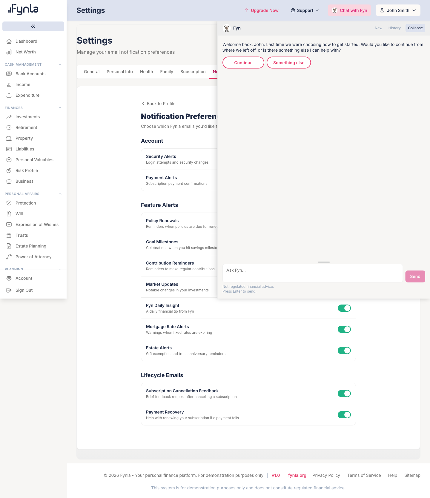
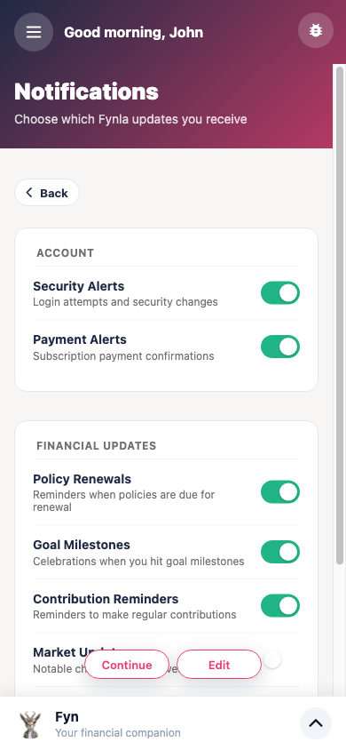

# Emails, notifications and push — application map

| | |
|---|---|
| Scope | Every way Fynla contacts a person: transactional email, the lifecycle email engine, the newsletter, in-app (database) notifications, push notifications to phones, and the preference screens that control them. The marketing content pipeline's internal emails are inventoried but not traced. Out of scope: the Fyn chat itself, and the Apple and Revolut webhooks that trigger payment emails (those belong to the billing map). |
| Commit | `28194e804` on `dev` |
| Mapped on | 2026-09-14 |
| Mapped by | Claude Code session, `app-map` skill |
| Supersedes | none |
| Issues raised | MB-06, MB-14, MB-15, MB-16, MB-17 (in `September/September14Updates/mappingBugs2026-09-14.md`) |

Every statement cites a file and line read this run, a command run this run, or a browser interaction performed this run. Where a claim could not be checked it says "I COULD NOT VERIFY".

## 1. Overview

### In plain English

Fynla talks to people in four ways. It emails them for things they asked for or need to know about: a login code, a password reset, a receipt, a warning that their account will be deleted, an invitation from a spouse. A separate "lifecycle" engine emails paying customers who cancel or whose payment fails, with links that act on the account when clicked. People who sign up to the newsletter get a confirmation email and a welcome. Finally, phones with the app installed can receive push notifications, and the server can also write "in-app" notifications to a table. Each person has a preferences page listing what they want to receive.

Two things do not work as their code suggests. Five of the daily alert types are computed every morning and then dropped before they reach anyone, because the code checks preference names that do not exist. And the in-app notifications the server writes are never read by any screen, so nothing that goes into that table is ever seen.

### How it fits together

All email goes through Laravel's mailer to the SMTP server named in the environment (`MAIL_MAILER=smtp`, host `mail.fynla.org`, from `noreply@fynla.org`). Every message is built by a mailable class in `app/Mail` from a Blade template in `resources/views/emails`, and all but two of those templates share one master layout. The queue is `sync` in the local environment, so even the mailables sent with `queue()` are delivered inside the web request. Push goes through `PushNotificationService`, which reads the `device_tokens` table and sends to Apple Push Notification service for iOS devices. In-app notifications use Laravel's `database` channel and land in the `notifications` table. Preferences live in one row per user in `notification_preferences`, read and written by a web endpoint and a mobile endpoint that both expose the same eleven columns.

### Flow diagrams

- `docs/diagrams/map-emails-transactional-flow.excalidraw` — the triggers that send a transactional email, the mailable and template each uses, and where a dedup log stops repeats.
- `docs/diagrams/map-emails-lifecycle-engine.excalidraw` — the daily lifecycle run: campaigns, eligibility filters, send, log, and the signed magic links back into the app.
- `docs/diagrams/map-emails-alerts-and-push.excalidraw` — the daily alert commands, the preference check, and the three channels (push, database, mail), including the two breaks.

### What it looks like

*Web, `/settings/notifications`. Eleven toggles in three groups: Account, Feature Alerts, and the two lifecycle campaigns. The "Fyn Daily Insight" toggle was clicked this run and the database row changed (`notification_preferences.fyn_daily_insight` false, `updated_at 11:09:50`).*

*`/m/app/notifications`. Nine toggles in two groups; the two lifecycle toggles are absent (MB-17). The same "Fyn Daily Insight" toggle was clicked here and the row changed back (true, `updated_at 11:11:35`), so both surfaces write the same row.*

### Surfaces

| Feature | Web | `/m` | iOS | Notes |
|---|---|---|---|---|
| Notification preferences page | Working (driven: page loaded, toggle written to DB) | Working (driven: page loaded, toggle written to DB) | Present (`ios-native/Fynla/Core/Push/PushModels.swift` lists all eleven keys) | Web calls `GET/PUT api/notifications/preferences` (`routes/api.php:406`); `/m` and iOS call `api/v1/mobile/notifications/preferences` (`routes/api_v1.php:172-175`) |
| Lifecycle toggles (cancellation feedback, payment recovery) | Present (`NotificationPreferences.vue:89-90`) | Absent (`resources/mobile/views/NotificationPreferences.vue` has nine keys) | Present (`PushModels.swift`) | MB-17 |
| Receiving push | n/a | n/a | Present (`ios-native/Fynla/Core/Push`, `device_tokens` registered via `POST api/v1/mobile/devices`) | I COULD NOT VERIFY delivery: `APNS_*` keys are not set in the local `.env`, and `device_tokens` has 0 rows locally |
| Receiving in-app notifications | Absent | Absent | Absent | No route lists the `notifications` table and no client reads it (MB-15) |
| Login and registration codes by email | Working (driven three times this run: code read from `email_verification_codes`, entered, dashboard reached) | Working (driven twice this run) | Present (`api/auth/verify-code`, `resend-code` called from Swift) | |
| Spouse invitation and permission emails | Present | Present (`/spouse-sharing`) | Present (`Features/Profile`) | Not driven |
| Newsletter subscribe, confirm, unsubscribe | Present (public pages and SPA news hub) | n/a | n/a | Not driven |

### Depends on / depended on by

| Direction | Module or service | What crosses the boundary | Evidence |
|---|---|---|---|
| Consumes | Auth (`EmailVerificationCode`, `PendingRegistration`, `PasswordResetService`) | codes to put in emails | `app/Http/Controllers/Api/AuthController.php:137,345,789,856`; `app/Services/Auth/PasswordResetService.php:42,277` |
| Consumes | Payment and Billing (`Subscription`, `Payment`, `Invoice`) | receipts, renewal reminders, failure notices, cancellation | `app/Services/Payment/PaymentFinalizationService.php:58`, `SubscriptionRenewalService.php:148`, `InvoiceService.php:121`, `PaymentController.php:1109` |
| Consumes | Account and GDPR | deletion schedule, restoration, retention warnings, erasure code | `app/Services/Account/AccountDeletionService.php:54,83,124,151`; `GDPRController.php:651`; `SendDataRetentionWarnings.php:82` |
| Consumes | Protection, Savings, Estate, Business, Property models | what to alert about | the eight alert commands in § 2.6 |
| Consumes | Gamification (`MilestoneDetectionService`) | milestone push | `app/Services/Mobile/MilestoneDetectionService.php:1179-1183` |
| Consumed by | Lifecycle magic links → dashboard checkout and profile | discount code applied on click | `app/Http/Controllers/Lifecycle/LifecycleActionController.php:27-45,97-113` |
| Consumed by | Marketing pipeline (internal emails to the team) | script, clips, posts, weekly report | `app/Jobs/Pipeline/*`, `app/Console/Commands/Pipeline/*` |

## 2. Detailed sections

### 2.1 Transport and layout

**In plain English.** One mail server, one sender address, one master template. Nothing is queued in the local environment, so an email is sent while the user waits for the page.

**Status:** Unverified for delivery (no mailbox was checked). The verification-code emails were sent this run five times as a side effect of logging in; I COULD NOT VERIFY they arrived because `john@example.com` is not a real mailbox.

| Piece | Evidence | What the code shows |
|---|---|---|
| Mailer | `.env` `MAIL_MAILER=smtp`, `MAIL_HOST=mail.fynla.org`, port 465 SSL, from `noreply@fynla.org` "Fynla"; `config/mail.php:16` default falls back to `log` | The local environment sends real mail through the production SMTP host. |
| Queue | `.env` `QUEUE_CONNECTION=sync` | `Mail::queue()` behaves as `send()`. Nine send sites use `queue()` (account deletion emails, bug report, newsletter); the rest use `send()`. |
| Layout | 22 templates `@extends('emails.layouts.master')`, 2 `@extends('emails.lifecycle._layout')` (grep this run); 20 module partials in `resources/views/emails/modules/` | The `email-template` skill documents the layout rules. |
| Templates | 37 email Blade files outside layouts and modules | `ls resources/views/emails` |
| Off-layout mail | `app/Notifications/SpousePermissionRequest.php:39-47` builds a Laravel `MailMessage` (framework markdown theme), not the Fynla master layout | Design inconsistency, not a defect |
| Contact form | `app/Http/Controllers/Api/ContactFormController.php:15-19,46-54` sends raw text to `hello@`, `support@` or `press@fynla.org` with reply-to the visitor; 3 attempts per IP | No template |
| Bug report | `BugReportController.php:115` queues `BugReportMail` to `chris@fynla.org` | Recipient is hardcoded |

### 2.2 Verification codes

**In plain English.** Signing up, signing in, and deleting an account each send a six-digit code that lasts fifteen minutes.

**Status:** Working for login on web and `/m` (driven this run). Registration and deletion codes Unverified.

**How it works**

| Step | Layer | File | What happens |
|---|---|---|---|
| 1 | Register | `AuthController.php:137` | A `PendingRegistration` row holds the code (`pending_registrations.verification_code`, `verification_attempts`, `expires_at`); `VerificationCode` mail with type `registration` is sent. Five wrong attempts end the registration (`:582-594`). |
| 2 | Login | `AuthController.php:342-345` | `EmailVerificationCode::generate($user->id, 'login', $challengeToken)`; 15-minute expiry (`app/Models/EmailVerificationCode.php:107,125`); mail sent. |
| 3 | Verify | `AuthController.php:712-720` | `findValidCode` requires an unexpired, unverified code; a miss records a failed attempt. |
| 4 | Resend | `AuthController.php:829-856` | Regenerates and resends; `resend_count` on the row. |
| 5 | Account deletion | `GDPRController.php:651` | `DeletionVerificationCode` mail. |
| 6 | Password reset | `PasswordResetService.php:42,277` | `PasswordResetCode` mail; session in `password_reset_sessions`. |

**Form fields:** the code entry is six single-digit boxes on web (`Verification code digit N of 6`) and on `/m` (`Digit N`); web auto-submits on the sixth digit, `/m` requires "Verify and continue" (observed this run).

**Tests:** `tests/Feature/Auth/CampaignRegistrationHandoffTest.php`, `tests/Feature/Auth/GDPRApiTest.php` use `Mail::fake` (grep this run). Not run this session.

### 2.3 Account, subscription and billing emails

**In plain English.** Money and account-lifecycle events send a fixed set of emails, most with a log table so the same reminder is never sent twice.

**Status:** Unverified (read, not executed).

| Trigger | Where | Mailable → template | Dedup or guard |
|---|---|---|---|
| Payment succeeds | `PaymentFinalizationService.php:58` | `PaymentConfirmation` → `emails.payment-confirmation` | |
| Invoice raised | `InvoiceService.php:121`, PDF via DomPDF (`:97-103`) | `InvoiceEmail` → `emails.invoice`, `invoices.pdf` | `invoices.pdf_path` |
| Renewal in 7 days | `SendRenewalReminderEmails.php:33-58`, daily 09:00 | `SubscriptionRenewalReminder` | `renewal_reminder_log(subscription_id, period_end_date)` |
| Renewal payment fails | `SubscriptionRenewalService.php:148` | `PaymentFailedNotification` | |
| User cancels | `PaymentController.php:1109` | `SubscriptionCancellation` | |
| Expired subscription, retention countdown | `SendDataRetentionWarnings.php:23-82`, daily 09:00 | `DataRetentionWarning` (subject blank in class; I COULD NOT VERIFY the rendered subject) | `data_retention_email_log(subscription_id, day_number)`; days 1, 15, 25, 29 per the comment at `:23` |
| Deletion scheduled, cancelled, done, restored | `AccountDeletionService.php:54,83,124,151` | four `Account/*Email` mailables | |
| Deletion reminders 7 days and 1 day | `SendDeletionReminders.php:37-54`, daily 00:20 | `AccountDeletionReminder7DaysEmail`, `1DayEmail` | `account_deletion_reminder_log(user_id, days_remaining)` |
| Referral invite | `ReferralService.php:43-85` | `ReferralInvitationEmail` | `referrals` row per email |
| Spouse invited (no account) | `SpouseLinkingService.php:643` | `SpouseInvitation` | |
| Spouse has an account | `SpouseLinkingService.php:618`, `SpousePermissionController.php:269` | `SpousePermissionRequest` notification, mail channel | links to `/settings/spouse-permission` (web route `router/index.js:631`; `/m` redirect `router.js:96`) |
| Spouse account created or linked | `SpouseInvitation.php` sends `SpouseAccountCreated`; `SpouseLinkingService.php` sends `SpouseAccountLinked` | | |

**Tests:** `tests/Unit/Console/Commands/SendRenewalReminderEmailsTest.php`, `SendDataRetentionWarningsTest.php`, `SendDeletionRemindersTest.php`, `tests/Unit/Services/Account/AccountDeletionServiceTest.php`, `tests/Unit/Services/Payment/ReferralServiceTest.php`, `tests/Feature/Api/SpouseFamilyLinkTest.php`, `SpouseLinkConsentTest.php`, `tests/Feature/Onboarding/CampaignSpouseInviteTest.php`. Not run this session.

### 2.4 Lifecycle email engine

**In plain English.** Once a day the engine looks for customers who cancelled three days ago, or whose payment has been failing for five days, and sends each one email with buttons. Clicking a button records why they left, applies a discount, or takes them to update their card, without needing to log in first.

**Status:** Unverified (read; unit test exists, not run).

**How it works**

| Step | File | What happens |
|---|---|---|
| 1 | `app/Console/Kernel.php:38` | `lifecycle:run-daily` at 08:30. |
| 2 | `config/lifecycle.php:12-15` | Two campaigns registered: `ChurnedSubscriberCampaign`, `LapsedSubscriberCampaign`. `LIFECYCLE_ENGINE_ENABLED` defaults true. |
| 3 | `LifecycleEngine.php:31-83` | Campaigns sorted by priority; each candidate set filtered; sends paced by `lifecycle.throttle_ms` (default 150 ms) to stay under the SMTP host's rate. |
| 4 | `LifecycleEngine.php:93-131` | Filters: not a preview persona; not a lifecycle test user unless test mode; not already emailed this run; no `lifecycle_email_log` row for this campaign ever; not opted out via the mapped `notification_preferences` column (`campaign_to_preference`, `config/lifecycle.php:36-39`). |
| 5 | `ChurnedSubscriberCampaign.php:27-40` | Eligible: a cancelled subscription cancelled exactly `cancellation_feedback_delay_days` (3) ago with at least one completed payment, and no active subscription. |
| 6 | `LapsedSubscriberCampaign.php:32-42` | Eligible: a `past_due` subscription whose period ended more than `lapsed_recovery_threshold_days` (5) ago. |
| 7 | `LifecycleEngine.php:133-148` | Sends, then writes `lifecycle_email_log(user_id, campaign, sent_at, clicked_at, action_taken, context)`. Test users can be redirected to `LIFECYCLE_TEST_RECIPIENT`. |
| 8 | `routes/web.php:35-49` | Magic links are `signed` routes with a 7-day TTL (`magic_link_ttl_days`). |
| 9 | `LifecycleActionController.php:27-45` | `apply-discount` marks the click and redirects to `/dashboard?lifecycle_discount=CODE` (or to login with that redirect). |
| 10 | `LifecycleActionController.php:48-94` | `feedback` stores a `feedback_responses` row and renders a thanks page with a second signed link for free text. |
| 11 | `LifecycleActionController.php:97-113` | `update-payment` marks the click and redirects to the profile subscription tab. |

**Dead code (MB-06):** seven further mailables and templates in `app/Mail/Lifecycle/` and `resources/views/emails/lifecycle/` have no campaign. Git shows the trial campaigns that used to exist were deleted on 2026-05-29 (`167c21e01`, `314cb5726`) and 2026-07-16 (`d7a5fddb4`); the `welcome`, `get-started`, `great-job`, `well-done`, `insights`, `dont-miss-out` and `we-havent-seen-you` mails were never given a campaign in the first place. Three columns for the deleted trial campaigns remain on `notification_preferences` (`lifecycle_empty_trialer`, `lifecycle_engaged_trialer`, `lifecycle_cancelled_trialer`) and are not in the model's `$fillable` (`NotificationPreference.php:16-29`).

**Tests:** `tests/Unit/Services/Lifecycle/LifecycleEngineTest.php`. Not run this session.

### 2.5 Newsletter

**In plain English.** A visitor enters an email on the news page, gets a confirmation link, and only after clicking it is on the list. Every email carries an unsubscribe link keyed by the same token.

**Status:** Unverified.

| Step | File | What happens |
|---|---|---|
| 1 | `routes/api.php:255-257` | `POST api/news/subscribe`, 5 per minute, public. |
| 2 | `NewsSubscriberController.php:24-72` | Creates `news_subscribers(email, confirmation_token, confirmed_at null, unsubscribed_at null, ip_address, source)`; queues `NewsletterConfirmationMail`. |
| 3 | `routes/web.php:66-69`, `NewsletterActionController.php:14-26` | `GET /subscribe/news/confirm/{token}` sets `confirmed_at`, queues `NewsletterWelcomeMail`. |
| 4 | `NewsletterActionController.php:32-40` | `GET /unsubscribe/news/{token}` sets `unsubscribed_at`, redirects to `/news?unsubscribed=1`. |
| 5 | | I COULD NOT FIND code that sends a newsletter issue to confirmed subscribers; the `news_subscribers` table is written by these three paths only (grep this run). |

**Tests:** `tests/Feature/Api/Public/NewsSubscriberControllerTest.php`, `tests/Feature/NewsletterActionControllerTest.php`. Not run this session.

### 2.6 Daily alerts, in-app notifications and push

**In plain English.** Every morning eight scheduled jobs look for things worth telling people about: a policy about to lapse, a savings rate ending, a mortgage fix expiring, a gift becoming tax-free, a company filing due. They then try three channels: a push to the phone, a row in the in-app notifications table, or an email. Two of those channels are broken in different ways.

**Status:** Broken (MB-14, MB-15). Read only; no command was run this session.

**The preference check every push and most alerts go through**

`app/Services/Mobile/PushNotificationService.php:37-47`: `shouldSend($userId, $key)` returns false unless the user has at least one row in `device_tokens`, then returns `(bool) ($prefs->{$key} ?? false)`. Two consequences follow from the code as written:

1. A user with no phone registered never passes, so the "database" channel, which needs no phone, is also blocked for every web-only user.
2. If `$key` is not a column on `notification_preferences`, the property is null and the result is false. Four keys passed by callers do not exist as columns: `savings_maturity_alerts`, `savings_rate_alerts`, `isa_allowance_warnings`, `protection_alerts` (columns listed by `SHOW COLUMNS` this run: `policy_renewals, goal_milestones, contribution_reminders, market_updates, fyn_daily_insight, security_alerts, payment_alerts, mortgage_rate_alerts, estate_alerts, lifecycle_*`).

**The alert commands**

| Command (schedule) | File | What it checks | Channel and preference key | Outcome from the code |
|---|---|---|---|---|
| `notifications:daily-insight` (08:00) | `SendDailyInsightNotifications.php:19-50` | users with `fyn_daily_insight` true and a device token | push, title "Your Daily Financial Insight" | Sends if APNs is configured |
| `notifications:policy-renewals` (09:00) | `SendPolicyRenewalReminders.php` | policies renewing within 30 days | push via `shouldSend(…, 'policy_renewals')` | Sends if the user has a device |
| `protection:send-alerts` (09:15) | `SendProtectionAlerts.php:44-261` | expired policies, 24/12/3-month renewals, annual review | `ProtectionAlertNotification` → `via()` returns `['database']` only if `shouldSend(…, 'protection_alerts')` | **Never delivered**: key is not a column (MB-14) |
| `notifications:mortgage-rate-alerts` (09:30) | `SendMortgageRateAlerts.php:29-51` | fixed rates ending in 90/60/30 days | push via `shouldSend(…, 'mortgage_rate_alerts')` | Sends if the user has a device |
| `savings:send-alerts` (10:00) | `SendSavingsAlerts.php:43-144` | maturity, rate expiry, ISA allowance, emergency fund | four notifications, each `via()` gated on `savings_maturity_alerts`, `savings_rate_alerts`, `isa_allowance_warnings`, `savings_maturity_alerts` (the emergency-fund one reuses the maturity key) | **Never delivered**: none of the keys is a column (MB-14) |
| `estate:send-alerts` (10:30) | `SendEstateAlerts.php:41-300` | gifts reaching 7 years, trust 10-year anniversaries, new tax year | `GiftExemptionNotification`, `TrustAnniversaryNotification` and an anonymous class, all `via()` `['database']`; gated by `shouldSendEstateAlerts` (`:45`) | Written to `notifications`; never read (MB-15) |
| `business:send-filing-alerts` (10:45) | `SendBusinessFilingAlerts.php:52-102` | Companies House deadlines | `CompanyFilingDueNotification`, `['database']` | Written to `notifications`; never read (MB-15) |
| milestone reached (event, not scheduled) | `MilestoneDetectionService.php:1179-1183` | gamification milestone | push, only if `gamification.push_enabled` | Off unless configured |

**Where the database channel goes:** the `notifications` table (Laravel's `DatabaseNotification`). No route in `routes/api.php` or `routes/api_v1.php` lists it (only `notifications/preferences` exists), and no file under `resources/js`, `resources/mobile` or `ios-native/Fynla` reads `unreadNotifications`, `notifications()` or the table (grep this run). Locally the table has 0 rows and `device_tokens` has 0 rows, so the local database cannot show the effect either way.

**Push delivery:** `PushNotificationService::sendToUser` (`:56-70`) sends iOS tokens through `ApnsClient` and anything else through a legacy FCM path (`:73-105`, `services.fcm.server_key`). APNs credentials come from `config/services.php:72-77` (`APNS_TEAM_ID`, `APNS_KEY_ID`, `APNS_BUNDLE_ID`, `APNS_PRIVATE_KEY`, `APNS_ENVIRONMENT`). None is set in the local `.env`. I COULD NOT VERIFY production.

**Tests:** `tests/Unit/Services/Mobile/PushNotificationServiceTest.php`, `ApnsClientTest.php`, `tests/Feature/Business/BusinessFilingAlertsTest.php`, `tests/Unit/Console/Commands/SendMortgageRateAlertsTest.php` and `SendPolicyRenewalRemindersTest.php` (names from the reverse sweep). No test references `SendSavingsAlerts`, `SendProtectionAlerts` or `SendEstateAlerts` (grep this run), which is why MB-14 has never failed a build.

### 2.7 Preferences

**In plain English.** One row per person with eleven yes/no switches. The web page and the phone page write the same row.

**Status:** Working (driven on web and `/m` this run, each write confirmed in the database).

**CRUD**

| Operation | Method and endpoint | Who may call it | Writes | Returns | Evidence |
|---|---|---|---|---|---|
| Read | `GET api/notifications/preferences` (web) | any authenticated user; preview users read only | creates the row on first read (`getOrCreateForUser`) | eleven booleans | `app/Http/Controllers/Api/NotificationPreferenceController.php:25-47` |
| Update | `PUT api/notifications/preferences` (web) | as above; `PreviewWriteInterceptor` blocks preview personas | any subset of the eleven columns | message | `:51-62`, `UpdateNotificationPreferencesRequest.php:19-29` |
| Read | `GET api/v1/mobile/notifications/preferences` | as above | same row | same | `routes/api_v1.php:172`, `Api\V1\Mobile\NotificationPreferenceController` |
| Update | `PUT api/v1/mobile/notifications/preferences` | as above | same row | same | `routes/api_v1.php:174` |
| Delete | none | | | | |

**Form fields** (as rendered this run)

| Label shown | Field | Web | `/m` | iOS |
|---|---|---|---|---|
| Security Alerts | `security_alerts` | yes | yes | yes |
| Payment Alerts | `payment_alerts` | yes | yes | yes |
| Policy Renewals | `policy_renewals` | yes | yes | yes |
| Goal Milestones | `goal_milestones` | yes | yes | yes |
| Contribution Reminders | `contribution_reminders` | yes | yes | yes |
| Market Updates | `market_updates` | yes | yes | yes |
| Fyn Daily Insight | `fyn_daily_insight` | yes | yes | yes |
| Mortgage Rate Alerts | `mortgage_rate_alerts` | yes | yes | yes |
| Estate Alerts | `estate_alerts` | yes | yes | yes |
| Subscription Cancellation Feedback | `lifecycle_churned_subscriber` | yes | no (MB-17) | yes |
| Payment Recovery | `lifecycle_lapsed_subscriber` | yes | no (MB-17) | yes |

Note what the switches actually control, from § 2.6: `security_alerts`, `payment_alerts`, `goal_milestones`, `contribution_reminders` and `market_updates` are read by no sender in `app/` (grep of `shouldSend` keys and the lifecycle mapping this run). They are stored and shown, and nothing consults them. The verification, payment and cancellation emails in § 2.2 and § 2.3 are sent regardless of any switch.

### 2.8 Fyn touchpoints

None. No Fyn tool sends mail or reads preferences (grep of `app/Services/AI` for `Mail::`, `notify(`, `NotificationPreference` this run returned nothing).

### 2.9 Background machinery

| Kind | Name | Trigger | Effect | Evidence |
|---|---|---|---|---|
| Schedule | `lifecycle:run-daily` | 08:30 daily | § 2.4 | `Kernel.php:38` |
| Schedule | eight alert commands | 08:00 to 10:45 daily | § 2.6 | `Kernel.php:37-47` |
| Schedule | `subscriptions:send-renewal-reminders`, `data-retention:send-warnings` | 09:00 daily | § 2.3 | `Kernel.php:20-21` |
| Schedule | `accounts:send-deletion-reminders` | 00:20 daily | § 2.3 | `Kernel.php:25` |
| Schedule | `registrations:cleanup` | hourly | deletes expired `pending_registrations` | `Kernel.php:27` |
| Event listener | `Registered` → `SendEmailVerificationNotification` | never: no code dispatches `Registered`, and `User` does not implement `MustVerifyEmail` (`app/Models/User.php:7` commented out) | dead mapping (MB-16) | `EventServiceProvider.php:69-71`, grep this run |
| Mail | 38 mailables | see § 2.1 to § 2.5 | | |
| Notifications | 9 classes plus one anonymous | see § 2.6 | | |

### 2.10 Tests

| Test file | Covers | Run this session | Result |
|---|---|---|---|
| `tests/Unit/Services/Lifecycle/LifecycleEngineTest.php` | engine filters and send | no | |
| `tests/Unit/Services/Mobile/PushNotificationServiceTest.php` | preference gate and token fan-out | no | |
| `tests/Unit/Services/Mobile/ApnsClientTest.php` | APNs client | no | |
| `tests/Unit/Console/Commands/SendRenewalReminderEmailsTest.php`, `SendDataRetentionWarningsTest.php`, `SendDeletionRemindersTest.php` | billing and account mails | no | |
| `tests/Feature/Business/BusinessFilingAlertsTest.php` | company filing notification | no | |
| `tests/Feature/Api/Public/NewsSubscriberControllerTest.php`, `tests/Feature/NewsletterActionControllerTest.php` | newsletter | no | |
| 23 files use `Mail::fake` or `Notification::fake` in total | | no | |

Tests written in this run: none. A Pest test that asserts `SavingsMaturityAlertNotification::via()` returns `['database']` for a user with a device token and the maturity preference on would fail today and is the natural regression test for MB-14; it is left for the fix, not the map.

## 3. Findings

| Id | Status | Where | What is wrong |
|---|---|---|---|
| MB-06 | Dead | `app/Mail/Lifecycle/` seven mailables | no campaign sends them; trial campaigns deleted May and July 2026 |
| MB-14 | Broken | `PushNotificationService.php:37-47` and the five alert notifications' `via()` | five alert types gated on preference columns that do not exist, so they are never delivered; also blocked for anyone without a phone |
| MB-15 | Dead end | `notifications` table; `SendEstateAlerts`, `SendBusinessFilingAlerts`, the five above | database-channel notifications are written and never read by any endpoint or client |
| MB-16 | Dead | `EventServiceProvider.php:69-71` | `Registered` listener mapping for a verification email that is never dispatched |
| MB-17 | Duplicate drift | `resources/mobile/views/NotificationPreferences.vue` | `/m` shows nine of the eleven switches; web and iOS show eleven |

Also noted, not raised as bugs: the local `.env` mails through the production SMTP host; five preference switches are consulted by no sender; `SpousePermissionRequest` uses the framework mail theme rather than the Fynla layout; three `lifecycle_*_trialer` columns survive the campaigns they belonged to.

## 4. Coverage and gaps

| Area | Checked | I COULD NOT VERIFY |
|---|---|---|
| Files | all 38 mailables listed with subject and template; all 9 notifications' `via()`; the engine, both campaigns, the action controller, the 8 alert commands, both preference controllers, the push service | the body of every template; the pipeline mails beyond their send sites |
| Playwright | web preferences page and toggle; `/m` preferences page and toggle; five verification-code logins | any email's rendered appearance; any push |
| Database | columns of every email-related table; row counts of `notifications` and `device_tokens` locally | production data |
| Tests | listed | none run this session |
| Configuration | local `.env` mail and push keys | production and staging `.env` |

## 5. Glossary

| Term | Meaning in this section |
|---|---|
| Mailable | A PHP class in `app/Mail` that builds one email from a template |
| Notification | A PHP class in `app/Notifications` that can go by several channels: `mail`, `database` (in-app table), or push |
| Database channel | Laravel writes the notification as a row in the `notifications` table for a screen to read later |
| Push | A message to the phone through Apple Push Notification service (APNs) |
| Lifecycle campaign | A rule for who gets a re-engagement email and what it contains, run daily |
| Magic link | A signed URL in an email that performs an action when clicked, valid for seven days |
| Dedup log | A table that records a send so the same reminder is not sent twice |
| SMTP | The protocol the server uses to hand email to the mail host |
