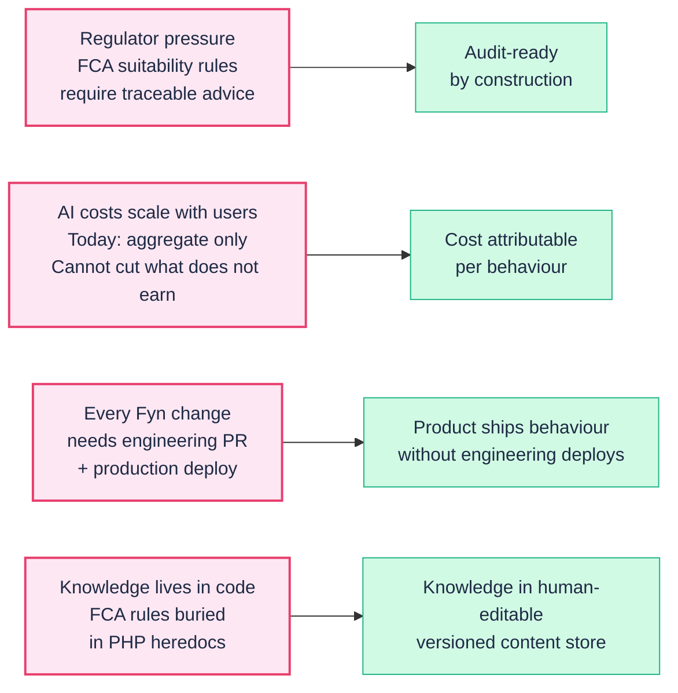
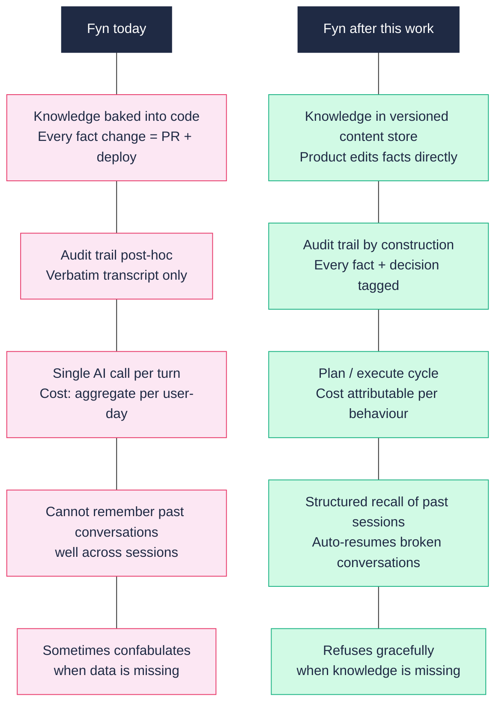
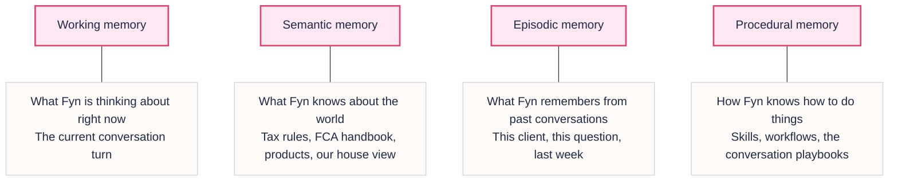
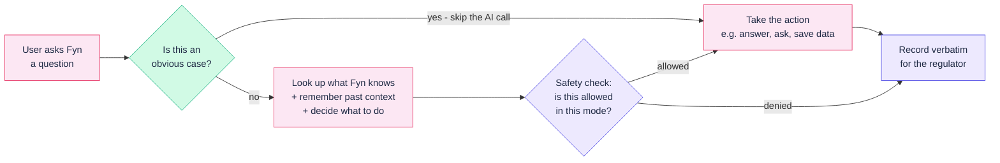
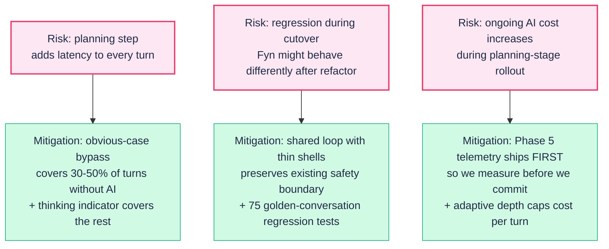
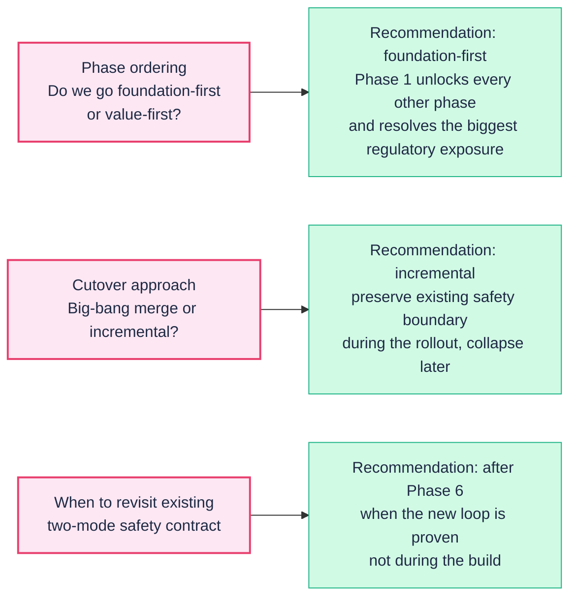

# Fyn brain rewire — stakeholder brief

**For:** Fynla leadership and investors
**About:** A planned upgrade to how Fyn — our AI advice surface — organises what it knows, what it can do, and how it decides
**Companion doc:** Full technical specification (`fynla-coala-implementation-plan.md`) for the engineering team
**Date:** 2026-05-26

---

## The one-liner

We are rebuilding the way Fyn thinks — not what Fyn says — so that Fyn becomes **regulator-auditable by design**, **cheaper to operate**, and **faster to improve** without engineering deploys. The user never sees the change. The business sees it on three lines of the P&L: compliance cost, AI infrastructure cost, and product iteration speed.

---

## Why now

**The cost of doing nothing.** Each driver above is already biting today. Building this structure now is cheaper than retrofitting it under regulator pressure, under cost pressure, or under competitor pressure. None of those windows reward delay.

---

## What changes for Fyn — before and after

---

## How Fyn will be organised

Borrowed from a 2023 Princeton paper (Cognitive Architectures for Language Agents, "CoALA") that has become the reference framework for production AI agents. Four kinds of memory, one decision loop, one safety boundary.

---

## How Fyn will think — a turn, simplified

The full engineering flow is detailed in the tech spec. The shape stakeholders should know:

**Two things to notice.** First, the safety check is mechanical — Fyn cannot write to your data in advice mode by construction, not by trust. Second, the obvious-case bypass keeps cost down: Fyn does NOT pay an AI bill for routing decisions a simple rule can make.

---

## The plan in six phases

```mermaid
gantt
  title CoALA delivery roadmap (relative effort)
  dateFormat X
  axisFormat %s

  section Foundation
  Phase 1 - Build the world knowledge store    :p1, 0, 5
  section Tidy-up
  Phase 2 - Tidy past-conversation storage     :p2, after p1, 3
  section Consolidate
  Phase 3 - Consolidate current-turn state     :p3, after p2, 2
  section Externalise
  Phase 4 - Move skills out of code            :p4, after p3, 3
  section Orchestrate
  Phase 5 - Wire the decision loop + cost telemetry :p5, after p4, 4
  section Learn
  Phase 6 - Human-gated learning from experience :p6, after p5, 3
```

Each phase ships independently. We do not need to commit to the full programme up front — each phase has a definition of done that pays back on its own. Phase 1 alone resolves the FCA narrative-content risk. Phase 5 alone resolves the cost-attribution gap.

---

## Top three risks and what we are doing about them

---

## What this work is NOT

A surprising amount of "AI strategy" conversations conflate things that should stay separate. To be explicit:

| This work is | This work is NOT |
|---|---|
| Restructuring how Fyn organises knowledge | Training our own AI model |
| Adding a decision layer above the existing AI providers | Replacing Anthropic / xAI |
| Building one cleaner decision loop | Building a multi-agent system |
| Improving Fyn's internal mechanics | Changing the user-facing chat experience |
| Making FCA audit cheaper | Replacing our regulatory framework |
| Making AI cost visible per behaviour | Cutting AI spend on its own — we still buy capability |

---

## Decisions we need stakeholder steer on

Three calls that are above the engineering team's pay grade:

---

## What we are asking for

1. **Endorsement of the direction.** Build what is described above; the framework is right, the sequencing is right, and the risks are understood.
2. **Commitment to fund Phase 1 + Phase 5 as a paired investment.** Phase 1 unlocks the regulatory case, Phase 5 unlocks the cost-visibility case. Together they pay back the rest of the programme.
3. **Decision on the cutover approach.** Default to incremental unless there is a strategic reason to accelerate.
4. **Re-review point at end of Phase 5.** Before committing to Phase 6 (learning from experience), the team checks back in with stakeholders. By that point we will have real telemetry on cost per behaviour, real measurement of the planning-stage latency, and real numbers to recalibrate the rest of the programme.

---

**Companion documents:**

- Full technical specification: `fynla-coala-implementation-plan.md` / `.html`
- CoALA reference paper: Sumers et al., 2023, arXiv:2309.02427
- Canonical Fyn contract today: `April/April24Updates/spec/00-canonical.md`
