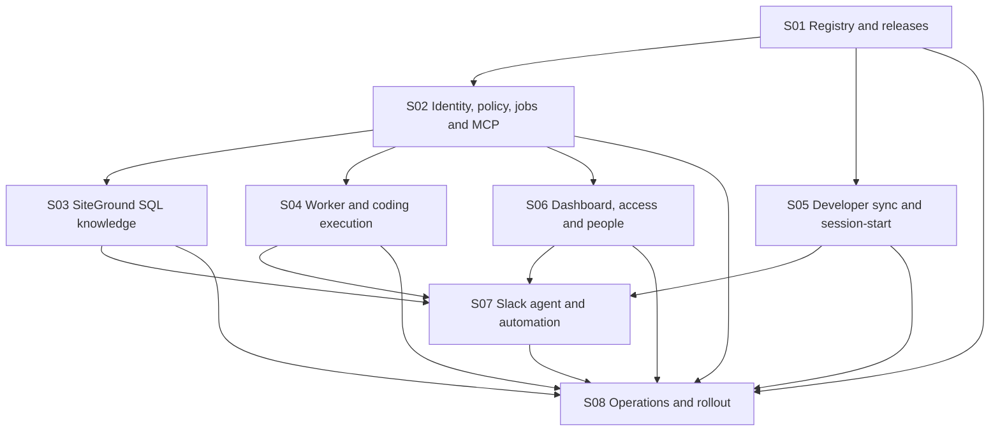

# Fynla Integrated AI Control Plane Programme Implementation Plan

> **For agentic workers:** REQUIRED SUB-SKILL: Use superpowers:subagent-driven-development (recommended) or superpowers:executing-plans to implement this plan task-by-task. Steps use checkbox (`- [ ]`) syntax for tracking.

**Goal:** Deliver the approved integrated founder and developer AI control plane through small, traceable pull requests whose tests, review evidence, dependencies and completion state can always be reconstructed.

**Architecture:** `Fynla/fynla-control` is the canonical registry; the existing PHP gateway at `mcp.fynla.org` is the policy, MCP, Slack, dashboard and job-control boundary; one dedicated SiteGround MySQL/MariaDB database holds operational state and the rebuildable FULLTEXT index; GitHub Actions workers perform bounded asynchronous work; native Codex and Claude Code adapters install layered configuration and enforce session preflight.

**Tech Stack:** PHP 8.2+, Symfony HttpFoundation/HttpClient components, SiteGround MySQL/MariaDB, Vue 3, TypeScript, Vite, Vitest, Python 3.12 GitHub Actions workers, pytest, PHPUnit 11, GitHub Actions, Slack Events API, MCP 2026-07-28, Google Workspace OIDC.

## Global Constraints

- Controlling design: [`2026-08-11-fynla-integrated-ai-control-plane-design.md`](../specs/2026-08-11-fynla-integrated-ai-control-plane-design.md), immutable source commit `fa8d417ae8f18e02d93ecd00283d349faa791cf0`.
- This programme supersedes the July founder-platform phase plans where they conflict with the controlling design.
- No worker may read production customer records, customer uploads, CoALA memory, production credentials or private runtime state.
- SiteGround handles short authenticated requests only. Long indexing, reasoning, builds and coding run in GitHub Actions.
- SiteGround MySQL/MariaDB is the only pilot database. PostgreSQL, pgvector and embeddings are excluded.
- Automatic green work stops at a tested draft pull request. Workers cannot merge or deploy.
- Amber work requires approval before mutation. Red work is unavailable unless separately designed and authorised.
- Global denials and protected policy cannot be weakened by repository, assistant, OS, discipline, developer or session layers.
- Every write-capable local or worker session requires a valid session attestation.
- Browser acceptance uses the user's installed Google Chrome through the Chrome connector. Chromium is prohibited.
- Implementation follows test-driven development: failing test, minimal code, passing test, focused commit.
- Do not combine unrelated refactors, formatting or dependency upgrades with a planned PR.

---

## 1. File and Repository Map

| Repository | Planned responsibility | Main paths |
|---|---|---|
| `Fynla/fynla-control` | Canonical policy, SOPs, schemas, assets, compiler inputs and releases | `core/`, `assistants/`, `schemas/`, `compiler/`, `tests/`, `release-notes/` |
| `Fynla/FynlaMCP` | SiteGround gateway, dashboard, SQL migrations, Slack/MCP APIs and worker boundary | `gateway/src/`, `gateway/database/`, `gateway/ui/`, `.github/workflows/`, `src/fynla_agent/` |
| `Fynla/Fynla` | Product-repository bootstrap and drift enforcement only | `AGENTS.md`, `CLAUDE.md`, `.codex/`, `.claude/`, `scripts/fynla-control/`, CI |
| Fixture repositories | Safe coding-job and lifecycle acceptance | `Fynla/control-plane-fixtures-*` |

No section may silently move a canonical responsibility into another repository. A cross-repository change uses separate PRs linked by explicit dependencies.

## 2. Traceability Model

Every unit has a stable identifier:

```text
SPEC requirement → Section Snn → Pull request Snn-PRnn → Task Snn-PRnn-Tnn
                                              └───────→ evidence record
```

Requirement prefixes are:

| Prefix | Approved-design area |
|---|---|
| `ARC` | architecture, boundaries and public endpoints |
| `REG` | canonical registry, compiler and releases |
| `IAM` | identity, roles, permissions and assignments |
| `JOB` | envelopes, risk, jobs, workers and recovery |
| `MCP` | MCP protocol and bounded tools |
| `KNW` | company knowledge and FULLTEXT retrieval |
| `SES` | layered configuration, sync and session preflight |
| `SLK` | Slack answer, participation, dispatch and steering |
| `UI` | unified role-scoped dashboard |
| `PPL` | onboarding, role change and offboarding |
| `SEC` | secrets, isolation, audit and retention |
| `OPS` | deployment, monitoring, backups, cost and rollout |

Each PR body and each task heading must list its requirement IDs and links to this programme, its section plan and its upstream PRs.

## 3. Status and Evidence Rules

Only these states are valid:

| State | Meaning |
|---|---|
| `Not started` | No implementation work has begun |
| `In progress` | Branch exists and at least one failing test is recorded |
| `PR open` | Draft PR exists; tasks may still be incomplete |
| `Changes requested` | Review found an unmet requirement |
| `Verified` | All task checks, section gates and review evidence pass |
| `Merged` | Verified PR merged through protected-branch controls |
| `Blocked` | A named external dependency prevents progress |

A checkbox is changed to `[x]` only in the same commit that adds or links its evidence. Required evidence for every PR:

- test command and exit status;
- failing-test observation before implementation;
- final test output or CI URL;
- security and boundary review result;
- changed-file list and confirmation no unrelated files are included;
- migration forward/rollback evidence when SQL changes;
- Google Chrome evidence when UI behaviour changes;
- draft PR URL and reviewer decision;
- merge commit SHA after merge.

Evidence is stored by stable ID, for example `docs/implementation-evidence/s01/s01-pr01.md`, in the repository owning the PR. The exact schema is introduced in S01-PR01.

## 4. Branch, Commit and PR Contract

- Branch: `codex/icp-sNN-prNN-short-slug`.
- PR title: `[ICP SNN/PRNN] Imperative outcome`.
- Task commit: `[ICP SNN/PRNN/TNN] Imperative outcome`.
- One task produces one focused commit unless the task explicitly names a red/green pair that must remain together.
- Open a draft PR after the first task passes; do not wait until the whole section is complete.
- Each PR targets the default development branch of its own repository.
- One worktree per PR. Never implement two open PRs in the same worktree.
- A dependent PR may be drafted against an upstream branch, but it cannot be verified or merged until the dependency is merged and the branch is rebased cleanly.
- The PR description must contain: plan links, task table, requirement IDs, dependencies, risk class, test evidence, rollback, screenshots where applicable and unresolved concerns.

## 5. Standard Task Execution Protocol

Every task in the section plans inherits these steps. Section tasks add exact files, interfaces and focused commands.

- [ ] Read the controlling design section, this programme, the section plan and all prerequisite evidence.
- [ ] Confirm the worktree contains no unrelated changes; record `git status --short --branch`.
- [ ] Add the smallest failing test for the named acceptance criterion.
- [ ] Run the task's focused test command and record the expected failure reason.
- [ ] Implement only the interface and behaviour named by the task.
- [ ] Re-run the focused test and record a passing result.
- [ ] Run the PR verification commands and `git diff --check`.
- [ ] Self-review the diff against requirement IDs, boundaries, secrets and deny-by-default behaviour.
- [ ] Update the PR evidence record and task checkbox.
- [ ] Commit using the task commit convention.

When a test passes before implementation, stop: the task either already exists or its test does not prove the requested behaviour. Correct the test or update the plan through review; do not add speculative code.

## 6. Section and PR Dependency Graph



Sections may overlap only where their PR-level prerequisites allow it. S08 continuously adds operational controls but its final acceptance PR waits for every other section.

## 7. Section Index

| Section | Plan | Outcome | PRs | Initial state |
|---|---|---|---:|---|
| S01 | [`registry-and-releases`](2026-08-11-fynla-control-plane-s01-registry-and-releases.md) | Canonical validated, reproducible releases | 4 | Not started |
| S02 | [`identity-policy-jobs-and-mcp`](2026-08-11-fynla-control-plane-s02-identity-policy-jobs-and-mcp.md) | Deny-by-default control-plane core | 6 | Not started |
| S03 | [`siteground-sql-knowledge`](2026-08-11-fynla-control-plane-s03-siteground-sql-knowledge.md) | Permission-filtered cited knowledge | 5 | Not started |
| S04 | [`worker-and-coding-execution`](2026-08-11-fynla-control-plane-s04-worker-and-coding-execution.md) | Codex/Claude to tested draft PR | 6 | Not started |
| S05 | [`developer-sync-and-session-start`](2026-08-11-fynla-control-plane-s05-developer-sync-and-session-start.md) | Layered cross-platform configuration and attestations | 5 | Not started |
| S06 | [`dashboard-access-and-people`](2026-08-11-fynla-control-plane-s06-dashboard-access-and-people.md) | One role-scoped UI and lifecycle controls | 8 | Not started |
| S07 | [`slack-agent-and-automation`](2026-08-11-fynla-control-plane-s07-slack-agent-and-automation.md) | Sourced conversation, steering and green autonomy | 6 | Not started |
| S08 | [`operations-and-rollout`](2026-08-11-fynla-control-plane-s08-operations-and-rollout.md) | Secure SiteGround operations and staged rollout | 5 | Not started |

Total: 45 bounded PRs. A PR may be split during review, but may not be enlarged without updating this programme and preserving the original requirement mapping.

## 8. Approved-Specification Coverage Matrix

| Design section | Requirement outcome | Implementing PRs |
|---|---|---|
| §§1–3 Decision, outcomes, non-goals | One integrated role-scoped platform; no production customer/CoALA boundary crossing | Global constraints; S08-PR04, S08-PR05 |
| §4 System boundaries | Dedicated control-plane resources on the shared subscription; canonical versus derived state | S03-PR01, S08-PR01, S08-PR02 |
| §5 Architecture/endpoints/provider routing | PHP control plane, SQL state, GitHub workers, stable public APIs and capability aliases | S02-PR03, S02-PR05, S02-PR06, S04-PR01, S08-PR01 |
| §6 Canonical registry | Sole registry, metadata, ownership, review and revocation | S01-PR01, S01-PR03, S01-PR04 |
| §7 Layered configuration | Eight ordered layers, protected merge and attributable native outputs | S01-PR02, S05-PR01, S05-PR04 |
| §8 Core and native SOPs | Core lifecycle plus separate Codex and Claude Code implementations/conformance | S01-PR04, S04-PR03, S04-PR04, S05-PR02, S05-PR03 |
| §9 Task envelope | Natural-language intake normalised into immutable assistant-neutral scope | S02-PR04, S04-PR02, S07-PR03 |
| §10 Risk/autonomy/actions | Green/amber/red gates, immutable approvals and draft-only automation | S02-PR04, S07-PR04, S07-PR05 |
| §11 Slack agent | Answer, participation, action, steering and secure ingress | S07-PR01 through S07-PR06 |
| §12 Unified dashboard | One role-scoped surface with server authorisation | S06-PR01, S06-PR02, S06-PR08 |
| §13 Roles/access UI | Editable roles, assignments, grants, safety and self-service | S02-PR01, S02-PR02, S06-PR03, S06-PR04 |
| §14 People Lifecycle | Onboarding, scheduled role changes and complete offboarding | S06-PR05, S06-PR06 |
| §15 Releases/sync/drift | Deterministic releases, atomic assignment/rollback and consumer drift | S01-PR03, S02-PR03, S05-PR01, S05-PR05, S06-PR07 |
| §16 Session-start | Prelaunch, native hooks, attestations, Git safety and offline rules | S02-PR03, S05-PR02, S05-PR03, S05-PR04 |
| §17 Company knowledge | Allowlisted sources, MySQL/MariaDB FULLTEXT, permissions/citations/freshness | S03-PR01 through S03-PR05 |
| §18 MCP contract | MCP 2026-07-28 and bounded tool catalogue | S02-PR06 |
| §19 Jobs/recovery | Leases, attempts, callbacks, cancellation, retries and failure behaviour | S02-PR05, S04-PR01, S04-PR06, S08-PR04 |
| §20 Security/governance | Identity mapping, least privilege, secrets, redaction, audit and retention | Security tasks/review gates in S01–S08; S08-PR02 closure |
| §§21–23 Operations/hosting/cost | Health, backups, switches, migration triggers and budgets | S06-PR08, S08-PR01, S08-PR02, S08-PR03 |
| §24 Verification | Automated matrices, real acceptance environments and quantitative gates | Every PR review gate; S08-PR04 |
| §25 Rollout | Six independently switchable phases with rollback | S07-PR04, S07-PR05, S08-PR05 |
| §§26–27 Alternatives/references | Preserve approved technology choices and verify current native assistant surfaces | Global constraints; S04-PR03, S04-PR04, S05-PR02, S05-PR03 |
| §28 Definition of done | All 15 outcomes proven and attributable | S08-PR04, S08-PR05 and programme closure |

## 9. Programme Checkpoints

### Checkpoint A — Foundation usable

- [ ] S01 is merged and can reproduce a digest-verified release from a clean checkout.
- [ ] S02 is merged and proves identity, permission filtering, durable jobs and bounded MCP.
- [ ] SiteGround staging health checks and MySQL migrations pass.

### Checkpoint B — Controlled developer pilot

- [ ] S04 Codex and Claude adapters stop at tested draft PRs.
- [ ] S05 preflight passes on Chris's macOS machine and compiles Windows/Linux fixtures.
- [ ] Every write-capable session and worker pins an effective release and attestation.

### Checkpoint C — Founder/developer platform pilot

- [ ] S03 golden knowledge set reaches the approved quality threshold.
- [ ] S06 gives founders and developers one server-authorised dashboard.
- [ ] Onboarding, role change and offboarding drills have complete evidence.

### Checkpoint D — Slack assisted and shadow mode

- [ ] S07 answers with permitted citations and acknowledges Slack below 2.5 seconds p95.
- [ ] Explicit Slack dispatch and safe steering pass replay and cancellation tests.
- [ ] At least 20 consecutive shadow green classifications agree with human review.

### Checkpoint E — Green automation and team rollout

- [ ] Automatic green work creates a tested draft PR and cannot merge or deploy.
- [ ] All kill switches, budgets, backup restore and recovery drills pass.
- [ ] Customer-site p95 degradation remains below the approved threshold.
- [ ] S08 final rollout evidence is accepted by both founder approvers.

## 10. Change-Control Rules for These Plans

- A task wording clarification may be made in its owning PR when it does not change scope or acceptance.
- A new requirement, removed gate, changed risk boundary, new external mutation or technology change requires a reviewed amendment to the controlling design first.
- A changed dependency or PR split requires a programme update and link from both replacement PRs.
- No agent may mark a parent PR, section or programme checkpoint complete by inference. Parent completion is calculated only from verified child records.
- If implementation discovers an unsafe or incorrect instruction, stop that task, mark it `Blocked`, record evidence and amend the plan before continuing.

## 11. Programme Definition of Done

- [ ] All 45 PRs are `Merged`, or an approved programme amendment explicitly supersedes them.
- [ ] Every approved-design requirement is mapped to at least one verified task and no requirement is mapped only to a manual assertion.
- [ ] All five programme checkpoints have signed evidence.
- [ ] Security review confirms no customer/CoALA boundary violation and no worker merge/deploy capability.
- [ ] Restore, rollback, cancellation, replay, revocation, offline preflight and provider-failure drills pass.
- [ ] Founder and developer pilots sign off the one-surface workflow.
- [ ] Operational ownership, review dates and runbooks are assigned.
